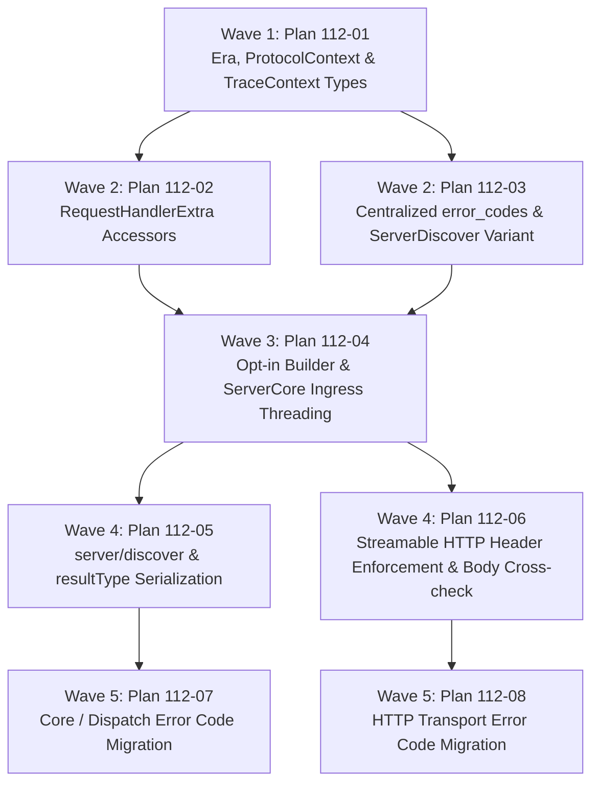

# Cross-AI Plan Review — Phase 112 (Version Plumbing Spine)

> Two independent external AI CLIs reviewed the 8-plan set. **They diverged sharply:**
> Gemini approved with high confidence; Codex rated overall risk HIGH and recommended
> revising Plans 03/04/05/06 before execution. See the Consensus Summary at the bottom.

---

## Gemini Review

# Structured Plan Review: Phase 112 (Version Plumbing Spine)

**Project:** PMCP SDK (`pmcp` crate)  
**Milestone:** v2.5 (MCP Spec 2026-07-28 v2 Support)  
**Phase Under Review:** Phase 112 — Version Plumbing Spine  
**Review Target:** 8 Execution Plans (112-01 through 112-08 across 5 waves)  
**Requirements Covered:** VERS-01 through VERS-09 (100% mapped)  
**Overall Verdict:** **APPROVED WITH HIGH CONFIDENCE** (Minor architectural highlights noted below)

---

## 1. Executive Summary & Assessment

Phase 112 establishes the foundational per-request protocol negotiation spine for dual-version MCP support (2025-11-25 `v1` and 2026-07-28 `v2`). The implementation plan is structured into 8 autonomous, tightly gated plans across 5 execution waves.

### Key Strengths
1. **Strict Non-Breaking Semver Discipline**: `LATEST_PROTOCOL_VERSION` remains strictly pinned to `"2025-11-25"`. `v2` is strictly opt-in via a builder accept-list (`.with_supported_protocol_versions([...])`). Un-opted-in servers experience zero behavior or performance change.
2. **Single Ingress Era Resolution**: `ProtocolContext` is resolved once at transport ingress from per-request `_meta` (or headers) and threaded through `ServerCore` dispatch (`core.rs`, `mod.rs`, `wasm_core.rs`) into `RequestHandlerExtra`. Handlers consume era details via typed accessors rather than ambient/session state.
3. **Robust Semantic Disambiguation (`-32002` Handling)**: Preserves pmcp's frozen `-32002` task-pending code and test suite intact while coexisting with `UNSUPPORTED_CAPABILITY` (-32002) and delegating `error::ErrorCode` consts to `error_codes::*`. Future spec-level `-32002` $\rightarrow$ `-32602` renames for resource-not-found are cleanly deferred until the final schema release.
4. **Serialization Injection for Envelope (`resultType`)**: Prevents breaking changes to public Rust `Result` structs by injecting `resultType: "complete"` at the JSON-RPC serialization boundary only for `v2` requests, leaving `v1` JSON byte-identical.
5. **Comprehensive Verification Gates**: Integration of `cargo-semver-checks`, property-based testing (`proptest`), WASM compilation targets (`wasm32-unknown-unknown`), and HTTP-specific header enforcement tests.

---

## 2. Requirement Coverage Matrix

| Req ID | Description | Primary Plan | Secondary Plan | Assessment |
|---|---|---|---|---|
| **VERS-01** | Resolve `ProtocolContext` at ingress, thread through dispatch & accessors | `112-01-PLAN.md` | `112-02-PLAN.md`, `112-04-PLAN.md` | **Complete** |
| **VERS-02** | Opt-in `v2` support; `LATEST_PROTOCOL_VERSION` stays `"2025-11-25"` | `112-01-PLAN.md` | `112-04-PLAN.md` | **Complete** |
| **VERS-03** | `_meta` self-description & `v2` `serverInfo` propagation | `112-01-PLAN.md` | `112-02-PLAN.md`, `112-05-PLAN.md` | **Complete** |
| **VERS-04** | `server/discover` read-only capability projection | `112-03-PLAN.md` | `112-05-PLAN.md` | **Complete** |
| **VERS-05** | Required HTTP headers (`Mcp-Method`, `Mcp-Name`, `MCP-Protocol-Version`) | `112-06-PLAN.md` | `112-08-PLAN.md` | **Complete** |
| **VERS-06** | Centralized error code table with frozen `-32002` intact | `112-03-PLAN.md` | `112-07-PLAN.md`, `112-08-PLAN.md` | **Complete** |
| **VERS-07** | `resultType` envelope (`complete`/`input_required`/`task`) | `112-05-PLAN.md` | — | **Complete** |
| **VERS-08** | `extensions` capability map support | `112-04-PLAN.md` | `112-05-PLAN.md` | **Complete** |
| **VERS-09** | W3C trace-context (`traceparent`/`tracestate`/`baggage`) accessors | `112-01-PLAN.md` | `112-02-PLAN.md` | **Complete** |

---

## 3. Wave Dependency & Pipeline Integrity



### Wave Progression Analysis
- **Wave 1 $\rightarrow$ Wave 2**: Base protocol types (`Era`, `ProtocolContext`, `TraceContext`) land first without dependencies on server internal state.
- **Wave 2 $\rightarrow$ Wave 3**: `RequestHandlerExtra` accessors and `error_codes` centralization prepare both the handler context and error infrastructure before `ServerCore` ingress logic is modified.
- **Wave 3 $\rightarrow$ Wave 4**: Threaded `ProtocolContext` allows dispatch arms (`server/discover`, `resultType` envelope) and transport gates (`Mcp-Method` enforcement) to era-gate cleanly.
- **Wave 4 $\rightarrow$ Wave 5**: Once `v2` dispatch and header enforcement are fully active, migrating legacy integer error literals across `core.rs`, `task_dispatch.rs`, and `streamable_http_server.rs` ensures zero raw error code regressions across 65+ call sites.

---

## 4. Deep Dive Technical Findings & Recommendations

### 1. JSON-RPC Response Wrapping for `resultType` (Plan 112-05)
* **Finding**: Plan 112-05 specifies injecting `"resultType": "complete"` at the serialization boundary for `v2` responses.
* **Detail**: In standard MCP JSON-RPC 2.0 messages, `resultType` belongs inside the inner `result` object (`{"jsonrpc":"2.0","id":1,"result":{"resultType":"complete", ...}}`).
* **Recommendation**: Ensure the serialization hook modifies the inner `serde_json::Value` payload of `JSONRPCResponse::Success` rather than top-level response metadata.

### 2. Header / Body Cross-Check with JSON-RPC Requests (Plan 112-06)
* **Finding**: Plan 112-06 implements a strict cross-check between the `Mcp-Method` HTTP header and the JSON-RPC body's `method` field.
* **Detail**: If a client sends malformed JSON or a batch payload, parsing the body method prior to JSON-RPC dispatch could fail or error differently.
* **Recommendation**: The plan correctly isolates this logic inside a pure, panic-safe parsing helper evaluated via `proptest`. Ensure that JSON parsing errors during header cross-checking return an `INVALID_REQUEST` (-32600) response directly via `error_codes::INVALID_REQUEST`.

### 3. WASM Transport Parity (`wasm_core.rs` & `wasm_http.rs`)
* **Finding**: Plan 112-04 and 112-05 explicitly mirror `ProtocolContext` ingress and `server/discover` dispatch to `wasm_core.rs`.
* **Detail**: Non-HTTP WASM environments (e.g. browser WebSockets/PostMessage) will not carry HTTP headers, but WILL carry `_meta`.
* **Recommendation**: Maintain the transport-agnostic `_meta` extraction strategy across both native and WASM builds. The plan's test suite includes `cargo build --lib --target wasm32-unknown-unknown` gates, which will catch any conditional compilation (`cfg`) drift.

---

## 5. Verification Checklist & Gate Alignment

- [x] **Semver Gate**: `cargo-semver-checks` checks all public surface additions (`ClientRequest`, `ProtocolContext`, `RequestHandlerExtra`) to guarantee 2.x minor compatibility.
- [x] **Zero New Runtime Dependencies**: Uses existing workspace crates (`serde`, `serde_json`, `http`). Dev dependencies (`cargo-semver-checks`, `cargo-public-api`, `proptest`) are isolated.
- [x] **Locking Tests Maintained**: `pending_tasks_result_preserves_minus_32002` and `latest_version_is_2025_11_25` stay green.
- [x] **WASM Parity**: Dual compilation targets (`x86_64` and `wasm32-unknown-unknown`) tested per wave.

---

## 6. Final Recommendation

The plan set for **Phase 112 (Version Plumbing Spine)** is **exceptionally thorough, architecturally sound, and ready for execution**. The wave breakdown eliminates circular dependencies, and the safety gates prevent accidental semver breaking changes or protocol leaks to legacy `v1` clients. Proceed with execution starting at Wave 1 (Plan 112-01).

---

## Codex Review

# Phase 112 Plan Review

## Summary

The plans show strong awareness of backward compatibility, the frozen `-32002` contract, dual dispatch sites, wasm parity, and the need for centralized protocol decisions. The wave ordering is mostly sound, and the test intent is unusually thorough. However, several architectural gaps undermine the phase’s central promise: protocol context is not actually resolved once at transport ingress; the accept-list is reduced to a boolean v2 flag rather than used for negotiation; HTTP classification has ambiguous and bypassable missing-signal cases; and adding `ServerDiscover` to the public exhaustive `ClientRequest` enum is likely a breaking Rust API change. The result-envelope design is also underspecified for non-object results and future non-`complete` outcomes. Finally, the plans intentionally leave VERS-06 incomplete while claiming it is satisfied, and their literal `TODO` comments conflict with the repository’s zero-SATD policy. Overall, the phase should be revised before execution.

## Strengths

- The five-wave ordering avoids material same-wave write conflicts:

  - Plans 02 and 03 are independent.
  - Plan 05 follows dispatch plumbing and the request variant.
  - Plan 06 follows context/error-code foundations.
  - Plans 07 and 08 migrate separate final-wave surfaces after their corresponding functional edits.

- The plans explicitly preserve important compatibility invariants:

  - `LATEST_PROTOCOL_VERSION` remains `2025-11-25`.
  - `2026-07-28` is not added to the legacy `SUPPORTED_PROTOCOL_VERSIONS`.
  - `resultType` and `serverInfo` are intended to be v2-only.
  - Existing v1 task-pending behavior remains `-32002`.
  - Independent raw-value assertions are retained instead of converted into tautological constant comparisons.

- The `RequestHandlerExtra` work follows an established additive pattern and accounts for native/wasm parity.

- Reusing `RequestMeta`’s flattened metadata, existing capability types, and already-computed `ServerCore.capabilities` avoids unnecessary parallel models.

- The plans correctly distinguish three separate `-32002` concerns:

  - Frozen v1 task-pending.
  - Existing PMCP unsupported-capability.
  - The provisional v2 resource-not-found allocation.

- HTTP method/header disagreement is treated as a request-smuggling concern and rejected fail-closed.

- The plans recognize that HTTP header behavior requires real HTTP tests rather than an in-memory transport.

- Property testing is proposed for the two most exposed parsers/decision points: trace metadata and HTTP header/body reconciliation.

- Delegating the widely used `error::ErrorCode` constants to the centralized table is an efficient way to cover many existing call sites without broad API churn.

## Concerns

### HIGH — Protocol context is not resolved once at transport ingress

Plan 04 says it resolves `ProtocolContext` in `ServerCore` from request `_meta`, while Plan 06 says the HTTP transport invokes or repeats that resolution to validate headers. This is not a single ingress resolution. It risks:

- Parsing the same evidence twice.
- Dispatch and transport validation producing different conclusions.
- HTTP-only information being unavailable to the core resolver.
- Context being constructed after transport decisions that were supposed to depend on it.

`ServerCore` dispatch is not transport ingress. The desired architecture needs one resolver that accepts normalized transport evidence and returns one authoritative result passed through the remainder of the request.

### HIGH — The version accept-list is not actually used as an accept-list

Plan 04 reduces the configured versions to `is_v2_opted_in()`. It does not specify:

- Checking the requested version against the configured list.
- Rejecting an explicitly unsupported version.
- Correct v2-only behavior when the list contains only `2026-07-28`.
- Handling an empty list.
- Handling duplicates or arbitrary `ProtocolVersion` strings.
- Selecting the v1 fallback version when per-request metadata is absent.
- How legacy session-negotiated versions participate when no per-request signal exists.

This fails the purpose of D-02. The same API may syntactically express v1-only, dual, and v2-only, but the planned runtime behavior does not.

### HIGH — HTTP v2 classification has downgrade/bypass gaps

Plan 06 declares `_meta` the authoritative v2 signal, then only reconciles the header when both values are present. This leaves important cases undefined:

- `MCP-Protocol-Version: 2026-07-28` with no `_meta` version may fall through as v1 and bypass v2 header enforcement.
- v2 `_meta` with no `MCP-Protocol-Version` header is not clearly rejected.
- VERS-05 requires `MCP-Protocol-Version` alongside `Mcp-Method` and `Mcp-Name`, but the plan explicitly mandates missing-header rejection only for the latter two.
- An unsupported non-v2 version in either location has no defined response.
- A malformed or non-string version value has no defined response.

The final verdict should not be computed solely from one source. On an opted-in HTTP server, either source indicating v2 should trigger strict validation requiring all mandated evidence and equality.

### HIGH — `ClientRequest::ServerDiscover` is likely not semver-minor

Adding a variant to a public exhaustive Rust enum breaks downstream exhaustive matches. Adding `#[non_exhaustive]` after publication also breaks downstream exhaustive matches and may prohibit existing external construction patterns. The proposed “try both and require no major result” procedure may have no successful branch.

This cannot be left as an execution-time experiment because Plan 05 depends on the variant. A non-breaking design is needed before implementation, such as:

- Dispatching `server/discover` before conversion into the public enum.
- Using an existing extensible/unknown-method representation.
- Introducing an internal dispatch enum while leaving the public enum unchanged.
- Providing a custom request representation that preserves unknown methods.

If the public enum must change, the milestone’s “2.x minor” promise needs explicit reconsideration.

### HIGH — Generic `resultType`/`serverInfo` injection is underspecified

The plans say to inject fields at the JSON serialization boundary, but do not define behavior when the result is:

- A scalar.
- An array.
- `null`.
- An object already containing `resultType` or `serverInfo`.
- A task or future `input_required` result needing a non-default discriminator.
- An error response or notification with no result.

There is also no planned mechanism by which Phases 113 and 114 select `InputRequired` or `Task`. Merely defining an internal enum does not establish the response metadata path.

Without a precise envelope model, Plan 05 may either corrupt existing result shapes or create a second incompatible envelope that later phases must replace.

### HIGH — VERS-06 remains incomplete but is marked complete

The centralized table is not genuinely version-gated; it is a flat set of current constants plus commented placeholders. The plans provide no API such as `code_for(era, semantic)` and no v2 interpretation path. They also intentionally omit final v2 values.

The deferral is correct because the final schema is unavailable, but traceability must reflect reality: Phase 112 cannot claim full VERS-06 completion until the final schema checkpoint is executed. Add a blocked/finalization task or mark VERS-06 partially complete.

### HIGH — Literal `TODO` comments conflict with repository policy

Plans 03 and 07 require commented `TODO` placeholders. The repository instructions prohibit SATD comments and state that PMAT rejects them. This creates a predictable quality-gate failure.

Use documentation such as “Unavailable until publication of the final schema” without SATD markers, or represent availability structurally with an `Option`, error, or omitted constant. Track the pending schema work in the planning system rather than source comments.

### HIGH — Required repository development workflow is missing

The plans do not include the mandatory contract-first and quality-proxy steps:

- Update the relevant provable-contract YAML.
- Run `pmat comply check` before and after implementation.
- Perform writes through the PMAT quality proxy.
- Generate PDMT-style todos.
- Run the mandated fuzz/property/unit/example/integration checks for new features.

Some property tests are present, but there is no fuzz target, runnable example, or explicit contract change. This is a process blocker under the supplied project standards.

### MEDIUM — Protocol metadata parsing policy is undefined

Plan 04 does not define what happens when:

- `protocolVersion` exists but is not a string.
- `clientInfo` is malformed.
- `clientCapabilities` is malformed.
- `_meta` is not an object.
- The same logical key appears through multiple serialization paths.
- Metadata is excessively large or deeply nested.

Silently dropping malformed identity/capability data would make handler-visible context disagree with the wire request. The resolver should return a typed error for malformed reserved keys while continuing to ignore unrelated extension keys.

### MEDIUM — Trace propagation does not satisfy the stated requirement clearly

Plans 01 and 02 parse and expose trace fields, while Plan 04 carries the existing request metadata. No integration test proves that a trace received at ingress is visible in the actual handler invocation. No outbound or observability propagation is planned.

If VERS-09 only requires handler visibility, say so explicitly and add an end-to-end dispatch test. If propagation means forwarding trace metadata to nested server-to-client calls or responses, the current plans do not implement it.

### MEDIUM — W3C trace validation and resource limits are absent

`TraceContext::from_meta` accepts any string as `traceparent`, with no syntax or length validation. `tracestate` and `baggage` also lack size limits. Even if the SDK intentionally exposes raw values, rustdoc should state that they are unvalidated. Prefer bounded validation at ingress to avoid propagating attacker-controlled oversized tracing values.

### MEDIUM — `Mcp-Name` semantics are unspecified

The plans check only that `Mcp-Name` is present. They do not define:

- Its expected value per request method.
- Whether it is cross-checked against `params.name`, a tool name, or another body field.
- What value is emitted in responses.
- Behavior for methods without a logical name.
- Validation of non-UTF-8 or invalid header values.

Presence-only validation may pass superficial tests without implementing the protocol contract.

### MEDIUM — Outbound header handling lacks error-path detail

The plans do not state whether required v2 headers are emitted on:

- Successful responses only.
- Structured 4xx JSON-RPC errors.
- Server errors.
- Streaming/SSE responses.
- Notifications or empty responses.

They also do not specify how invalid values are converted to `HeaderValue` without panicking. This should be part of the transport contract.

### MEDIUM — v1 byte-identity claims need stronger verification

Existing tests remaining green do not necessarily prove byte identity. The plans should retain or add golden serialized responses for representative v1 operations through:

- Opt-in unset.
- Dual-version server receiving a v1 request.
- Stateful/session-backed v1 HTTP.
- Stdio.
- Error responses, especially task-pending and method-not-found.

Adding `ServerDiscover` to parsing also changes how a previously unknown method travels through the v1 pipeline; verify that D-10’s desired `-32601` behavior is reconciled with the broader byte-identity claim.

### MEDIUM — Wasm parity is asserted more than designed

Plan 04 names `wasm_core.rs`, but does not explain how the wasm core receives the supported-version configuration or whether it shares the same resolver and builder. Plan 05 adds discover parity, while result-envelope/server-info Task 2 omits `wasm_core.rs` from its file list.

Consequently, wasm may recognize discover but serialize responses differently. The exact shared implementation should be identified rather than relying on file-level mirroring.

### MEDIUM — `server/discover` wire shape is provisional

The plan defines a new discover result before the final specification is available, but only error codes are treated as provisional. If the exact discover payload, result envelope, header semantics, or server-info placement can still change, these must also have a final-schema/spec checkpoint.

At minimum, isolate provisional wire shapes behind internal conversion functions and golden fixtures so final-spec adjustments remain localized.

### MEDIUM — Error-code audit may still be incomplete

Plans 03, 07, and 08 cover known surfaces, but grep counts against selected files do not prove that all production protocol errors use the table. Potential misses include:

- Other transports.
- Error construction through struct literals.
- Casts from `ProtocolErrorCode`.
- Constants in feature-gated modules.
- Examples or integration crates that emit protocol responses.

A repository-wide semantic audit should be the final acceptance gate. The surviving `ProtocolErrorCode` discriminants also remain a parallel numeric definition, so the “one source of truth” statement is not literally true unless their discriminants delegate to the table or the enum is deprecated and removed from production use.

### MEDIUM — Tool installation and semver verification are not reproducible

The plans install the latest `cargo-semver-checks` and `cargo-public-api`, but:

- Versions are not pinned.
- `cargo-public-api` is installed but never meaningfully used.
- The baseline package/version/tag is unspecified.
- Plan 01 runs a phase semver check before most phase changes exist.
- Plan 03’s two-way experiment does not specify how the worktree is restored between trials.
- Installation is mixed into source implementation rather than handled as a prerequisite.

Pin tool versions and define the exact baseline and package selection. Run the authoritative check after the complete phase diff.

### LOW — Some verification commands are brittle

Examples include quoted wildcard test targets and grep/awk assertions tied to source formatting. These are useful supplementary checks but should not be primary correctness gates. Prefer named test targets and behavior-based assertions.

### LOW — Plan 01 contains contradictory tripwire language

Research originally says to update the “supports four versions” test to five, while Plan 01 correctly keeps the legacy supported slice at four. The final desired invariant is clear, but the surrounding research and plan prose should be normalized to avoid an executor following the wrong instruction.

## Plan-by-Plan Recommendations

### Plan 112-01

- Keep the legacy supported-version slice unchanged, but rename it or document clearly that it is the default legacy negotiation set, not every version the crate can understand.
- Remove source `TODO` placeholders from the later error-code design.
- Define strict parsing/validation behavior for `TraceContext`.
- Move semver tooling setup to a pinned prerequisite; run the real API comparison after the full phase.

### Plan 112-02

- Add rustdoc explicitly marking `client_info` and `client_capabilities` as self-reported and unsuitable for authorization.
- Add an end-to-end handler test, not only direct accessor tests.
- Decide whether trace values are raw or validated and document that contract.
- Avoid duplicating implementations where a shared cfg-safe implementation can provide parity mechanically.

### Plan 112-03

- Resolve the public-enum semver problem before execution. Do not rely on an in-plan experiment.
- Avoid adding `ServerDiscover` to the public exhaustive enum unless a baseline check proves the project accepts that break.
- Represent unavailable v2 codes structurally or solely in planning artifacts, without SATD comments.
- Add an era-and-semantic lookup API if VERS-06 truly requires version-gated resolution.
- Audit whether `ProtocolErrorCode` can reference the centralized constants rather than retain independent numeric discriminants.

### Plan 112-04

- Replace `is_v2_opted_in()`-driven behavior with a real resolver:

  ```text
  configured accept-list
          +
  normalized transport evidence
          +
  optional legacy session fallback
          ↓
  Result<ProtocolContext, ProtocolNegotiationError>
  ```

- Specify outcomes for absent, malformed, unsupported, and conflicting versions.
- Make v2-only configuration genuinely prevent v1 dispatch.
- Resolve once and pass the completed context into dispatch; do not re-read `_meta` downstream.
- Prove native, stdio, HTTP, and wasm use the same resolver.

### Plan 112-05

- Specify the exact result envelope and collision behavior.
- Ensure scalar, array, and null results remain valid.
- Define how later phases set `InputRequired` and `Task`.
- Include wasm in result-envelope/server-info parity.
- Add golden v1 wire fixtures and v2 wire fixtures.
- Treat the discover result wire shape as provisional until final-spec verification.

### Plan 112-06

- Require `MCP-Protocol-Version` on v2 HTTP requests, not just `Mcp-Method` and `Mcp-Name`.
- Define classification for all presence combinations:

  | Header | `_meta` | Expected |
  |---|---|---|
  | v2 | v2 | Validate remaining headers and process |
  | v2 | absent/v1/invalid | Reject |
  | absent/v1/invalid | v2 | Reject |
  | v1 | absent/v1 | v1 behavior |
  | unsupported | any | Explicit unsupported-version handling |
  | any | any, server not opted in | Locked D-04 legacy behavior |

- Define `Mcp-Name` derivation and cross-check rules.
- Validate header decoding and length without panics.
- Test required headers on success and error responses.
- Consume a context resolved by transport ingress rather than calling the resolver a second time.

### Plans 112-07 and 112-08

- Preserve the independent frozen numeric assertions as planned.
- Add a final repository-wide audit rather than relying only on enumerated line lists.
- Include feature-gated transports/modules in the audit.
- Confirm no new literals were introduced after the plans were written.
- Run final-spec and semver gates after both migrations, not only targeted tests.

## Suggested Revised Architecture

Use one shared resolver with explicit inputs and outcomes:

```text
HTTP ingress:
  headers + parsed JSON-RPC request metadata
          │
          ▼
normalize ProtocolEvidence
          │
          ▼
resolve(configured_accept_list, evidence, optional_v1_session_version)
          │
          ├── ProtocolContext(V1)
          ├── ProtocolContext(V2)
          └── typed negotiation/header error
          │
          ▼
dispatch(context, request, auth_context)
          │
          ▼
serialize response using context + explicit ResponseDisposition
```

For stdio/wasm, construct the same `ProtocolEvidence` without HTTP headers. This ensures:

- Exactly one resolution.
- Exact accept-list enforcement.
- One precedence/conflict policy.
- No v2 header-validation bypass.
- A single context available to handlers and serialization.
- Clean future deletion of v1 fallback logic.

`ResponseDisposition` should explicitly carry `Complete`, `InputRequired`, or `Task`, rather than relying on an enum with no path from handlers to serialization.

## Risk Assessment

**Overall risk: HIGH**

The plan set is well researched and has good test discipline, but the remaining issues are architectural rather than cosmetic. The protocol-era resolver is the keystone for every later phase, and its current design permits duplicated resolution, incomplete accept-list enforcement, and ambiguous HTTP downgrade behavior. The proposed public enum change may violate the hard 2.x-minor constraint, while result-envelope injection lacks a safe definition for arbitrary JSON results. VERS-06 is intentionally unfinished yet marked satisfied, and its required source comments conflict with the repository’s quality policy.

Execution should pause until the resolver contract, public API strategy, HTTP evidence matrix, and result-envelope model are corrected. Once those are settled, the existing wave structure and most of the planned tests can be retained.

_(Codex note: its own external-CLI delegation sub-step failed — Claude was unauthenticated and Gemini could not bind a port under the sandbox — so the review above is Codex's own direct analysis. No repository files were changed by the reviewer.)_

---

## Consensus Summary

Two reviewers, opposite verdicts. **Gemini: APPROVED, high confidence.** **Codex: HIGH risk, revise Plans 03/04/05/06 before Wave 1.** The divergence is not noise — Gemini reviewed the plans for *coverage and internal consistency* (and they pass that bar), while Codex reviewed them adversarially for *architectural correctness of the negotiation spine* and surfaced design gaps that the internal plan-checker also missed. On a keystone phase, the adversarial read deserves weight.

### Agreed Strengths (both reviewers)

- **Full VERS-01..09 coverage** across the 8 plans — no orphaned requirements.
- **Semver/backcompat discipline**: `LATEST_PROTOCOL_VERSION` pinned to `2025-11-25`, v2 opt-in only, `cargo-semver-checks` gate, v1 output intended byte-identical.
- **Frozen `-32002` preserved** and correctly disambiguated from the other two `-32002` meanings (`UNSUPPORTED_CAPABILITY`, provisional v2 resource-not-found); locking test kept intact.
- **`error::ErrorCode` → `error_codes::*` delegation** is an efficient way to centralize the 210-site dominant surface without churning call sites.
- **Wave ordering** avoids same-wave write conflicts; `RequestHandlerExtra` follows the established additive pattern with native/wasm parity.
- **Property tests** targeted at the two untrusted-input parsers (trace `_meta`, header/body reconciliation).

### Agreed Concerns (raised or implicitly shared)

- **`server/discover` wire shape is provisional** — both note the final 2026-07-28 schema isn't published; Codex extends this from "just error codes" (VERS-06) to the discover payload, envelope, and header semantics too. Both want a final-spec checkpoint.

### Codex-only Concerns Worth Triaging Before Execution (HIGH)

These were NOT caught by Gemini or the internal plan-checker and several look real:

1. **`ClientRequest::ServerDiscover` may not be semver-minor.** Adding a variant to a public *exhaustive* enum breaks downstream exhaustive matches; adding `#[non_exhaustive]` after publication is itself breaking. Plan 03 defers this to an execution-time "try both" experiment, but Plan 05 hard-depends on the variant. **This should be resolved in planning, not during execution** — options: dispatch `server/discover` before conversion into the public enum, or use an internal dispatch enum leaving the public one unchanged.
2. **Zero-SATD conflict.** Plans 03/07 mandate literal `TODO` placeholder comments for the deferred v2 error values — CLAUDE.md's zero-SATD policy + PMAT will reject these, a predictable quality-gate failure. Represent unavailability structurally (`Option`/omitted const) or track it in the planning system, not source comments.
3. **"Resolve once at ingress" may not hold.** Plan 04 resolves `ProtocolContext` in `ServerCore` dispatch while Plan 06 re-derives a v2 verdict in the HTTP transport — two resolution sites that can disagree. Codex wants one resolver over normalized transport evidence.
4. **Accept-list collapsed to `is_v2_opted_in()` boolean** — doesn't actually enforce the configured version list (v2-only config, empty list, unsupported-version rejection all undefined). Partially a D-02 fidelity question.
5. **HTTP v2 classification downgrade/bypass gaps** — the header-present/`_meta`-present matrix has undefined cells; VERS-05 requires `MCP-Protocol-Version` alongside `Mcp-Method`/`Mcp-Name` but only the latter two are mandated. Codex supplies a full presence matrix (see its Plan 112-06 section).
6. **`resultType`/`serverInfo` injection underspecified** for scalar/array/null results and future `input_required`/`task` dispositions.
7. **Missing repo-mandated workflow** — no contract-first `pmat comply check`, no fuzz target, no runnable example (though CLAUDE.md's ALWAYS-requirements arguably apply; note DOCS-06/Phase 119 owns runnable examples).

### Divergent Views

- **Overall go/no-go.** Gemini says proceed to Wave 1 as-is; Codex says pause and revise the negotiation contract, HTTP evidence matrix, public-API strategy, and result-envelope model first. My read: Codex's #1 (enum semver) and #2 (zero-SATD) are concrete and cheap to verify/fix now, and directly threaten the milestone's "2.x minor" and quality-gate promises — worth addressing before execution regardless of the broader architectural debate.

### Recommended Next Step

Feed this back into planning:

```
/gsd:plan-phase 112 --reviews
```

The planner will weigh Codex's HIGH concerns against the locked CONTEXT.md decisions (several — e.g. `_meta`-authoritative HTTP classification per D-11, resultType-at-serialization per D-07/D-08 — are deliberate design choices, so some Codex concerns will be answered "intentional, here's why" rather than changed). Prioritize resolving the `ServerDiscover` enum-semver question and the zero-SATD TODO conflict, which are unambiguous and pre-execution-critical.
