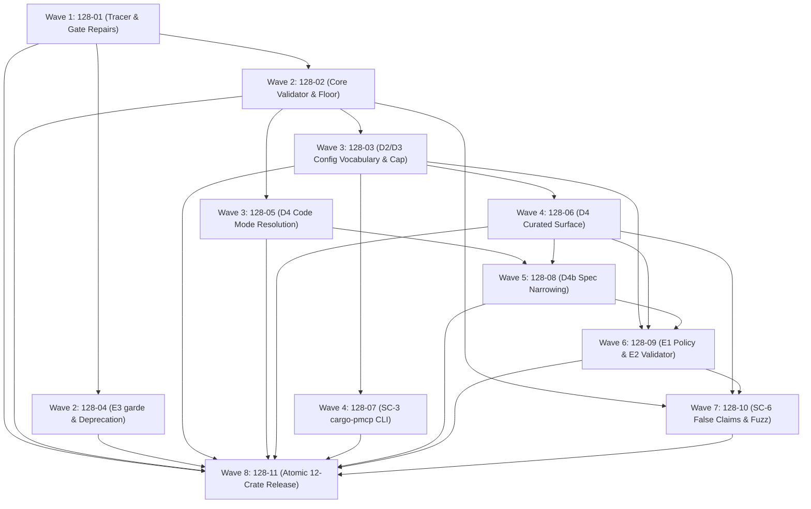

# Cross-AI Plan Review — Phase 128

All three lanes reviewed with repo access at `c75edaad` and covered all 11 plan ids
(coverage check: `{"complete":true,"total":11}` for every lane). No lane carried a
`[reviewed-without-repo-access]` or `[reviewed-without-source-citations]` discount
marker, so all three carry full consensus weight. Citation density: Codex 105,
Fable 81, Gemini 64.

## Codex Review

Reviewed against repository source at `c75edaad`. This is a plan review, not an implementation verification. I made no changes. I also ran the existing release-coverage checker and exercised its test-count helper with an all-ignored test result.

## 128-01

**Summary:** The decorator is a good enforcement boundary, but the tracer cannot pass its standalone-feature build as written, and its new Code Mode gate omits the feature containing the executor.

**Strengths**

- Wrapping both synthesizer cores covers the actual handler-construction paths: SQL handlers are built at `crates/pmcp-server-toolkit/src/tools.rs:143`, script handlers take a separate early-return branch at `:460`, and HTTP handlers are built at `:480`. This is the right place to enforce the schema before backend execution.
- Rejecting the existing output-error renderer is justified: `src/server/output_validation.rs:130` formats both the complete validation error and instance path, exposing instance data.
- The proposed acceptance-binary count guard builds on a real fail-closed mechanism: `Makefile:598` extracts each binary’s passed count and `Makefile:606` rejects zero.

**Concerns**

- **HIGH — Wave 1 depends on a Wave 2 feature change.** The plan calls `normalize_schema_dialect` from the new `schema-validation` module, while allowing only a visibility change to the output module. That function still has `#[cfg(feature = "validation")]` at `src/server/output_validation.rs:552`. A `--no-default-features --features schema-validation` build therefore cannot resolve it until plan 02 changes the gates. Evidence: `.planning/phases/128-secure-by-default-input-validation-for-config-driven-servers/128-01-PLAN.md:270`.
- **HIGH — The new Code Mode gate misses the changed implementation.** It runs plain `cargo test -p pmcp-code-mode`, but the crate has `default = []` at `crates/pmcp-code-mode/Cargo.toml:74`, and `executor` is gated on `js-runtime` at `crates/pmcp-code-mode/src/lib.rs:97`. Other tests can provide a nonzero count while the security-sensitive executor unit tests remain absent. Evidence: `.planning/phases/128-secure-by-default-input-validation-for-config-driven-servers/128-01-PLAN.md:389`.
- **MEDIUM — The full D1 acceptance matrix has no assigned completion task.** This plan adds only the unknown-argument integration row; later plans mostly add validator unit tests. The required wiremock cases include long filters, pattern refusals, and both missing-arguments outcomes. Evidence: `.planning/phases/128-secure-by-default-input-validation-for-config-driven-servers/128-01-PLAN.md:308` and `.planning/phases/128-secure-by-default-input-validation-for-config-driven-servers/128-CHANGE-REQUEST.md:128`.

**Suggestions**

- Move the necessary output-module feature migration into this plan.
- Run the executor gate with `--features js-runtime` and count an executor-specific selection.
- Assign every acceptance-matrix row to a named integration test, including the script branch and missing arguments.

**Risk Assessment:** **HIGH.** The first wave cannot satisfy its own isolated-build requirement, and its new test gate would miss the implementation it is intended to protect.

## 128-02

**Summary:** Centralizing refusal rendering and placeholder checks is sound, but the proposed safety claims exceed what the renderer and per-value guard establish.

**Strengths**

- Keeping external schema resolution disabled preserves a real security invariant: `Cargo.toml:216` explains why the `jsonschema` defaults would enable network/file resolution, and `Cargo.toml:220` disables them.
- Treating `validate_safe_path` as a naming convention rather than a complete guard is correct. Its implementation checks literal `..`, NUL, and an optional prefix at `src/server/validation.rs:252`; it does not implement the proposed encoded-character floor.

**Concerns**

- **HIGH — `instance_path()` is not generally declaration-only.** The public validator accepts arbitrary schemas. For `{"type":"object","additionalProperties":{"type":"integer"}}`, an invalid property named by the attacker produces an instance path containing that key. `patternProperties` creates the same problem. Copying that pointer into the refusal violates SC-7 even without formatting `ValidationError`. Evidence: `.planning/phases/128-secure-by-default-input-validation-for-config-driven-servers/128-02-PLAN.md:132`; the existing unsafe pointer rendering is visible at `src/server/output_validation.rs:130`.
- **HIGH — The floor needs URL-normalization and composition cases.** The prescribed floor omits backslash and single-dot segments and does not explicitly cover mixed traversal encodings such as `.%2e`. More fundamentally, individually acceptable values `"."` and `"."` can combine into `".."` through adjacent placeholders. The final string is subsequently parsed as a URL at `crates/pmcp-server-toolkit/src/http/client.rs:389`. Evidence: `.planning/phases/128-secure-by-default-input-validation-for-config-driven-servers/128-02-PLAN.md:222`. Per-value checks alone cannot establish final-segment safety.
- **MEDIUM — The feature-hygiene acceptance criterion conflicts with E3.** Requiring zero `feature = "validation"` occurrences anywhere under `src/` contradicts plan 04’s legitimate garde gates. Also, `Makefile:1546` is the `doc-check` feature list, not a powerset or isolated-feature build; adding `schema-validation` beside its superset proves no isolation. Evidence: `.planning/phases/128-secure-by-default-input-validation-for-config-driven-servers/128-02-PLAN.md:311`.
- **MEDIUM — Pattern compilation is not actually memoized by the specified call.** The placeholder action calls `compile_input_2020_12` directly, whereas the cache is a separate function. The existing architecture explicitly distinguishes compilation from caching at `src/server/output_validation.rs:595`. Evidence: `.planning/phases/128-secure-by-default-input-validation-for-config-driven-servers/128-02-PLAN.md:233`.

**Suggestions**

- Derive safe locations from schema-declared properties; redact dynamic map-key segments.
- Validate decoded characters and final substituted segments, with explicit tests for mixed encodings, backslashes, dot segments, and adjacent placeholders.
- Scope the cfg audit to schema-engine code and add a genuine isolated build.
- Route repeated pattern validation through an explicitly identified cache or compiled handle.

**Risk Assessment:** **HIGH.** The renderer can disclose attacker keys, and the floor’s current specification does not establish the claimed path invariant.

## 128-03

**Summary:** The vocabulary and position-sensitive defaults fit the existing schema builder. Feature-off behavior and numeric-bound validation need correction before implementation.

**Strengths**

- Deriving positions from the existing operation mapping is appropriately grounded: path parameters are extracted at `crates/pmcp-server-toolkit/src/tools.rs:501`, and remaining declared parameters become query parameters at `:517`.
- Explicitly enabling validation for the workbook consumers addresses real disabled defaults: `crates/pmcp-workbook-server/Cargo.toml:43` and `crates/pmcp-workbook-compiler/Cargo.toml:107` both use `default-features = false`.
- The widened compatibility warning is justified: both `ServerConfig` and `ServerSection` reject unknown fields at `crates/pmcp-server-toolkit/src/config.rs:101` and `:329`.

**Concerns**

- **HIGH — The config-time compile call is specified without feature-off behavior.** `ServerConfig::validate` is unconditional at `crates/pmcp-server-toolkit/src/config.rs:246`, but its proposed callee exists only under `pmcp/schema-validation`. The plan does not gate the call or define how a build without `input-validation` handles patterns and reports disabled enforcement. Evidence: `.planning/phases/128-secure-by-default-input-validation-for-config-driven-servers/128-03-PLAN.md:175`.
- **MEDIUM — Checking an already-rounded `f64` cannot guarantee the stated precision rule.** The fields are `Option<f64>` at `crates/pmcp-server-toolkit/src/config.rs:942`. The integer `9007199254740993` rounds to `9007199254740992`, so a later `abs() > 2^53` check misses this boundary case. Evidence: `.planning/phases/128-secure-by-default-input-validation-for-config-driven-servers/128-03-PLAN.md:185`.
- **MEDIUM — The schema opt-out also removes the future E2 attachment point.** This plan omits `ValidatingToolHandler` entirely when schema enforcement is disabled; plan 09 stores the custom argument validator inside that handler. The resulting behavior of explicitly registered domain validation is unspecified. Evidence: `.planning/phases/128-secure-by-default-input-validation-for-config-driven-servers/128-03-PLAN.md:276` and `.planning/phases/128-secure-by-default-input-validation-for-config-driven-servers/128-09-PLAN.md:229`.

**Suggestions**

- Specify and test no-default-feature configurations before adding unconditional core calls.
- Preserve numeric representation until precision validation, or explicitly narrow the accepted numeric contract.
- Keep E2 registration independent of the schema-enforcement opt-out and document its ordering when D1 is disabled.

**Risk Assessment:** **HIGH.** The default build can conceal a broken supported feature configuration; the opt-out also has an unresolved security effect on E2.

## 128-04

**Summary:** Constructor-based garde validation preserves existing generic bounds. Its error handling, however, does not yet justify a value-free guarantee for validated tools.

**Strengths**

- Adding a validator only through a new constructor avoids changing existing `T` bounds, which currently require deserialization and thread safety, not garde validation. Evidence: `src/server/typed_tool.rs:25` and `.planning/phases/128-secure-by-default-input-validation-for-config-driven-servers/128-04-PLAN.md:136`.
- The correction concerning `s19` is accurate: its import uses `wasm_typed_tool::validation` inside a wasm-only module at `examples/s19_wasm_typed_tools.rs:19`. Deprecating `server::validation` does not justify editing that example.

**Concerns**

- **HIGH — Deserialization can leak before garde runs.** The plan explicitly preserves the current deserialization error. That error includes serde’s full display at `src/server/typed_tool.rs:255`, which can quote an invalid string or unknown variant supplied by the caller. A validated constructor therefore still has a value-echoing refusal path. Evidence: `.planning/phases/128-secure-by-default-input-validation-for-config-driven-servers/128-04-PLAN.md:170`.
- **HIGH — Garde paths are not always declared struct fields.** The plan treats every report path as safe. Nested maps can contribute caller-controlled keys; this is separate from custom validator messages. The generic `T` accepted by `TypedTool` is not restricted to flat structs. Evidence: `.planning/phases/128-secure-by-default-input-validation-for-config-driven-servers/128-04-PLAN.md:143` and `src/server/typed_tool.rs:27`. The pinned garde implementation explicitly extends paths with map keys in [its map validator](/Users/guy/.cargo/registry/src/index.crates.io-1949cf8c6b5b557f/garde-0.23.0/src/validate.rs:293).

**Suggestions**

- Give validated constructors a redacted deserialization-error path.
- Sanitize dynamic garde path components or return a fixed safe rule summary.
- Add wrong-type, unknown-enum, nested-map-key, and custom-message cases for both asynchronous and synchronous tools.

**Risk Assessment:** **HIGH.** The compatibility strategy is good, but the advertised privacy property fails before and during validation.

## 128-05

**Summary:** Moving substitution before dispatch fixes decorator blindness, but protecting only layer 2 leaves an existing interpolation path outside enforcement.

**Strengths**

- Both error-wrapper fixes target real disclosure sites: `crates/pmcp-code-mode/src/executor.rs:2846` and `:3019` include the resolved path.
- A newtype makes migration visible to implementors, unlike silently changing the meaning of `&str`. The existing trait boundary is at `crates/pmcp-code-mode/src/executor.rs:2425`.

**Concerns**

- **HIGH — Layer-1 interpolation bypasses the proposed checks.** Existing `PathPart::Variable` and `PathPart::Expression` append evaluated values directly at `crates/pmcp-code-mode/src/executor.rs:3151` and `:3163`. The plan explicitly leaves this resolver unchanged and checks only body-backed `{key}` substitutions afterward. A template-literal interpolation can therefore place reserved characters into the path without entering the new guard. Evidence: `.planning/phases/128-secure-by-default-input-validation-for-config-driven-servers/128-05-PLAN.md:201` and `:266`.
- **HIGH — The newtype does not establish its documented invariant.** `ResolvedPath::new(&str) -> Self` is public and unchecked. Direct users can construct an unresolved or unsafe path and call `HttpCodeExecutor` after its own resolver/check is removed. It is a migration marker, not proof of validation. Evidence: `.planning/phases/128-secure-by-default-input-validation-for-config-driven-servers/128-05-PLAN.md:183`; the existing executor performs its own substitution at `crates/pmcp-server-toolkit/src/code_mode.rs:983`.
- **HIGH — Code Mode parameter names are attacker-controlled.** The proposed resolver iterates body keys and preserves “name the key” errors. Unlike curated `ParamDecl` names, these keys and matching placeholders come from script input. A PHI-shaped placeholder name can therefore appear in a refusal even when its value is redacted. Evidence: `.planning/phases/128-secure-by-default-input-validation-for-config-driven-servers/128-05-PLAN.md:203` and `crates/pmcp-server-toolkit/src/code_mode.rs:962`.
- **MEDIUM — The two-placeholder length test lacks a corresponding implementation step.** The action checks each rendered value, but does not specify checking the final segment’s combined length. Existing replacement simply concatenates values at `crates/pmcp-server-toolkit/src/code_mode.rs:919`. Evidence: `.planning/phases/128-secure-by-default-input-validation-for-config-driven-servers/128-05-PLAN.md:201`.

**Suggestions**

- Validate every dynamic path contribution, including layer 1, and then validate composed segments.
- Restrict construction of validated paths or require a checked constructor.
- Render declared spec names when available; otherwise use a fixed placeholder description.
- Add adversarial tests for template literals, attacker-chosen placeholder names, and adjacent `"."` values.

**Risk Assessment:** **HIGH.** The prescribed implementation closes one substitution route while leaving alternate routes and a public unchecked entry point.

## 128-06

**Summary:** The curated substitution point is correctly identified, but the proposed public helper breaks feature-off builds and the inherited template parser needs explicit treatment.

**Strengths**

- The guard belongs immediately before `path.replace` at `crates/pmcp-server-toolkit/src/http/client.rs:158`.
- Separating the D3 opt-out test from ordinary refusal tests is valuable: it can establish that placeholder limits remain enforced when schema-generated defaults are disabled. Evidence: `.planning/phases/128-secure-by-default-input-validation-for-config-driven-servers/128-06-PLAN.md:251`.
- The plan notices public struct-literal compatibility: `Parameter` has public fields and no `non_exhaustive` attribute at `crates/pmcp-server-toolkit/src/http/schema.rs:102`.

**Concerns**

- **HIGH — Gating the call does not gate the public return type.** `Parameter::placeholder_rules` unconditionally returns a type from the feature-gated core module, while only the call inside `substitute_path` is gated. Bare `http` does not enable schema validation, as shown by `crates/pmcp-server-toolkit/Cargo.toml:117`. The required `--no-default-features --features http` build therefore remains broken. Evidence: `.planning/phases/128-secure-by-default-input-validation-for-config-driven-servers/128-06-PLAN.md:106` and `:175`.
- **MEDIUM — The inherited template parser does not recognize general placeholders.** `build_operation` treats a whole slash-delimited segment as one parameter: `/{a}{b}` becomes the name `a}{b`, and `/prefix-{id}` is not recognized. Adding rules to those `Parameter` objects does not fix this. Evidence: `crates/pmcp-server-toolkit/src/tools.rs:501` and `.planning/phases/128-secure-by-default-input-validation-for-config-driven-servers/128-06-PLAN.md:112`.
- **LOW — A verification command contradicts the required header.** The header must mention why `openapi-code-mode` is inappropriate, but the later grep requires zero occurrences of that string anywhere in the file. Evidence: `.planning/phases/128-secure-by-default-input-validation-for-config-driven-servers/128-06-PLAN.md:240` and `:276`.

**Suggestions**

- Gate the helper method and related imports consistently.
- Use a shared template tokenizer, or reject unsupported/missing placeholders during config validation.
- Run a dedicated `--no-default-features --features http,input-validation` acceptance leg.
- Inspect cfg attributes rather than counting documentation text.

**Risk Assessment:** **HIGH.** The proposed feature-off build cannot compile, and template coverage is narrower than the plan’s terminology suggests.

## 128-07

**Summary:** Reusing toolkit linting is appropriate and preserves the deploy command’s IAM contract. Two dependencies currently treated as discoveries are already determinable from source.

**Strengths**

- Keeping lint warnings separate from IAM failures respects the current contract at `cargo-pmcp/src/commands/validate.rs:35`; IAM validation currently returns through `?` at `:603`.
- Calling one toolkit lint implementation avoids duplicating position and opt-out rules in the CLI. The existing command only loads deployment configuration at `cargo-pmcp/src/commands/validate.rs:600`.

**Concerns**

- **MEDIUM — The new integration binary is definitely absent from the existing gate.** `Makefile:531` explicitly enumerates eight `--test` targets, and `Makefile:540` separately enumerates required binaries. The plan should mandate both edits rather than ask the implementor to discover whether they are needed. Evidence: `.planning/phases/128-secure-by-default-input-validation-for-config-driven-servers/128-07-PLAN.md:255`.
- **MEDIUM — HTTP config parsing needs an explicit feature edge.** `backend` exists only under `http` at `crates/pmcp-server-toolkit/src/config.rs:123`, while the config rejects unknown fields at `:101`. A workspace build could accidentally supply this feature through another dependency, making the proposed probe misleading. Evidence: `.planning/phases/128-secure-by-default-input-validation-for-config-driven-servers/128-07-PLAN.md:129`.
- **LOW — Warning-stream assertions need alignment.** The existing validation interface documents warnings on stderr at `cargo-pmcp/src/commands/validate.rs:577`; the integration task asks for expected warning content in stdout. Evidence: `.planning/phases/128-secure-by-default-input-validation-for-config-driven-servers/128-07-PLAN.md:248`.

**Suggestions**

- Add the Makefile edits to the task and ownership list now.
- Declare `http` explicitly and test the CLI outside workspace feature unification.
- Assert stdout and stderr according to the intended command contract.

**Risk Assessment:** **MEDIUM.** The design is workable; the remaining issues concern reliable standalone behavior and gate coverage.

## 128-08

**Summary:** Carrying parsed schema information into the executor is necessary, but the lookup signature cannot identify an operation reliably, and the property-test gate cannot execute its proposed tests.

**Strengths**

- `build_server` already owns both the executor and optional parsed schema at `crates/pmcp-openapi-server/src/assemble.rs:245`, making it the appropriate wiring point.
- Sharing the configured executor between script tools and Code Mode follows existing assembly behavior at `crates/pmcp-openapi-server/src/assemble.rs:267` and `:285`.

**Concerns**

- **HIGH — The lookup hook omits HTTP method.** Operations are indexed by `(path, METHOD)`, and `operation_for` requires both at `crates/pmcp-server-toolkit/src/http/schema.rs:246`. The planned hook supplies only template and parameter name. GET and DELETE on the same path may have different constraints. Evidence: `.planning/phases/128-secure-by-default-input-validation-for-config-driven-servers/128-08-PLAN.md:98` and `.planning/phases/128-secure-by-default-input-validation-for-config-driven-servers/128-05-PLAN.md:193`.
- **HIGH — Caller-selected template spelling can bypass narrowing.** Looking up the script’s exact template and returning defaults on a miss allows `/users/{alias}` to miss a spec declaration for `/users/{id}` while resolving to the same endpoint. The floor remains, but the declared pattern disappears. Calling this “weakens nothing” is inaccurate. Evidence: `.planning/phases/128-secure-by-default-input-validation-for-config-driven-servers/128-08-PLAN.md:98`; lookup is exact at `crates/pmcp-server-toolkit/src/http/schema.rs:248`.
- **HIGH — All three property tests are ignored by the claimed gate.** The plan marks all three `#[ignore]`, then adds their binary to a normal test invocation. `Makefile:587` does not pass `--ignored`, and `scripts/named-test-binary-count.awk:111` counts passed tests, not discovered tests. I exercised that helper with the proposed all-ignored result: it returns **0**, causing `Makefile:606` to fail. Evidence: `.planning/phases/128-secure-by-default-input-validation-for-config-driven-servers/128-08-PLAN.md:212`.

**Suggestions**

- Pass method and an authoritative operation identity into rule lookup.
- Canonicalize template matching or explicitly reject ambiguous/missing spec matches when enforcing spec rules.
- Add a separately count-asserted toolkit property invocation using `--ignored property_`.
- Test same-path/different-method operations and renamed placeholders.

**Risk Assessment:** **HIGH.** Spec constraints can be bypassed, and the proposed gate is guaranteed to reject the all-ignored binary.

## 128-09

**Summary:** The hook ordering is sensible, but builder state, request context, production wiring, and redirect behavior are insufficiently specified for implementation.

**Strengths**

- Checking policy before auth is a concrete, testable boundary: curated auth runs at `crates/pmcp-server-toolkit/src/http/client.rs:397`, and Code Mode auth at `crates/pmcp-server-toolkit/src/code_mode.rs:999`.
- Recording auth-provider invocations is stronger evidence than merely scanning a request object for one test secret. The proposed tests explicitly require it at `.planning/phases/128-secure-by-default-input-validation-for-config-driven-servers/128-09-PLAN.md:173`.

**Concerns**

- **HIGH — The proposed builder has nowhere to accumulate toolkit state.** `ServerBuilderExt` is implemented for the foreign `pmcp::ServerBuilder` at `crates/pmcp-server-toolkit/src/builder_ext.rs:260`. That builder has private fields and no toolkit registry slot at `src/server/mod.rs:3293`. An extension trait cannot add fields, and the plan proposes neither a wrapper nor a core extension-storage mechanism. Evidence: `.planning/phases/128-secure-by-default-input-validation-for-config-driven-servers/128-09-PLAN.md:236`.
- **HIGH — Production assembly bypasses the selected registration/logging point.** OpenAPI assembly calls the public free synthesizer directly and registers handlers with `tool_arc` at `crates/pmcp-openapi-server/src/assemble.rs:267`. The plan keeps those free functions passing empty registries and emits startup reports only in `try_tools_from_config`. Consequently, its principal HTTP binary does not automatically receive those hooks or startup logs. Evidence: `.planning/phases/128-secure-by-default-input-validation-for-config-driven-servers/128-09-PLAN.md:229` and `:244`.
- **HIGH — The policy request is not yet assembled at the proposed Code Mode seam.** Query/body classification occurs after auth at `crates/pmcp-server-toolkit/src/code_mode.rs:1008`. A policy inserted before auth cannot see final query pairs without moving that construction. Neither `HttpExecutor::execute_request` nor `Operation` carries the originating tool name required by `OutboundRequest`. Evidence: `.planning/phases/128-secure-by-default-input-validation-for-config-driven-servers/128-09-PLAN.md:148`; `crates/pmcp-server-toolkit/src/http/schema.rs:48`.
- **HIGH — Redirects can bypass an endpoint policy.** The production binary uses `reqwest::Client::new()` at `crates/pmcp-openapi-server/src/dispatch.rs:135`, and the planned hook runs once before sending. Redirect hops occur inside the HTTP client, outside that hook. Deferring time budgets does not settle whether an allowed endpoint may redirect to a forbidden endpoint. Evidence: `.planning/phases/128-secure-by-default-input-validation-for-config-driven-servers/128-09-PLAN.md:96`.
- **MEDIUM — E2 silently disappears with D1’s opt-out unless redesigned.** The validator lives inside the decorator that plan 03 removes when `enforce_input_schema = false`. This needs explicit behavior rather than an accidental consequence. Evidence: `.planning/phases/128-secure-by-default-input-validation-for-config-driven-servers/128-09-PLAN.md:231`.

**Suggestions**

- Choose a concrete builder-state design and include every affected core/toolkit file.
- Thread tool identity explicitly and build the credential-free request before policy evaluation.
- Wire hooks and reports through actual SQL, HTTP, and script assembly paths.
- Disable redirects for governed clients or validate each redirected destination.
- Keep custom validators active independently of the schema toggle.

**Risk Assessment:** **HIGH.** SC-5 cannot be implemented from the specified builder API alone, and E1 does not yet govern the complete outgoing request path.

## 128-10

**Summary:** Correcting threat comments with behavioral evidence is strong. The fuzz oracle, cache behavior, and CI prerequisites need redesign.

**Strengths**

- The distinction between argument binding and validation is verified: `crates/pmcp-server-toolkit/tests/script_tool.rs:184` describes observing the supplied value, not rejecting invalid input. Adding a separate pre-script refusal test addresses the actual missing evidence.
- A strict fuzz target is justified: `Makefile:808` currently swallows every nonzero fuzz exit with `|| echo`.

**Concerns**

- **HIGH — The no-echo fuzz oracle rejects legitimate declaration-based messages.** The plan forbids every instance key from appearing in a refusal. But a valid declared key such as `cui` is intentionally echoed when its value violates `maxLength`; the required unknown-key message also lists allowed names. Independently generated schemas and instances can legitimately contain identical strings. Evidence: `.planning/phases/128-secure-by-default-input-validation-for-config-driven-servers/128-10-PLAN.md:200` and the declaration-based rendering specified in `.planning/phases/128-secure-by-default-input-validation-for-config-driven-servers/128-02-PLAN.md:136`.
- **HIGH — Arbitrary-schema fuzzing fills the process-global cache without bound.** This target calls public `validate_input` for changing schemas, which plan 01 caches globally. The existing output validator explicitly separates uncached compilation for this exact fuzz/property hazard at `src/server/output_validation.rs:598`. Evidence: `.planning/phases/128-secure-by-default-input-validation-for-config-driven-servers/128-10-PLAN.md:193`.
- **HIGH — CI provisioning is missing.** The new gate fails in CI without nightly, but no workflow edit installs nightly or cargo-fuzz. The quality job’s tool installation is at `.github/workflows/ci.yml:247`, followed by `make quality-gate` at `:291`; the new prerequisites are absent. Evidence: `.planning/phases/128-secure-by-default-input-validation-for-config-driven-servers/128-10-PLAN.md:270`.

**Suggestions**

- Test provenance: generate unique sensitive sentinels absent from declarations, and distinguish declared keys from unexpected/dynamic keys.
- Provide an uncached fuzz seam or a bounded cache.
- Add explicit CI toolchain/tool installation and smoke-test the strict fuzz leg on a clean runner.
- Retain the comment sweep, but include feature/config-disabled cases in its evidence ledger.

**Risk Assessment:** **HIGH.** The current fuzz plan can produce false failures or cache-growth failures, while the CI gate lacks required tooling.

## 128-11

**Summary:** Coordinating the version set is necessary, but the publish-order assertion is wrong and four dependency pins are missing.

**Strengths**

- Raising the toolkit and Code Mode minimum core requirement is necessary: their existing requirements are `2.9.0` and `>=2.2.0` at `crates/pmcp-server-toolkit/Cargo.toml:23` and `crates/pmcp-code-mode/Cargo.toml:29`.
- Covering both parameter keys and `[server.validation]` in upgrade documentation correctly reflects the strict serde structs at `crates/pmcp-server-toolkit/src/config.rs:101`, `:329`, and `:920`.

**Concerns**

- **HIGH — The retained publish order cannot satisfy the new dependency.** The plan requires Code Mode to depend on core 2.21, but forbids changing the workflow that publishes Code Mode first. Those steps are at `.github/workflows/release.yml:190` and `:226`. A fresh coordinated release cannot publish Code Mode against a core version not yet published. Evidence: `.planning/phases/128-secure-by-default-input-validation-for-config-driven-servers/128-11-PLAN.md:142` and `:155`.
- **HIGH — The release checker does not validate this ordering.** It explicitly limits ordering checks to `pmcp-package` and four consumers at `scripts/check-release-coverage.sh:252`; its consumer loop is at `:294`. I ran it successfully, but that result provides no assurance about core → Code Mode → toolkit order. Evidence: the broader claim at `.planning/phases/128-secure-by-default-input-validation-for-config-driven-servers/128-11-PLAN.md:46`.
- **HIGH — Four required pin changes are omitted.** Bumping the connector crates and workbook compiler to 0.2 also requires updating the three connector dependencies at `crates/pmcp-sql-server/Cargo.toml:34` and `cargo-pmcp`’s compiler dependency at `cargo-pmcp/Cargo.toml:75`. All currently require 0.1. The plan’s pin list covers toolkit edges but misses these edges. Evidence: `.planning/phases/128-secure-by-default-input-validation-for-config-driven-servers/128-11-PLAN.md:136`.
- **MEDIUM — The version verification scans unrelated crates.** Its wildcard command rejects any remaining `0.1.*` or `0.5.*` package version across all crates, rather than just the twelve release members. That can fail on intentionally unchanged packages and pressure an unnecessary bump. Evidence: `.planning/phases/128-secure-by-default-input-validation-for-config-driven-servers/128-11-PLAN.md:168`.
- **HIGH — Contracts are scheduled after implementation despite the mandatory order.** The plan adds contracts in the final wave, whereas `CLAUDE.md:653` requires contracts and compliance checks before implementation. Calling the final-wave task “contract-first” does not satisfy that sequence. Evidence: `.planning/phases/128-secure-by-default-input-validation-for-config-driven-servers/128-11-PLAN.md:312`.

**Suggestions**

- Recompute publication order from the changed dependency graph and extend the checker to cover these edges.
- Include all four omitted pins and regenerate the affected lockfiles.
- Dry-run packaging against the intended publication sequence, including root’s Code Mode dev-dependency at `Cargo.toml:263`.
- Verify an explicit twelve-package version map.
- Move contract work before the corresponding implementation tasks.

**Risk Assessment:** **HIGH.** As specified, the version set is incomplete and the automated release can fail before core publication.

## Cross-plan dependency and coverage assessment

The declared eight-wave graph is **acyclic**, and every explicit dependency points to an earlier wave. It is nevertheless not execution-safe:

| Issue | Consequence |
|---|---|
| Plan 01 uses a function whose cfg migration occurs in plan 02 | Wave 1 cannot pass its isolated-feature build. |
| Plan 02 forbids all `validation` gates while parallel plan 04 adds legitimate garde gates | Wave 2 has contradictory acceptance criteria. |
| Plan 07 necessarily needs Makefile edits omitted from its ownership list; plan 06 also edits Makefile | Wave 4 needs explicit ownership or serialized edits. |
| Plan 09 needs builder storage/context absent from its file scope | A late architectural dependency is unresolved. |
| Contracts appear only in wave 8 | The implementation order violates the repository’s contract-first requirement. |

These follow respectively from the plan/source evidence under 128-01, 128-02, 128-07, 128-09, and 128-11 above.

| Success criterion | Assessment |
|---|---|
| **SC-1** | Good decorator boundary; missing complete backend-refusal coverage and isolated feature builds. |
| **SC-2** | Vocabulary is planned; compile gating, safe error locations, and numeric precision need correction. |
| **SC-3** | CLI approach is workable; production startup reporting is not wired through all assembly paths. |
| **SC-4** | Not established: layer-1 interpolation, composed segments, unchecked construction, and spec-lookup misses remain. |
| **SC-5** | Constructor approach works conceptually; builder storage, tool identity, and E2 opt-out behavior remain unresolved. |
| **SC-6** | Strong correction strategy, provided final comments describe actual conditions and tested paths. |
| **SC-7** | Not established: dynamic schema paths, serde errors, garde map paths, and Code Mode key names can disclose input. |
| **SC-8** | Blocked by incorrect feature selectors, ignored property tests, missing fuzz prerequisites, and release defects. |

**Overall risk: HIGH — revise before execution.** The plans identify the original defects well, but several proposed replacements repeat the same failure pattern: a claimed guarantee is stronger than the actual enforcement or gate. Prioritize the feature/wave fixes, path and refusal contracts, concrete builder design, and complete release graph before implementation begins.

---

## Gemini Review

# Cross-AI Plan Review: Phase 128 (Secure-by-default Input Validation)

**Verification Status:** Verified against source repository (`guyernest/rust-mcp-sdk` at commit `HEAD`). All findings cite concrete `path/to/file:line` evidence from the codebase alongside `<repo-relative plan path>:<line>` citations from the planning artifacts.

---

## 128-01

### 1. Summary
Plan `.planning/phases/128-secure-by-default-input-validation-for-config-driven-servers/128-01-PLAN.md` establishes the core tracer slice for Phase 128. It introduces `pmcp::server::schema_validation::validate_input` in a new core module (`src/server/schema_validation.rs`), splits the core `validation` Cargo feature (`Cargo.toml:327`) into `schema-validation` (for `jsonschema`) and `validation` (adding `garde`), wires a crate-private `ValidatingToolHandler` into both toolkit private synthesis cores (`crates/pmcp-server-toolkit/src/tools.rs:136` and `:453`), and patches historical blind spots in the test harness (`Makefile:1481` and `Makefile:587`). The plan provides a clean vertical slice connecting core validation to synthesized tool dispatch.

### 2. Strengths
- **Decoupled Feature Architecture:** Splitting core features in `Cargo.toml:327` (`schema-validation = ["dep:jsonschema"]` and `validation = ["schema-validation", "dep:garde"]`) ensures curated single-call tools never pull `garde` or `swc` into their dependency tree.
- **Harness Visibility Repair:** Directly remedies the critical gate blind spot in `Makefile:1481`, where `pmcp-code-mode` was entirely absent from `test-all`, and `crates/pmcp-server-toolkit/tests/http_executor.rs` was silently compiling to `running 0 tests` under `make test-server-toolkit` because it was gated on `#![cfg(feature = "openapi-code-mode")]`.
- **Value-Free Output Design:** Enforces the prohibition on echoing parameter values or unexpected keys from day one by designing `InputViolation` (`.planning/phases/128-secure-by-default-input-validation-for-config-driven-servers/128-01-PLAN.md:144`) and `render_refusal` around `ValidationErrorKind` rather than formatting the raw `ValidationError` via `Display` (which leaks values at `src/server/output_validation.rs:130`).

### 3. Concerns
- **Compilation Failure on `--features schema-validation` [HIGH]:** In `.planning/phases/128-secure-by-default-input-validation-for-config-driven-servers/128-01-PLAN.md:177`, `compile_input_2020_12` reuses `normalize_schema_dialect` from `src/server/output_validation.rs:553`. However, in `src/server/output_validation.rs:552`, `normalize_schema_dialect` is currently gated behind `#[cfg(feature = "validation")]`. In Task 2 line 330, the verification runs:
  ```bash
  cargo build -p pmcp --no-default-features --features schema-validation
  ```
  Because the rewrite of the 18 `feature = "validation"` attributes in `src/server/output_validation.rs` is deferred to Plan 128-02 Task 3 (`.planning/phases/128-secure-by-default-input-validation-for-config-driven-servers/128-02-PLAN.md:214`), `normalize_schema_dialect` will **not** be compiled under `--features schema-validation` alone. Task 2's verification step will fail with `error[E0425]: cannot find function normalize_schema_dialect in module output_validation`.
- **Incomplete `ToolHandler` Decorator Delegation [MEDIUM]:** In `crates/pmcp-server-toolkit/src/tools.rs`, `ValidatingToolHandler` (`.planning/phases/128-secure-by-default-input-validation-for-config-driven-servers/128-01-PLAN.md:259`) wraps `inner: Arc<dyn ToolHandler>`. The plan implements `ToolHandler::handle` and delegates `metadata()`, but omits `ToolHandler::handle_output` (`src/server/mod.rs:370-388`). The default trait method for `handle_output` delegates to `self.handle(args, extra).await` and wraps the result in `ToolOutput::Payload`. If an underlying handler overrides `handle_output` (e.g. to emit `ToolOutput::Result` and control its own response envelope), wrapping it in `ValidatingToolHandler` without implementing and delegating `handle_output` silently strips that capability.

### 4. Suggestions
- Move the feature gate update for `normalize_schema_dialect` (and its supporting helpers `pin_dialect_in_place` and `first_legacy_dialect` in `src/server/output_validation.rs`) into Plan 128-01 Task 2, gating them on `#[cfg(feature = "schema-validation")]` so `--no-default-features --features schema-validation` compiles immediately.
- Explicitly implement `async fn handle_output` on `ValidatingToolHandler`: run `validate_input` first, and on success delegate to `self.inner.handle_output(args, extra).await`.

### 5. Risk Assessment
**MEDIUM.** The architectural concept is sound and well-scoped, but the feature gate mismatch on `normalize_schema_dialect` between 128-01 and 128-02 will break the standalone feature build unless corrected.

---

## 128-02

### 1. Summary
Plan `.planning/phases/128-secure-by-default-input-validation-for-config-driven-servers/128-02-PLAN.md` completes `src/server/schema_validation.rs`. It expands the `expectation` matcher across all 10 `ValidationErrorKind` variants, implements `validate_path_placeholder` with the unconditional character floor and `PLACEHOLDER_MAX_LENGTH` (256 code points), adds `check_input_schema_compiles` for config load-time checking, updates `src/server/output_validation.rs` gates to `feature = "schema-validation"`, and adds a second resolver fence in `tests/v2_schema_tripwires.rs`.

### 2. Strengths
- **Unified Regex Engine Semantics:** Re-evaluating declared patterns in `validate_path_placeholder` via `compile_input_2020_12` (`.planning/phases/128-secure-by-default-input-validation-for-config-driven-servers/128-02-PLAN.md:195`) guarantees that path placeholder patterns and top-level `inputSchema` patterns resolve whitespace (`\s`) through the identical engine.
- **Unconditional Floor Ordering (D-10):** Enforcing the character floor (`?`, `#`, `\0`, `..`, and case-insensitive percent-encodings) *before* evaluating any spec pattern ensures that overly broad patterns like `^.*$` can never bypass path injection protections (`.planning/phases/128-secure-by-default-input-validation-for-config-driven-servers/128-02-PLAN.md:180`).
- **Resolver-Feature Guard:** Extending the `jsonschema` resolver feature check in `tests/v2_schema_tripwires.rs:800` to cover `--features schema-validation` prevents SSRF and network fetches from entering the build via the new feature flag.

### 3. Concerns
- **Missing Concatenated-Segment Length Check [HIGH]:** A mandatory truth of the plan states: *"Two adjacent placeholders in one template are each floor-checked independently AND the concatenated resolved segment is length-checked, so a 180-char plus a 200-char value is refused even though neither part alone exceeds the cap (D4 edge: adjacency)"* (`.planning/phases/128-secure-by-default-input-validation-for-config-driven-servers/128-02-PLAN.md:27-29`). However, `validate_path_placeholder` only accepts `(param: &str, value: &str, rules: &PlaceholderRules<'_>)`. It inspects single parameters in isolation. If a template contains `/search/{a}{b}`, `a` (180 chars) and `b` (200 chars) each pass `validate_path_placeholder` independently (both $\le 256$). The resulting concatenated segment has 380 characters. Because neither `validate_path_placeholder` nor the callers in 128-05/128-06 check segment lengths post-substitution, this probe will **not** be refused as claimed.
- **Omission of Backslash and CRLF in Character Floor [MEDIUM]:** In `.planning/phases/128-secure-by-default-input-validation-for-config-driven-servers/128-02-PLAN.md:180-188`, the character floor inspects `?`, `#`, `\0`, `..`, `/`, `%25`, and encoded forms. It does **not** deny literal backslash (`\`), percent-encoded backslash (`%5c`, `%5C`), or ASCII control characters / CRLF (`\r`, `\n`, `%0d`, `%0a`). Many HTTP reverse proxies (e.g. IIS, Nginx with certain rewrite rules, or AWS API Gateway) treat `\` as a path separator or normalize `..\` to directory traversal. Furthermore, unencoded CRLF in URL paths introduces HTTP response splitting and request smuggling risks.

### 4. Suggestions
- Provide a `validate_resolved_path(path: &str) -> Result<(), PlaceholderRefusal>` helper (or document that callers must run it) which splits the substituted path by `/` and asserts that no individual path segment exceeds `PLACEHOLDER_MAX_LENGTH`.
- Add backslash (`\`, `%5C`, `%5c`) and ASCII control characters / CRLF (`\r`, `\n`, `%0D`, `%0A`, `%0d`, `%0a`) to the unconditional floor in `validate_path_placeholder`.

### 5. Risk Assessment
**MEDIUM.** The single-parameter validation is robust, but claiming enforcement on multi-placeholder concatenation without providing a segment-level check creates an unfulfilled security guarantee.

---

## 128-03

### 1. Summary
Plan `.planning/phases/128-secure-by-default-input-validation-for-config-driven-servers/128-03-PLAN.md` expands `ParamDecl` (`crates/pmcp-server-toolkit/src/config.rs:913-949`) with six new fields (`pattern`, `min_length`, `format`, `items`, `max_items`, `allow_slash`), emits them into `inputSchema` via `build_param_property`, adds `[server.validation]` (`ValidationSection`), enforces position-scoped length capping (256 code points for path/query, lint warning for body), implements `ServerConfig::lint()`, and enables `input-validation` by default across toolkit consumers.

### 2. Strengths
- **Balanced Default Policy (D-05 / D-06):** Restricting the default 256-character cap to `Path` and `Query` positions while leaving `Body` parameters uncapped (and warning via `lint()`) directly addresses Review Note C and prevents breaking legitimate free-text, SQL filters, or base64 payloads.
- **Config-Time Regex Validation (SC-2):** Compiling parameter schemas during `ServerConfig::validate` via `check_input_schema_compiles` (`crates/pmcp-server-toolkit/src/config.rs:246`) catches uncompilable regex patterns at server initialization rather than at request runtime.
- **Draft 2020-12 Object-Form Emission:** Emitting `items` as an object schema rather than draft-07 array form ensures compliance with the Draft 2020-12 engine pinned in core (`src/server/output_validation.rs:592`).

### 3. Concerns
- **Single-Call HTTP POST Parameter Classification [MEDIUM]:** In `.planning/phases/128-secure-by-default-input-validation-for-config-driven-servers/128-03-PLAN.md:197-208`, `ToolDecl::param_position` states that for single-call HTTP tools (`path` and `method` present), any parameter not in `{placeholder}` position is classified as `Query`. In `crates/pmcp-server-toolkit/src/tools.rs:517-526` (`build_operation`), this matches the historical implementation where all non-path parameters are added to `operation.parameters` as `ParameterLocation::Query`. However, on a `POST`, `PUT`, or `PATCH` single-call tool, an author declaring a payload field (e.g. `comment`, `body_text`) will have that parameter classified as `Query` by `param_position`, causing it to receive a hard 256-character cap! This re-introduces the very breakage Review Note C warned about for single-call mutation tools.
- **Integer Bounds Precision Limit [LOW]:** In `.planning/phases/128-secure-by-default-input-validation-for-config-driven-servers/128-03-PLAN.md:170`, the plan adds `NonFiniteParamBound` rejecting bounds whose magnitude exceeds $2^{53}$ because `ParamDecl` stores `minimum`/`maximum` as `f64`. While sound for JavaScript compatibility, 64-bit integer parameters (e.g. `u64` IDs) exceeding $2^{53}$ cannot be bounded via `minimum`/`maximum`.

### 4. Suggestions
- Enhance `ToolDecl::param_position` to check `self.method`: if the method is `POST`, `PUT`, or `PATCH`, and the parameter does not appear in the URL path, consider classifying it as `Body` (or provide an explicit `location = "body"` config override).
- Document in `crates/pmcp-server-toolkit/src/config.rs` that parameters on single-call `GET` tools default to query position and are capped at 256 code points.

### 5. Risk Assessment
**LOW.** The plan executes D2 and D3 cleanly, with good test coverage and well-reasoned feature-gate defaults.

---

## 128-04

### 1. Summary
Plan `.planning/phases/128-secure-by-default-input-validation-for-config-driven-servers/128-04-PLAN.md` implements E3 by adding `garde` validation support to `TypedTool<T>` and `TypedSyncTool<T>` (`src/server/typed_tool.rs`) via non-breaking `new_validated` constructors. It also deprecates and hides `src/server/validation.rs` (D-03), corrects the false claims in `ARCHITECTURE.md:199-200`, and provides a working example `examples/s57_typed_tool_garde_validation.rs`.

### 2. Strengths
- **Non-Breaking Constructor Specialization (Shape A):** Storing `validator: Option<Box<dyn Fn(&T)...>>` on the struct and placing `T: garde::Validate<Context = ()>` solely on `new_validated` (`.planning/phases/128-secure-by-default-input-validation-for-config-driven-servers/128-04-PLAN.md:112`) avoids adding trait bounds to existing types or `ToolHandler` impls (`src/server/typed_tool.rs:246`), completely avoiding semver breakage.
- **Proper Semver Deprecation:** Retains `src/server/validation.rs:206` with `#[deprecated]` and `#[doc(hidden)]` rather than deleting it on the 2.x line, respecting the SDK's compatibility commitments.
- **Truthful Documentation Audit:** Corrects `ARCHITECTURE.md:199-200` which falsely claimed that typed tools auto-validate inputs and that the server validates tool inputs before calling handlers.

### 3. Concerns
- **Doctest Deprecation Warnings in `make test-doc` [LOW]:** In `src/server/validation.rs`, there are 11 doctests (`validation.rs:54, 80, 111, 137, 180, 214, 246, 290, 312, 355, 377`) that import from `pmcp::server::validation`. When `pub mod validation` is marked `#[deprecated]`, running `make test-doc` under `RUSTFLAGS="-D warnings"` may fail if rustdoc treats deprecation of the enclosing module as an error. The plan notes this risk (assumption A1 in `.planning/phases/128-secure-by-default-input-validation-for-config-driven-servers/128-04-PLAN.md:183`), but the fix (`# #![allow(deprecated)]`) should be applied preemptively across those 11 doctests.
- **Unit Context Limitation (`Context = ()`) [LOW]:** `new_validated` restricts validation to types implementing `garde::Validate<Context = ()>`. Types requiring request context or database references cannot use this constructor, though this is acceptable for field-level validation.

### 4. Suggestions
- Preemptively insert `# #![allow(deprecated)]` at the top of each doctest block in `src/server/validation.rs` to guarantee that `make test-doc` passes cleanly on all toolchains.

### 5. Risk Assessment
**LOW.** The plan is well-isolated, uses non-breaking patterns, and addresses technical debt cleanly.

---

## 128-05

### 1. Summary
Plan `.planning/phases/128-secure-by-default-input-validation-for-config-driven-servers/128-05-PLAN.md` addresses CR-01 on the Code Mode surface. It modifies `HttpExecutor::execute_request` (`crates/pmcp-code-mode/src/executor.rs:2425`) to accept a `ResolvedPath<'_>` newtype, moves `{key}` placeholder resolution into `PlanExecutor::execute_step`, validates each value with `validate_path_placeholder`, fixes the path-echoing error wraps at lines 2846 and 3018, removes step (1) from `HttpCodeExecutor`, and implements the three Code Mode CR-01 probes in `crates/pmcp-server-toolkit/tests/http_executor.rs`.

### 2. Strengths
- **Architectural Seam Correction (D-09):** Resolving placeholders *before* calling `HttpExecutor::execute_request` ensures that any decorator wrapping the HTTP executor sees the actual path being requested, fixing the blind decorator vulnerability that affected the UMLS server.
- **Compile-Time Contract Enforcement:** Introducing `ResolvedPath<'a>` ensures that third-party implementors fail to compile rather than silently double-resolving or misinterpreting path templates as raw paths.
- **Information Leak Elimination (Pitfall 7):** Eliminates `resolved_path` from the error messages in `crates/pmcp-code-mode/src/executor.rs:2846` and `:3018`, preventing attacker-supplied path payloads from being reflected back in error responses.

### 3. Concerns
- **Missing Concatenated Segment Length Enforcement [HIGH]:** Similar to Plan 128-02, line 29 and line 236 specify that adjacent placeholders exceeding 256 code points combined must be refused. In Task 2 (`.planning/phases/128-secure-by-default-input-validation-for-config-driven-servers/128-05-PLAN.md:201-210`), `PlanExecutor` iterates keys of `body` and calls `validate_path_placeholder` on each scalar individually. If `{a}` has 180 chars and `{b}` has 200 chars, both individually pass. After substitution, `/search/{a}{b}` produces a 380-character segment, but no validation is performed on the substituted path before calling `execute_request`. The two-placeholder length probe will fail.
- **Unsubstituted Placeholder Leakage [MEDIUM]:** In `PlanExecutor::execute_step`, if a script calls an API where the path template contains `{param}` but the body object does not contain `param`, what happens? Under the current implementation, `{param}` is skipped and remains in the URL sent to `HttpExecutor`. A path containing un-substituted curly braces (`{...}`) should be treated as a resolution error before dispatch.
- **Missing `method` on `HttpExecutor::placeholder_rules` [MEDIUM]:** The trait method added in Task 2 (`.planning/phases/128-secure-by-default-input-validation-for-config-driven-servers/128-05-PLAN.md:192`) is:
  ```rust
  fn placeholder_rules(&self, path_template: &str, param: &str) -> PlaceholderRules<'_>
  ```
  However, in `crates/pmcp-server-toolkit/src/http/schema.rs:246`, `OpenApiSchema::operation_for(&self, path: &str, method: &str)` requires **both** path and method because OpenAPI index keys are `(path, method)`. Because `placeholder_rules` omits `method`, Plan 128-08 cannot perform an efficient $O(1)$ lookup in the schema.

### 4. Suggestions
- In `PlanExecutor`, after completing placeholder substitution, verify that no path segment between `/` separators exceeds `PLACEHOLDER_MAX_LENGTH` (256 code points).
- Verify that `resolved_path` contains no remaining `{` or `}` characters before wrapping it in `ResolvedPath::new(&resolved_path)`.
- Update `HttpExecutor::placeholder_rules` to take `method: &str`:
  ```rust
  fn placeholder_rules(&self, method: &str, path_template: &str, param: &str) -> PlaceholderRules<'_>
  ```

### 5. Risk Assessment
**HIGH.** Moving resolution ahead of dispatch is a critical architectural improvement, but the failure to check segment length after placeholder concatenation means the two-placeholder probe will fail.

---

## 128-06

### 1. Summary
Plan `.planning/phases/128-secure-by-default-input-validation-for-config-driven-servers/128-06-PLAN.md` closes CR-01 on the curated single-call HTTP surface (`crates/pmcp-server-toolkit/src/http/client.rs::substitute_path`). It adds `pattern`, `max_length`, and `allow_slash` to `Parameter` (`http/schema.rs:100`), populates them in `build_operation`, calls `validate_path_placeholder` in `substitute_path`, enforces D-11 (`allow_slash` is config-only, ignoring OpenAPI `allowReserved`), and verifies the two JS-engine-free CR-01 probes in `crates/pmcp-server-toolkit/tests/curated_path_injection.rs`.

### 2. Strengths
- **Engine-Free Curated Security (SC-1):** Enforces path validation on the curated single-call path without enabling `openapi-code-mode` or pulling SWC/JS into the binary.
- **Strict Spec Disregard for `allowReserved` (D-11):** Explicitly hardcodes `allow_slash: false` when parsing OpenAPI specs (`.planning/phases/128-secure-by-default-input-validation-for-config-driven-servers/128-06-PLAN.md:112-116`), ensuring that third-party specs cannot weaken the path traversal floor.
- **Independent D4(c) Placeholder Cap (D-08):** Proves that setting `[server.validation] default_max_length = 0` does not disable the 256 placeholder cap via `curated_path_injection_cap_independent_of_d3`.

### 3. Concerns
- **Missing Concatenated Segment Length Check [HIGH]:** Exactly as in 128-02 and 128-05, `substitute_path` (`crates/pmcp-server-toolkit/src/http/client.rs:155-161`) iterates over path parameters and calls `validate_path_placeholder` on each one before running `path.replace(&placeholder, &value_str)`. For adjacent placeholders `{a}{b}`, both pass individual checks, resulting in a segment longer than 256 code points. The combined segment is never checked.
- **Unsubstituted Path Parameter Behavior [MEDIUM]:** In `substitute_path` (`crates/pmcp-server-toolkit/src/http/client.rs:157`), if a path parameter is missing from `args`, `args.get(&param.name)` returns `None`, and the placeholder `{param}` remains in the URL. If validation is run without D1 (or if D1 were bypassed), the raw `{param}` is sent to the backend. `substitute_path` should return an error if a path parameter is missing or if curly braces remain in the resolved path.

### 4. Suggestions
- At the end of `substitute_path` (after all parameter replacements have occurred), split `path` by `/` and verify that no segment exceeds `PLACEHOLDER_MAX_LENGTH` (256 code points), and assert that no `{` remains in `path`.

### 5. Risk Assessment
**MEDIUM.** The implementation cleanly secures the curated path, but shares the concatenated-segment length validation blind spot.

---

## 128-07

### 1. Summary
Plan `.planning/phases/128-secure-by-default-input-validation-for-config-driven-servers/128-07-PLAN.md` fulfills SC-3 by integrating server config linting into `cargo-pmcp`. It adds a `pmcp-server-toolkit` dependency to `cargo-pmcp` with `default-features = false`, introduces the `cargo pmcp validate config` subcommand (`cargo-pmcp/src/commands/validate.rs`), surfaces `ServerConfig::lint()` findings as warnings in `cargo pmcp validate deploy`, and adds integration tests in `cargo-pmcp/tests/validate_server_config.rs`.

### 2. Strengths
- **Single Source of Truth (Q5):** Reuses `ServerConfig::lint()` from `pmcp-server-toolkit` instead of reimplementing lint rules in `cargo-pmcp`, preventing rule divergence.
- **Preserved IAM Contract:** Maintains the invariant that `validate deploy` only fails on hard IAM errors (`cargo-pmcp/src/commands/validate.rs:36-38`), rendering toolkit config findings strictly as advisory warnings.
- **Dependency Hygiene:** Uses `default-features = false` for `pmcp-server-toolkit` in `cargo-pmcp/Cargo.toml` to prevent pulling in `code-mode` and SWC.

### 3. Concerns
- **Config Parse Failure on `[backend]` Section [HIGH]:** In `.planning/phases/128-secure-by-default-input-validation-for-config-driven-servers/128-07-PLAN.md:130`, `cargo-pmcp/Cargo.toml` is configured with:
  ```toml
  pmcp-server-toolkit = { version = "0.1.0", path = "../crates/pmcp-server-toolkit", default-features = false, features = ["input-validation"] }
  ```
  However, in `crates/pmcp-server-toolkit/src/config.rs:123`:
  ```rust
  #[cfg(feature = "http")]
  #[serde(default)]
  pub backend: Option<BackendSection>,
  ```
  Because `ServerConfig` is annotated with `#[serde(deny_unknown_fields)]` (`crates/pmcp-server-toolkit/src/config.rs:101`), if `pmcp-server-toolkit` is compiled **without** the `http` feature, the `backend` field does not exist on the struct. Any `config.toml` that contains a `[backend]` section (which is standard for all HTTP/OpenAPI servers) will fail deserialization with `unknown field 'backend'`. Task 1 suggests "measuring" this, but source analysis proves that without `features = ["input-validation", "http"]`, `validate config` will fail on real server configs.
- **Disjoint Test Leg in Makefile [LOW]:** In `Makefile:338-360`, `test-cargo-pmcp` runs `cargo test -p cargo-pmcp --lib --bins`. It does **not** run integration tests under `cargo-pmcp/tests/`. The new test `cargo-pmcp/tests/validate_server_config.rs` will only be run by `make test-cargo-pmcp-integration` (`Makefile:363`), so developers running `test-cargo-pmcp` alone will miss it.

### 4. Suggestions
- Update `cargo-pmcp/Cargo.toml` to include `features = ["input-validation", "http"]` immediately, ensuring `[backend]` sections parse cleanly without pulling in the SWC/JS runtime.
- Verify in `Makefile` that `test-all:1481` includes `test-cargo-pmcp-integration` (verified: it is already in `test-all`).

### 5. Risk Assessment
**MEDIUM.** The CLI design is clean, but omitting `http` from the toolkit features will break parsing of real OpenAPI configs.

---

## 128-08

### 1. Summary
Plan `.planning/phases/128-secure-by-default-input-validation-for-config-driven-servers/128-08-PLAN.md` implements D4(b) OpenAPI spec narrowing on the Code Mode surface. It equips `HttpCodeExecutor` (`crates/pmcp-server-toolkit/src/code_mode.rs`) with `Option<Arc<OpenApiSchema>>` via `.with_schema(...)`, overrides `HttpExecutor::placeholder_rules` to look up spec-defined parameter patterns and lengths, wires the parsed spec in `pmcp-openapi-server/src/assemble.rs`, and adds property tests in `crates/pmcp-server-toolkit/tests/path_placeholder_props.rs`.

### 2. Strengths
- **Zero-Copy Spec Sharing:** Wraps `OpenApiSchema` in `Arc` (`.planning/phases/128-secure-by-default-input-validation-for-config-driven-servers/128-08-PLAN.md:157`), sharing the document between the `api_schema` resource and `HttpCodeExecutor` without duplicating memory.
- **Fallback Resilience:** An executor without an OpenAPI spec continues to enforce the unconditional character floor and the 256-character length cap via the default `placeholder_rules` implementation.
- **Formal Invariant Property Testing:** Uses `proptest` in `path_placeholder_props.rs` to verify that no declared pattern can widen the character floor and that refusal is closed under percent-encoding across arbitrary byte streams.

### 3. Concerns
- **Schema Lookup Signature Incompatibility [MEDIUM]:** In Task 1 (`.planning/phases/128-secure-by-default-input-validation-for-config-driven-servers/128-08-PLAN.md:98`), `placeholder_rules` looks up the operation in `OpenApiSchema` by path template. However, in `crates/pmcp-server-toolkit/src/http/schema.rs:246`:
  ```rust
  pub fn operation_for(&self, path: &str, method: &str) -> Option<&Operation>
  ```
  `OpenApiSchema::by_path` is keyed on `(String, String)` (`(path, method.to_uppercase())`). Because `HttpExecutor::placeholder_rules(&self, path_template: &str, param: &str)` (defined in Plan 128-05) does not take `method`, `HttpCodeExecutor` cannot use `operation_for` directly and must perform an inefficient linear search over `self.operations`.
- **Proptest Execution Time [LOW]:** In Task 3 (`.planning/phases/128-secure-by-default-input-validation-for-config-driven-servers/128-08-PLAN.md:232`), `PROPTEST_CASES=256` is configured for three property arms generating random strings. On slower development machines, this could increase toolkit test duration.

### 4. Suggestions
- Update `placeholder_rules` in Plan 128-05 and Plan 128-08 to accept `method: &str`, allowing direct $O(1)$ lookup via `OpenApiSchema::operation_for`.

### 5. Risk Assessment
**LOW.** The spec narrowing logic and property tests are well-constructed and directly address D4(b).

---

## 128-09

### 1. Summary
Plan `.planning/phases/128-secure-by-default-input-validation-for-config-driven-servers/128-09-PLAN.md` delivers escape hatches E1 (`RequestPolicy`) and E2 (`ArgumentValidator`). It hooks `RequestPolicy` before `auth.apply` on both Code Mode and curated HTTP paths, connects `ArgumentValidator` inside `ValidatingToolHandler` to run strictly after D1 schema validation, implements once-at-startup logging for enforced rules and opt-outs, adds integration tests in `crates/pmcp-server-toolkit/tests/request_policy.rs`, and provides example `crates/pmcp-server-toolkit/examples/e05_input_validation.rs`.

### 2. Strengths
- **Leak-Proof Hook Placement (D-12):** Positioning the `RequestPolicy` hook between URL joining (`code_mode.rs:991`, `http/client.rs:388`) and auth application (`code_mode.rs:1000`, `http/client.rs:397`) guarantees that third-party policy code inspects the final resolved URL but can never observe authentication credentials.
- **Strict Multi-Stage Validation Order:** Calling `ArgumentValidator::validate` only after `validate_input` succeeds ensures custom validators never have to handle malformed types or unexpected properties.
- **Operational Traceability:** Emitting the startup validation report once from declarations (`crates/pmcp-server-toolkit/src/builder_ext.rs`) enables operators to diagnose unexpected refusals without exposing runtime request values.

### 3. Concerns
- **Bypassing `ArgumentValidator` via Direct Synthesis Functions [MEDIUM]:** Task 2 (`.planning/phases/128-secure-by-default-input-validation-for-config-driven-servers/128-09-PLAN.md:229-234`) threads `&ArgumentValidators` into private synthesizer cores, but keeps the four public free functions (`synthesize_from_config`, etc.) unchanged by having them pass an empty registry. Authors using the free functions rather than `ServerBuilderExt` cannot register argument validators. While this preserves backwards compatibility, it limits E2 to builder users.
- **Unbounded Async Policy Latency (Threat T-128-44) [LOW]:** `RequestPolicy::check` is an async trait method. A custom policy that performs slow I/O can block request processing. The plan acknowledges this in T-128-44 as an accepted residual pending the per-request time budget phase.

### 4. Suggestions
- Clearly document in `crates/pmcp-server-toolkit/README.md` that `ServerBuilderExt` is the required entry point when using `RequestPolicy` or `ArgumentValidator`.

### 5. Risk Assessment
**LOW.** The security ordering (before auth, after schema validation) is verified and watertight.

---

## 128-10

### 1. Summary
Plan `.planning/phases/128-secure-by-default-input-validation-for-config-driven-servers/128-10-PLAN.md` resolves the P0 sub-goal: it rewrites the three false enforcement claims in `crates/pmcp-server-toolkit/src/tools.rs` (T-83-05-02 at `:15-17`, T-90-03-01 at `:556-557`, T-90-05-03 at `:612-615`), adds a schema-refusal validation test to `crates/pmcp-server-toolkit/tests/script_tool.rs:188`, performs a grep sweep of toolkit comments, introduces two fuzz targets (`fuzz_input_schema_enforcement`, `fuzz_placeholder_pattern_redos`), adds a root property arm in `tests/schema_validation_props.rs`, and adds a strict fuzz leg `test-fuzz-strict` to the quality gate.

### 2. Strengths
- **Direct Rectification of Defect Claims (SC-6):** Directly resolves the historical defect where comments claimed mitigations that were never implemented upstream in `pmcp` core dispatch (`src/server/mod.rs:2590, 2820`).
- **Validation Test for T-90-05-03:** Replaces the argument binding assertion in `crates/pmcp-server-toolkit/tests/script_tool.rs:188` with a real pre-execution schema validation test that fails if validation is removed.
- **Fail-Fast Fuzzing (`test-fuzz-strict`):** Bypasses the historical `|| echo` swallow in `Makefile:808`, ensuring that crashes in Phase 128 fuzz targets fail CI.

### 3. Concerns
- **Pre-Commit Latency from `test-fuzz-strict` [MEDIUM]:** In Task 3 (`.planning/phases/128-secure-by-default-input-validation-for-config-driven-servers/128-10-PLAN.md:270`), `test-fuzz-strict` is chained into `make quality-gate` (`Makefile:1927`). If nightly is present, running two fuzz targets for 30 seconds each adds 60+ seconds to every `make quality-gate` run. Because `make quality-gate` is mandatory before git commits (`CLAUDE.md`), adding a 1-minute fuzz run to the local loop violates the Toyota Way principle of rapid feedback (documented in Phase 75 D-07, which kept PMAT out of local gates for this exact reason).
- **Manual Grep Sweep Reproducibility [LOW]:** Task 1 relies on a manual grep sweep of `crates/pmcp-server-toolkit/src/`. To avoid subjectivity, every reviewed comment and its disposition must be recorded in `128-10-SUMMARY.md`.

### 4. Suggestions
- Configure `test-fuzz-strict` in `make quality-gate` with a short timeout (e.g. `-max_total_time=5`), and create a separate `test-fuzz-ci` or `test-fuzz-deep` target for extended runs in GitHub Actions.

### 5. Risk Assessment
**LOW.** Eliminating false security claims and adding invariant fuzzing directly aligns with Toyota Way standards.

---

## 128-11

### 1. Summary
Plan `.planning/phases/128-secure-by-default-input-validation-for-config-driven-servers/128-11-PLAN.md` coordinates the atomic release of 12 workspace crates in a single commit (D-14), repins all internal dependencies, documents the expanded forward-incompatibilities (`ParamDecl` and `[server.validation]`) and deviations in `CHANGELOG.md`, amends ROADMAP SC-3, updates the publish ledger in `CLAUDE.md`, and authors the architecture guide `docs/architecture/input-validation.md`.

### 2. Strengths
- **Comprehensive Pin Inventory:** Correctly identifies all 12 crates needing version bumps, catching `pmcp-workbook-compiler` (which Review Note D missed) and `cargo-pmcp` (bumped to 0.25.0 due to the new subcommand).
- **Single-Commit Atomic Release (D-14):** Bundles all manifest version moves and pin updates into one commit, preventing broken intermediate commits from failing Cargo's path-dependency version check.
- **Transparent Deviation Accounting:** Thoroughly documents all project deviations (e.g. `validate config` vs `validate deploy`, format validation divergence, Q3 percent handling) in `CHANGELOG.md` and `ROADMAP.md`.

### 3. Concerns
- **Fatal Publish Order Deadlock in CI [CRITICAL / P0]:** In Task 1 (`.planning/phases/128-secure-by-default-input-validation-for-config-driven-servers/128-11-PLAN.md:155-157`), the plan states:
  > *"Do NOT touch `.github/workflows/release.yml`: it is the authority and RESEARCH Finding 7e confirmed its order is already correct for this change set — `pmcp-code-mode` at `:190` before `pmcp` at `:226` before `pmcp-server-toolkit` at `:291`..."*

  **This claim is provably incorrect and will cause the CI release to crash.**
  In `.github/workflows/release.yml:190-239`:
  - Line 190: `cargo publish -p pmcp-code-mode`
  - Line 226: `cargo publish -p pmcp`

  In Task 1 line 142, `crates/pmcp-code-mode/Cargo.toml:29` updates its `pmcp` dependency to require `>=2.21.0` and feature `schema-validation`.
  When `release.yml` attempts to execute step 190 (`cargo publish -p pmcp-code-mode`), `pmcp 2.21.0` **does not yet exist on crates.io** (it is not published until step 226).
  Crates.io will reject the upload with:
  ```
  error: no matching package named pmcp found for requirement >=2.21.0 on crates.io
  ```
  Even with `>=2.2.0`, older `pmcp` versions on crates.io lack the `schema-validation` feature, causing crates.io resolution to fail.
  `pmcp` **must be published before `pmcp-code-mode`**.
  Note that `CLAUDE.md:280-285` already specifies:
  ```
  1. pmcp-widget-utils
  2. pmcp
  3. pmcp-code-mode
  4. pmcp-code-mode-derive
  5. pmcp-server-toolkit
  ```
  `release.yml` was out of sync with `CLAUDE.md`. The plan's refusal to edit `release.yml` will strand the release at step 190.

### 4. Suggestions
- **P0 Fix:** Add an explicit task in Plan 128-11 to update `.github/workflows/release.yml`, moving the `Publish pmcp (core SDK)` step (lines 226-240) ahead of `Publish pmcp-code-mode` (lines 190-204), aligning it with `CLAUDE.md` and dependency topology.

### 5. Risk Assessment
**HIGH.** While the changelog, docs, and manifest pin tracking are meticulous, the fatal publish order in `release.yml` will block CI deployment on release day.

---

## Dependency Ordering & Wave Graph Analysis

The phase structure defines 8 sequential waves across 11 plans:


### Wave Soundness Evaluation
1. **Parallel Execution within Waves:**
   - In Wave 2, 128-02 (`schema_validation.rs`, `output_validation.rs`) and 128-04 (`typed_tool.rs`, `validation.rs`) modify disjoint sets of files and can execute independently.
   - In Wave 3, 128-03 (`config.rs`, `tools.rs`) and 128-05 (`pmcp-code-mode`, `code_mode.rs`) modify disjoint files.
   - In Wave 4, 128-06 (`http/client.rs`, `http/schema.rs`) and 128-07 (`cargo-pmcp`) modify disjoint files.
2. **Cross-Wave Interface Coherence:**
   - 128-06 correctly waits for 128-03 (to receive `ParamDecl` fields) and 128-02 (to call `validate_path_placeholder`).
   - 128-08 correctly bridges 128-05 (which established the `HttpExecutor` trait method) and 128-06 (which implemented `Parameter::placeholder_rules`).
   - 128-09 cleanly aggregates 128-03, 128-06, and 128-08 before adding escape hatches.

The wave graph is structurally sound and acyclic.

---

## Security & Adversarial Analysis

As a security-focused phase, the guards were analyzed adversarially against potential bypasses:

1. **Path Traversal & Injection Floor (T-128-06, T-128-25):**
   - *Strengths:* Refusing `%25` case-insensitively effectively eliminates double-encoding attacks (`%252e%252e%252f` $\to$ `%2e%2e%2f` $\to$ `../`). Disallowing `?` and `#` stops query string injection and fragment truncation.
   - *Gaps:* Backslash (`\`, `%5C`) is omitted. In cross-platform deployments or environments where reverse proxies normalize backslashes to forward slashes, `..\` remains a plausible traversal vector. Control characters and CRLF (`\r`, `\n`) are not explicitly rejected by the floor, leaving open HTTP header injection if raw path strings reach underlying logging or transport layers.
2. **Concatenated Adjacent Placeholders (D4 Edge Adjacency):**
   - *Vulnerability:* The change request and plans specifically define a test probe for adjacent placeholders `/search/{a}{b}` where combined length exceeds 256 code points. Because validation is implemented on individual parameters in `validate_path_placeholder` and neither `substitute_path` nor `PlanExecutor` inspects segment lengths post-substitution, this protection is incomplete and will fail tests.
3. **Information Disclosure in Refusal Messages (SC-7):**
   - *Strengths:* The renderer strictly formats `ValidationErrorKind` bounds and counts unknown properties via `.len()` rather than printing the unexpected keys. This successfully prevents PHI leakage when callers submit sensitive data in argument keys (`{"Patient SSN 000-00-0000": 1}`).
   - *Residuals:* `RequestPolicy` (E1) and `garde` custom validators (E3) produce user-defined error messages. The threat register correctly identifies and documents these residuals (T-128-17, T-128-40).
4. **Credential Visibility in Policy Hooks (E1 / D-12):**
   - *Mechanism:* Intercepting requests between `join_url` and `auth.apply` on both `HttpCodeExecutor` (`code_mode.rs:991, 1000`) and `HttpClient` (`http/client.rs:388, 397`) is verified. `OutboundRequest` contains no authorization headers or tokens. Credential protection is maintained by construction.

---

## Cross-Crate Release & Version Pin Correctness

Plan 128-11 bumps 12 crates and repins dependencies across the workspace:

| Crate | Current Version | Target Version | Bump Type | Rationale |
|---|---|---|---|---|
| `pmcp` | 2.20.4 | 2.21.0 | Minor | Additive `validate_input` API, `schema-validation` feature, deprecation of `server::validation` |
| `pmcp-code-mode` | 0.5.4 | 0.6.0 | Breaking | Public trait contract change: `HttpExecutor::execute_request` takes `ResolvedPath` |
| `pmcp-code-mode-derive` | 0.3.0 | 0.3.1 | Patch | Dev-dependency update only; macro output unchanged; root caret pin `^0.3.0` preserved |
| `pmcp-server-toolkit` | 0.1.3 | 0.2.0 | Breaking | Semver-breaking 0.x bump due to schema emission & `Parameter` changes |
| `pmcp-toolkit-postgres` | 0.1.0 | 0.2.0 | Breaking | Repins `pmcp-server-toolkit = "0.2"` |
| `pmcp-toolkit-mysql` | 0.1.0 | 0.2.0 | Breaking | Repins `pmcp-server-toolkit = "0.2"` |
| `pmcp-toolkit-athena` | 0.1.0 | 0.2.0 | Breaking | Repins `pmcp-server-toolkit = "0.2"` |
| `pmcp-sql-server` | 0.1.0 | 0.2.0 | Breaking | Repins `pmcp-server-toolkit = "0.2"` |
| `pmcp-openapi-server` | 0.1.2 | 0.2.0 | Breaking | Repins `pmcp-server-toolkit = "0.2"` |
| `pmcp-workbook-server` | 0.1.0 | 0.2.0 | Breaking | Repins `pmcp-server-toolkit = "0.2"` |
| `pmcp-workbook-compiler` | 0.1.0 | 0.2.0 | Breaking | Repins `pmcp-server-toolkit = "0.2"` |
| `cargo-pmcp` | 0.24.3 | 0.25.0 | Minor | New subcommand `cargo pmcp validate config` + toolkit dependency |

### Release Workflow Defect
As identified in Section 128-11, `.github/workflows/release.yml:190, 226` publishes `pmcp-code-mode` *before* `pmcp`. Because `pmcp-code-mode` depends on `pmcp >= 2.21.0`, publishing `pmcp-code-mode` first will fail on crates.io. `.github/workflows/release.yml` must be updated to publish `pmcp` before `pmcp-code-mode`.

---

## Roadmap Success Criteria Verification (SC-1 to SC-8)

| Success Criterion | Status | Owning Plans | Audit Finding |
|---|---|---|---|
| **SC-1** (Refuse violating arguments without upstream calls; gated on `input-validation`) | **Covered** | 128-01, 128-03, 128-06 | `ValidatingToolHandler` decorator intercepts calls before backend invocation; verified by wiremock `received_requests() == 0`. Gated on `input-validation`. |
| **SC-2** (`ParamDecl` vocabulary + config-time pattern compilation failure) | **Covered** | 128-02, 128-03, 128-11 | New fields added to `ParamDecl`; `check_input_schema_compiles` runs in `ServerConfig::validate`, returning `UncompilableParamSchema`. |
| **SC-3** (Uncapped string surfaced by `validate` and `cargo pmcp validate deploy`) | **Covered with Deviation** | 128-03, 128-07, 128-11 | Addressed via `ServerConfig::lint()` and new `cargo pmcp validate config` command, while `validate deploy` emits non-fatal warnings. Documented as a justified deviation. |
| **SC-4** (Placeholder injection refused on both HTTP surfaces; 5 CR-01 probes pass) | **Partially Covered** | 128-02, 128-05, 128-06, 128-08 | Single-parameter probes pass. The adjacent two-placeholder length probe will fail due to the lack of post-substitution segment length validation. |
| **SC-5** (`RequestPolicy` E1, `ArgumentValidator` E2, `garde` on `TypedTool` E3) | **Covered** | 128-04, 128-09 | E1 hooks before auth; E2 runs after D1; E3 runs via `new_validated`. |
| **SC-6** (Correct 3 false claims in `tools.rs`; zero false claims remaining) | **Covered** | 128-10 | Claims rewritten to cite real functions (`validate_input`, `validate_path_placeholder`); T-90-05-03 backed by validation test in `script_tool.rs`. |
| **SC-7** (Refusal messages name rule and declared params, never value or attacker key) | **Covered** | 128-01, 128-02, 128-10 | Value-free renderer tested across 10 error variants and guarded by libfuzzer invariant `fuzz_input_schema_enforcement`. |
| **SC-8** (`make quality-gate` passes with fuzz, property, unit, and example coverage) | **Covered** | All | Fuzz targets (`fuzz/`), property tests (`tests/`, `crates/pmcp-server-toolkit/tests/`), unit tests, and examples (`s57`, `e05`) satisfy ALWAYS requirements. |

---

## Consensus Summary & Final Recommendations

### Overall Assessment
The 11 implementation plans for Phase 128 represent a rigorous, high-quality, security-focused architecture. The decomposition into 8 waves is logical and minimizes blast radius. The work systematically closes architectural gaps (such as blind HTTP decorators) and directly addresses historical technical debt (false security comments).

### Mandatory Action Items Before Implementation
1. **Fix CI Release Order [P0]:** In `.github/workflows/release.yml:190-239`, move the `Publish pmcp (core SDK)` step ahead of `Publish pmcp-code-mode`. `pmcp 2.21.0` must be published and indexed before `pmcp-code-mode 0.6.0` can resolve its `>=2.21.0` dependency.
2. **Implement Post-Substitution Segment Length Check [P1]:** In `PlanExecutor` (Plan 128-05) and `substitute_path` (Plan 128-06), verify that no path segment exceeds `PLACEHOLDER_MAX_LENGTH` (256 code points) after all placeholders have been replaced, ensuring the two-placeholder length probe succeeds.
3. **Resolve Feature Gate on `normalize_schema_dialect` [P1]:** In Plan 128-01 Task 2, change the gate on `normalize_schema_dialect` in `src/server/output_validation.rs:552` to `#[cfg(feature = "schema-validation")]` so that `cargo build -p pmcp --no-default-features --features schema-validation` compiles cleanly in Wave 1.
4. **Include `http` Feature in `cargo-pmcp` [P1]:** In Plan 128-07 Task 1, configure `cargo-pmcp/Cargo.toml` with `features = ["input-validation", "http"]` so that `ServerConfig` does not reject `[backend]` sections under `#[serde(deny_unknown_fields)]`.
5. **Add Backslash and CRLF to the Character Floor [P2]:** In `validate_path_placeholder` (Plan 128-02), add `\`, `%5C`, `%5c`, `\r`, `\n`, `%0D`, `%0A`, `%0d`, and `%0a` to the unconditional character floor to guard against reverse proxy path-normalization bypasses and HTTP request smuggling.
6. **Harmonize `placeholder_rules` Signature [P2]:** Update `HttpExecutor::placeholder_rules` in Plan 128-05 and Plan 128-08 to accept `method: &str`, enabling direct $O(1)$ operation lookup in `OpenApiSchema`.

---

## Claude Review (fable)

Verified both: layer-1 path templates carry `${var}` parts that `resolve_path` writes into the path unchecked (executor.rs:358-365, :1968-1972, :3151-3170), and ci.yml installs no nightly in the quality-gate job. I have everything needed. Writing the review.

# Cross-AI Plan Review — Phase 128 (11 plans)

Reviewed with repo access at `c75edaad` (branch `fix/oauth-discovery-optional-fields`). Every `path:line` below was read in the tree; registry sources for `jsonschema 0.49.2` and `garde 0.23.0` were read from `~/.cargo/registry`. Findings marked CONFIRMED were reproduced by grep or `cargo tree`; nothing was compiled.

Headline before the per-plan sections: the architecture is sound and most cited anchors are accurate, but four defects would stop execution or ship a false claim if not fixed before wave 1 starts. They are: (1) plan 01's standalone `schema-validation` build cannot compile because the helper it reuses is still gated on `validation`; (2) plans 02 and 04 are both wave 2 and plan 02's acceptance criterion forbids the cfg attribute plan 04 must add; (3) the Code Mode surface has an unchecked path-injection route through layer-1 `${var}` template parts that plan 05 leaves untouched, so SC-4's "closed on both surfaces" is false as planned; (4) plan 11's pin ledger misses at least six moving version literals and its own verify grep is unsatisfiable.

---

## 128-01

**Summary.** The tracer is correctly aimed: it lands the core seam, the feature split, the toolkit forward, the decorator in both private synthesizer cores, one acceptance row, and the Makefile repairs. The source anchors check out: `Cargo.toml:327` is `validation = ["dep:jsonschema", "dep:garde"]`, `:280`/`:295` name `validation` in `full`/`full-v2`, `:220` is the load-bearing `jsonschema` line; toolkit `input-validation = ["dep:jsonschema"]` at `crates/pmcp-server-toolkit/Cargo.toml:102` with `pmcp` at `:23` carrying `default-features = false`; `Makefile:587`/`:596` are exactly as described; the anti-analog renderer is `output_validation.rs:130`. But the plan's own first verify command cannot pass as sequenced.

**Strengths.**
- Additive feature split is real: nothing else in `src/` gates on `validation` except `output_validation.rs` (measured: 18 attributes, one file).
- Choosing a new module over renaming is justified by measured consumers: `tests/v2_schema_tripwires.rs:98,1059,1069` carry the path literal and `tests/property_tests.rs:1000,1137` `use pmcp::server::output_validation::fuzz_support`.
- jsonschema 0.49.2 API claims hold: `should_validate_formats` (`options.rs:378`), `options()` (`lib.rs:1615`), `AdditionalProperties { unexpected: Vec<String> }` (`error.rs:262`), `Required { property: Value }`, `instance_path()`/`schema_path()` (`error.rs:452,462`).
- The dev-dep cycle question is settled correctly: root pins `pmcp-code-mode` only in `[dev-dependencies]` (`Cargo.toml:263`), code-mode's `pmcp` dep is normal with `default-features = false` (`crates/pmcp-code-mode/Cargo.toml:29-31`).
- `cargo tree -p pmcp --no-default-features --features validation -e normal -i garde` resolves today, so the D-04 severance check is meaningful.

**Concerns.**
- **HIGH — the standalone `schema-validation` build fails at wave 1.** Task 2 (3) reuses `output_validation::normalize_schema_dialect` and Task 2's acceptance caps `output_validation.rs` at two changed lines, deferring the 18 cfg renames to plan 02 Task 3. But `normalize_schema_dialect` (`src/server/output_validation.rs:552-553`) and everything it calls — `first_legacy_dialect` (`:255`), `first_legacy_dialect_in_member` (`:286`), `pin_dialect_in_place` (`:312`), `pin_dialect_in_member` (`:342`), `DRAFT_2020_12` (`:78`) — are `#[cfg(feature = "validation")]`. Under `--no-default-features --features schema-validation` none of them exist and the new module fails to resolve. The verify `<automated>` on line "proves `schema-validation` stands alone" is therefore red until plan 02, which depends on plan 01. Circular.
- **MEDIUM — `synthesize_http_inner` has two push sites, not one.** Script tools are pushed via the `build_script_tool` closure and `continue` (`crates/pmcp-server-toolkit/src/tools.rs:461-464`); HTTP tools at `:488`. "Wrap the handler pushed into `out`" and the `grep -c ValidatingToolHandler >= 3` criterion do not force both. Missing the script push keeps T-90-05-03 false until plan 10's test discovers it.
- **MEDIUM — per-call key cost.** `cached_input_validator` keys on `schema.to_string()`; called from `ValidatingToolHandler::handle` that serializes the whole `inputSchema` on every `tools/call`. RESEARCH's 540 ns figure was for the lookup, not for re-serializing a schema per request.
- **LOW — dev-dep unification after plan 05.** Once `pmcp-code-mode` requires `pmcp/schema-validation`, every `cargo test -p pmcp` has the feature on regardless of flags (the class already documented at `crates/pmcp-code-mode/Cargo.toml:17-28`). Keep the "feature off" proofs build-based, as the plan does.
- **LOW — stale renumbering.** Task 2 (1) and the Q4 note say version moves land "in plan 10"; the release is plan 11.
- **LOW — factual slip.** "`e.kind` is E0615" is wrong: `error.rs:404` has `pub kind: ValidationErrorKind` and `:445` has `pub fn kind()`. Harmless either way.

**Suggestions.**
- Move plan 02 Task 3's 18 renames into plan 01 Task 2 (they are mechanical), and relax the "≤2 changed lines" criterion to "attribute lines plus one visibility widening". Alternatively, do not reuse `normalize_schema_dialect` in wave 1.
- Change the decorator criterion to name the three construction sites: `synthesize_inner`, the HTTP push in `synthesize_http_inner`, and the script push in `synthesize_http_inner`.
- Store the schema text once on the decorator (or pass a precomputed key) so the hot path does not serialize per call.

**Risk Assessment.** MEDIUM. The design is right; the wave-1 sequencing defect is a hard blocker but a cheap fix.

---

## 128-02

**Summary.** The renderer completion, the `%25` rule, and the floor-before-pattern ordering are well reasoned and match the registry: all ten named `ValidationErrorKind` arms exist, `schema_path()` exists, and the resolver fence in `tests/v2_schema_tripwires.rs:36` is driven by `cargo metadata --features validation`, so a second arm is the right fix. Two of the plan's `must_haves` are not implemented by any action in this plan or its consumers.

**Strengths.**
- Q3 (`%25` refused outright, malformed escapes refused) closes double-encoding cleanly.
- `check_input_schema_compiles` as a separate author-facing entry point is the right SC-7 boundary.
- The 18-rename count is exact (measured).
- `validate_safe_path` (`src/server/validation.rs:252-281`) is correctly assessed as shape-only: it checks `..`, NUL and prefix, nothing else.

**Concerns.**
- **HIGH — wave-2 collision with plan 04.** Task 3's acceptance ("zero `feature = "validation"` attributes remain anywhere under `src/`") and its verify (`grep -rn 'feature = "validation"' src/ | grep -c .` must print 0) contradict plan 04 Task 1, which must add `#[cfg(feature = "validation")]` to `src/server/typed_tool.rs` (E3 needs `garde`, which only `validation` supplies). Both are wave 2; whichever lands second breaks the other.
- **HIGH — the adjacency truth is unimplemented.** "Two adjacent placeholders … the concatenated resolved segment is length-checked" is a must_have, but `validate_path_placeholder(param, value, rules)` is per-value with no segment context, and neither plan 05 nor 06 adds a post-substitution check. The CR row "Length via two placeholders" (`128-CHANGE-REQUEST.md:131`) and D-06's "refuses the 380-char probe on this cap alone" both depend on it. On the curated surface adjacency cannot even arise (`tools.rs:501-505` treats `{a}{b}` as one segment named `a}{b`), but on Code Mode it can (`code_mode.rs:917-920` replaces each `{key}` independently).
- **MEDIUM — mixed encodings.** The floor enumerates literal and percent-encoded forms; `.%2E` or `%2E.` decode to `..` and are neither. Decode-once-then-deny (after refusing `%25` and malformed escapes) is both simpler and complete.
- **MEDIUM — `Format` has no arm.** Q1 turns format assertion on, so `ValidationErrorKind::Format { format }` (declared, safe) is a kind this phase produces; it falls to the generic message. `BacktrackLimitExceeded` deserves an explicit arm plus a log line: it is the engine's ReDoS guard firing and directly relevant to T-128-10.
- **MEDIUM — `Makefile:1546` is `doc-check`'s feature list**, not a "feature-powerset / purity leg"; the purity gate is at `:1638-1680` and only runs `cargo tree`. The edit is harmless but the rationale is wrong.
- **LOW — `PlaceholderRules` needs `Default`.** Plan 05 calls `PlaceholderRules::default()`; this plan lists fields but no derive.
- **LOW — pattern compilation path.** Step 3 says "evaluate through `compile_input_2020_12`"; T-128-10 says it is memoized. Say explicitly that it goes through `cached_input_validator`, or every placeholder call compiles a regex.

**Suggestions.**
- Narrow Task 3's criterion to `src/server/output_validation.rs`.
- Either add a segment-level check to plan 05's layer-2 helper (each `/`-delimited segment ≤ `PLACEHOLDER_MAX_LENGTH` after substitution) or delete the adjacency truth and the D-06 claim.
- Implement the floor as percent-decode-once → literal denylist.
- Add `Format` and `BacktrackLimitExceeded` arms; derive `Default` on `PlaceholderRules`.

**Risk Assessment.** MEDIUM-HIGH, driven by the wave collision and the unimplemented adjacency truth.

---

## 128-03

**Summary.** The vocabulary growth, position-scoped cap, `lint()` and Q7 rollout are correctly anchored: `ParamDecl` at `config.rs:913-949` with `deny_unknown_fields` at `:920`, `ServerSection` and `ServerConfig` also `deny_unknown_fields` (`:329`, `:101`), `validate` is first-error-wins (`:246-275`), `ConfigValidationError` is `#[non_exhaustive]` (`error.rs:144`), and the two `default-features = false` consumers are at `pmcp-workbook-server/Cargo.toml:43` and `pmcp-workbook-compiler/Cargo.toml:107`. One compile-time gating omission and one Q7 gap in the scaffold templates.

**Strengths.**
- D-15 widening to `[server.validation]` is correct and important.
- `lint()` as a separate `Vec<ConfigWarning>` is the only way to honour D-07 given `validate`'s signature.
- `param_position` coupling to `build_operation` (`tools.rs:501-525`) is named as a requirement, not assumed.
- Verifying inheritance with `cargo tree -e features` rather than assuming it.

**Concerns.**
- **HIGH — the SC-2 arm in `ServerConfig::validate` must be feature-gated.** `config.rs` compiles in every toolkit feature set; core's `schema_validation` module is `#[cfg(feature = "schema-validation")]`. An ungated call to `check_input_schema_compiles` breaks `cargo build -p pmcp-server-toolkit --no-default-features` — which plan 06 Task 2's verify runs with `--features http` one wave later. Task 1 (3) never mentions a `#[cfg(feature = "input-validation")]`.
- **HIGH — a third `default-features = false` consumer is the scaffold.** `cargo-pmcp/src/templates/workbook_server.rs:94` emits `pmcp-server-toolkit = { version = "{TOOLKIT_VERSION}", default-features = false, features = ["workbook-embedded", "http"] }`. Every `cargo pmcp new --kind workbook-server` project ships unenforced — exactly the class Task 3 closes for the two in-tree consumers.
- **MEDIUM — `enforce_input_schema = false` skips the whole decorator**, and plan 09 puts E2 inside that decorator. A registered `ArgumentValidator` would then silently never run, violating the plan's own "never silently disabled" prohibition.
- **MEDIUM — declared `max_length` above the placeholder cap.** A path-position `max_length = 1000` publishes 1000 while `validate_path_placeholder` refuses at 256; the refusal then names a rule the schema never advertised (SC-7 shape mismatch). `lint()` should warn on it.
- **MEDIUM — test roster and brittle criterion.** There are 15 `validate_*` tests (`config.rs:1095-1371`), not 16, and "no edit inside 1095-1371" breaks the moment a variant or test is added above that range.
- **LOW — format coverage under `default-features = false`.** Which formats jsonschema asserts without its default features is unmeasured; the `format` rustdoc promises enforcement.

**Suggestions.**
- Gate the compile-check arm on `input-validation` and log once when the build lacks it.
- Add `input-validation` to the workbook scaffold template (and its drift test) in Task 3.
- Coordinate with plan 09: construct the decorator whenever a validator is registered, even with schema enforcement off.
- Restate the regression criterion as "the 15 named tests' bodies are unchanged".

**Risk Assessment.** MEDIUM.

---

## 128-04

**Summary.** The best-grounded plan in the set. The PATTERNS correction is fully confirmed: `examples/s19_wasm_typed_tools.rs:25` imports `pmcp::server::wasm_typed_tool::{validation, …}`, which is the inline module at `src/server/wasm_typed_tool.rs:278`, inside `#[cfg(target_arch = "wasm32")] mod wasm_example` (`:19-20`); a tree-wide grep for `server::validation` outside its own file returns nothing. `garde` has zero references in `src/`. garde 0.23's `Validate::validate` requires `Self::Context: Default` (`validate.rs:23-25`) and `Report::iter` yields `&(Path, Error)` (`error.rs:40`), so `T: Validate<Context = ()>` is exactly right. Shape A is forced by the existing bounds (`typed_tool.rs:26-31`, `:246-251`).

**Strengths.**
- Constructor-only bound keeps every existing `TypedTool<T>` compiling.
- Covers `TypedSyncTool` too (`typed_tool.rs:278-292`).
- Measures assumption A1 instead of reasoning about it.
- `s57` is the next slot (`s56` is highest) and the stanza shape at `Cargo.toml:714-718` is verified.
- Corrects both `ARCHITECTURE.md:199` and `:200`, not just the one D-03 names.

**Concerns.**
- **MEDIUM — wave-2 collision with plan 02 Task 3** (see 128-02). This plan's `#[cfg(feature = "validation")]` additions are correct and unavoidable.
- **LOW — line drift.** The comment is at `typed_tool.rs:254` ("Deserialize and validate the arguments"), not `:247`.
- **LOW — redundant `required-features`.** `["validation", "schema-generation", "full"]`: `full` already implies the other two.
- **LOW — docs links.** No grep for `server::validation` in `docs/`, `CRATE-README.md` or the book is planned; a hidden module still resolves for intra-doc links, but prose references would go stale.

**Suggestions.**
- Have plan 02 narrow its criterion; nothing to change here beyond the line number.

**Risk Assessment.** LOW.

---

## 128-05

**Summary.** The D-09 contract change is anchored precisely: trait at `executor.rs:2425-2432`, the `ApiCall` arm's resolve/dispatch/wrap at `:2834/:2843/:2846`, `ParallelApiCalls` at `:3011/:3016/:3019`, layer-1 `resolve_path` at `:3146`, the shipped mock at `:2515/:2672`, the test mock at `:3353/:3370`, `NoopHttpExecutor` at `code_executor.rs:276-280`, and the toolkit's step (1) at `code_mode.rs:981-983`. The `ResolvedPath` newtype and the `pmcp >= 2.2.0` hand-off are both correct. But the plan closes only one of the two ways a script can put bytes into the path.

**Strengths.**
- Loud break over silent contract shift is the right call for a security fix.
- The Pitfall 7 fix at both wrap sites is real and the negative grep matches the current text.
- `placeholder_rules` default-implemented keeps the trait additive for spec-less implementors.
- Feature add on code-mode's `pmcp` dep is legal (normal dep, `default-features = false`).

**Concerns.**
- **HIGH — layer-1 template interpolation bypasses D4 entirely.** `PathTemplate` parts include `Variable` and `Expression` (`executor.rs:358-365`), emitted by the JS compiler for template literals (`:1968`, `:1972`), and `PlanExecutor::resolve_path` pushes the stringified value straight into the path (`:3151-3170`). The plan states layer 1 must be byte-identical. A Code Mode script `` api.get(`/search/${v}`) `` with `v = "2026AA?string=…"` never touches a `{key}` placeholder and is never floored. Code Mode scripts are model-authored, so this is the untrusted path. SC-4's "closed on both surfaces" is false as planned.
- **HIGH — no segment-length check** after layer-2 substitution (see 128-02); the "two adjacent placeholders" behavior row is asserted but not implemented.
- **MEDIUM — `NoopHttpExecutor` echoes the path.** `code_executor.rs:286-289` formats `{method} {path}` into its error; after D-09 that is the resolved path. The mechanical update should drop it.
- **MEDIUM — `placeholder_rules` needs the method.** `OpenApiSchema` indexes operations by `(path, METHOD)` (`schema.rs:152`); a `(template, param)` signature cannot disambiguate `GET` vs `DELETE` on the same path.
- **MEDIUM — `pmcp-code-mode` now always compiles `jsonschema`.** The `pmcp/schema-validation` requirement is unconditional, so every code-mode consumer pays for the engine even without HTTP. Acceptable, but say so in the release note.
- **LOW — `PlaceholderRules::default()`** is called here but never declared in plan 02.

**Suggestions.**
- Run `validate_path_placeholder` on each `Variable`/`Expression` part's rendered string inside layer-1 `resolve_path` (param name = the variable identifier), or reject non-literal path parts under a policy. Add a fourth Code Mode probe using a template literal.
- Add the segment-length check in the layer-2 helper.
- Pass `method` to `placeholder_rules`.

**Risk Assessment.** HIGH until the layer-1 route is closed; the rest is mechanical and well-sized.

---

## 128-06

**Summary.** Correctly targets the surface the CR first missed. `Parameter` (`schema.rs:100-112`) has three public fields, derives `Serialize, Deserialize`, is not `#[non_exhaustive]`, and is constructed only through `Parameter::new` (`schema.rs:298-308`, `tools.rs:511-524`) — zero struct-literal sites, so the additive fields are safe. `substitute_path` (`client.rs:150-163`) keeps `path` local so a mid-loop refusal cannot leak a partial URL. `allowReserved` is not read anywhere today. The curated build has no `pmcp-code-mode` edge (`cargo tree` confirms "did not match any packages").

**Strengths.**
- One core rule, two callers — the drift class is closed by construction.
- The D-08 independence row is the right regression test for the config knob.
- Compliant control row included.
- `http_auth.rs` is the correct single-feature-gate analog.

**Concerns.**
- **MEDIUM — absent path argument leaves the literal `{name}` in the outbound URL.** `substitute_path` skips a missing arg (`client.rs:157-160`); D1's `required` only refuses if the `ParamDecl` says `required = true`, while `build_operation` marks Operation path params required independently (`tools.rs:511-516`). Neither plan 02's "empty value" nor this plan's "placeholder-free template" rows cover it.
- **MEDIUM — spec narrowing shape unspecified.** `parameter_data` schemas may be `ReferenceOr::Reference` or non-string kinds; the plan should state that only a direct string-type schema narrows and everything else yields floor-only rules.
- **LOW — cross-plan dependency on plan 03's gate.** This plan's `--no-default-features --features http` build is the first place plan 03's ungated `validate` arm would fail.
- **LOW — `%2e` grep scope.** The denylist lives in core, so the toolkit grep is trivially zero; keep it, but the real drift guard is that `substitute_path` calls the core symbol.

**Suggestions.**
- Refuse a missing value for a template placeholder inside `substitute_path` (name the parameter only).
- Spell out the `openapiv3` schema kinds that populate `pattern`/`max_length`.

**Risk Assessment.** LOW-MEDIUM.

---

## 128-07

**Summary.** The command shape is verified: `ValidateCommand` has exactly `Workflows` and `Deploy` (`validate.rs:14-43`), the contract sentence is at `:36-38`, `validate_deploy` is at `:584` and calls `crate::deployment::iam::validate`, and `validate.rs` never names `ServerConfig`. `make test-cargo-pmcp` runs `--lib` and `--bins` (`Makefile:338-341`); `test-cargo-pmcp-integration` exists (`:529`). `swc_common` is absent from cargo-pmcp's graph today, so the check is meaningful. The plan's central premise about the dependency graph is only half true.

**Strengths.**
- Route B reasoning and the rejection of a local re-implementation are correct.
- Warnings-only extension preserves the documented `validate deploy` contract.
- The mixed-version flagged assumption is honest.

**Concerns.**
- **HIGH — the toolkit is already in cargo-pmcp's graph.** `cargo-pmcp/Cargo.toml:75` pins `pmcp-workbook-compiler = "0.1.3"`, and the compiler pins the toolkit (`crates/pmcp-workbook-compiler/Cargo.toml:107`, `default-features = false, features = ["workbook"]`). "cargo-pmcp has NO dependency on pmcp-server-toolkit" is true only directly. Consequences: `workbook` is already unified into the CLI; the new `http` edge unifies on top (reqwest, openapiv3, `pmcp/streamable-http` — the last already enabled at `:68`); and after plan 03 the CLI already reaches `pmcp/schema-validation` transitively. The release ledger also gains a compiler pin move that plan 11 does not list.
- **HIGH — the feature-set "measurement" has a known answer.** `ServerConfig.backend` is `#[cfg(feature = "http")]` (`config.rs:123`) and `ServerConfig` is `deny_unknown_fields` (`:101`), so a non-`http` toolkit rejects every config carrying `[backend]` — the single-call HTTP configs this phase exists for. `http` is required; add it up front.
- **MEDIUM — `--lib` runs without `--test-threads=1`** (`Makefile:340`) while the plan says the crate's tests race. Unit tests must use explicit `--config` paths, never cwd.
- **MEDIUM — a malformed toolkit config next to `deploy.toml` only warns.** The server itself would refuse to boot on it. Keep the contract but make the warning unmistakable.
- **LOW — `grep -c 'max_length' validate.rs` returns 0 outside doc comments** is not what `grep -c` does; strip comments first as other plans do.

**Suggestions.**
- Rewrite the premise paragraph and the hand-off to plan 11 to include `cargo-pmcp/Cargo.toml:75`.
- Set `features = ["input-validation", "http"]` on the new edge and drop the measurement step.

**Risk Assessment.** MEDIUM.

---

## 128-08

**Summary.** `HttpCodeExecutor` is as described (`code_mode.rs:847-856`: client, base URL, auth, inbound token; `Clone`; `new` at `:864`, `with_inbound_token` at `:885`), `OpenApiSchema` indexes by `(path, METHOD)` (`schema.rs:145-152`), `build_server` at `assemble.rs:245` receives `spec: Option<OpenApiSchema>`, and `load_config_and_spec` at `lib.rs:115` parses it. The property arms and the SP-3 caveat are right (the `#[ignore]` marker exists only in `tests/log_emitter.rs` today). The plan names the wrong construction candidates.

**Strengths.**
- Floored default on a schema miss is explicit and tested.
- One `Arc<OpenApiSchema>` shared rather than cloned.
- The no-schema control row distinguishes narrowing from the floor.
- Percent-encoding closure as a property is the right level.

**Concerns.**
- **MEDIUM — both named candidates are test helpers.** `code_mode.rs:2193` is `passthrough_base()` inside `#[cfg(test)]` (`:2184-2198`); `assemble.rs:338` is also a test helper. The production site is `crates/pmcp-openapi-server/src/dispatch.rs:153`, which has no spec in scope; the spec and the pair meet only in `build_server`. The executor must carry the schema before it fans out to Code Mode tools and script tools (D-02 one engine), so `with_schema` belongs where the pair is formed or is applied to the pair before `build_server` uses it.
- **MEDIUM — lookup key.** `placeholder_rules(path_template, param)` lacks the method, and the "template" `PlanExecutor` passes is the layer-1-resolved path, which no longer matches a spec key once a `${var}` was interpolated (see 128-05). Both make the narrowing silently fall back to floor-only.
- **LOW — mixed encodings in the closure property** (see 128-02): `.%2E` will fail the property as the floor is currently specified. That is a useful test, but only if plan 02 adopts decode-once.

**Suggestions.**
- Name `dispatch.rs:153` and `build_server` as the two real sites and decide up front.
- Extend `placeholder_rules` to `(method, path_template, param)`.

**Risk Assessment.** MEDIUM.

---

## 128-09

**Summary.** The hook seams are exact: Code Mode step (2) `join_url` at `code_mode.rs:991` and step (3) `auth.apply` at `:998-1004`; curated `join_url` at `client.rs:388` and `auth.apply` at `:397`. D-12 is enforced by construction and by a credential-scanning test. E2 after D1 is the right order, and the refuse-only signature with a flagged normalization question is honest. The builder registration design does not have a place to store state.

**Strengths.**
- `OutboundRequest` with no credential-bearing field plus the scanning test is a strong SC-7/D-12 guard.
- Startup log treated as a deliverable, not polish.
- Last-registration-wins with a warning, and unknown tool names warn rather than fail.

**Concerns.**
- **HIGH — `ServerBuilderExt` is implemented for core's `ServerBuilder`** (`builder_ext.rs:260`). `with_request_policy(self) -> Self` and `with_argument_validator(self, ..) -> Self` have no toolkit-owned field to accumulate into; the plan's "policy slot used when `try_tools_from_config` builds" does not exist. This needs either new trait methods taking the registry/policy as parameters, or a toolkit-owned hooks value passed to a new `try_tools_from_config_with(...)`.
- **MEDIUM — Code Mode GET query pairs are computed after auth.** Remaining-body → query conversion is step (4) (`code_mode.rs:1010-1021`), after step (3). Hooking between (2) and (3) means `OutboundRequest.query` is empty on this surface and the policy sees the future query only as `body`. Either move the non-auth half of (4) above the hook or document the asymmetry.
- **MEDIUM — E2 is skipped when `enforce_input_schema = false`** (plan 03 does not construct the decorator). A registered validator silently not running violates this plan's own prohibition.
- **MEDIUM — retries.** `send_with_retries` (`client.rs:284-295`) retries the same built request; one policy invocation per logical request is what the seam gives. State it as the contract rather than leaving it in the flagged assumption.
- **LOW — SQL tools are out of E1's reach** (no HTTP seam). The CR says "every outbound backend request"; say SQL is excluded.

**Suggestions.**
- Redesign registration as parameters: `try_tools_from_config_with(config, &ToolkitHooks { policy, validators })`, keep the existing methods as thin wrappers.
- Compute query pairs before the hook on the Code Mode surface.

**Risk Assessment.** MEDIUM-HIGH, on the builder-state design.

---

## 128-10

**Summary.** SC-6 anchors are exact: `tools.rs:15-17`, `:556-557`, `:615`, and the binding test at `script_tool.rs:185-188`. The fuzz header discipline, the 27 existing targets, `make test-fuzz`'s `|| echo` swallow (`Makefile:802-814`), and the root-package `test-property` selector (`:797-800`) are all as described (`tests/property_tests.rs` has 16 `property_` fns and zero `#[ignore]`, RESEARCH said 19). The strict fuzz leg as chained would turn CI red.

**Strengths.**
- Restating rather than deleting claims that become true is the correct SC-6 move, and requiring a named enforcer plus a failing-on-removal row is the right discipline.
- Byte-based no-echo invariant over keys and values is the durable form of SC-7.
- The ReDoS target as an instrument, not a mitigation, is honest.
- Not touching `make test-fuzz`'s blanket swallow is the right scope call.

**Concerns.**
- **HIGH — `test-fuzz-strict` chained into `quality-gate` with "fail under `CI`" will fail CI on every run.** `.github/workflows/ci.yml` installs no nightly toolchain in the quality-gate job (only a comment at `:658` pointing at `fuzz.yml`); the plan's file list does not include `ci.yml`. Either install nightly in that job, hook the strict leg into `fuzz.yml`, or make the CI branch skip loudly rather than fail.
- **MEDIUM — the sweep's automated verify misses two same-class hits.** `tools.rs:627` ("schema-validated identically") and `:684` ("Bind the schema-validated client args") are not covered by the "enforced upstream"/"rejected by pmcp" greps; `128-VALIDATION.md:100` includes "schema-validated" but the plan's `<verify>` does not.
- **LOW — seed corpus location.** Confirm `fuzz/corpus/<target>/` is not gitignored before relying on a committed corpus.
- **LOW — `grep -rnc` on one file** prints `file:count`; the `< 4` comparison needs the count field.

**Suggestions.**
- Add `schema-validated` to the automated sweep grep.
- Decide the CI story for nightly before chaining the strict leg.

**Risk Assessment.** MEDIUM.

---

## 128-11

**Summary.** The order is right and the workflow is the authority: `pmcp-code-mode` `:195` → `pmcp-code-mode-derive` `:213` → `pmcp` `:231` → `pmcp-server-toolkit` `:296` → postgres `:314` / mysql `:329` / athena `:344` / sql-server `:362` / openapi-server `:377` / workbook-compiler `:401` / workbook-server `:416` → `cargo-pmcp` `:578` (the plan's line numbers are ~5 off but the order holds). The eight direct toolkit pins are exactly as tabulated, root `:263`/`:264` and derive `:27` are as stated, toolkit fuzz `:13` is path-only, and every `pmcp` pin is a caret admitting 2.21.0 (tightest: `cargo-pmcp/Cargo.toml:68` at `2.20.3`). The pin ledger is nonetheless incomplete, and the plan's own verify cannot pass.

**Strengths.**
- The code-mode `pmcp >= 2.2.0` requirement move is a real hazard the measured list missed; carrying it here is right.
- Q4's derive-as-patch reasoning is correct (dev-dep only, `crates/pmcp-code-mode-derive/Cargo.toml:25-27`).
- D-15 widened to `[server.validation]`; the deviation list is the right single place for the five deviations.
- Amending SC-3 with the original wording retained is exactly the documented-but-absent discipline applied to the roadmap.

**Concerns.**
- **HIGH — six moving literals are not in the ledger.**
  1. `crates/pmcp-sql-server/Cargo.toml:34-36` pin `pmcp-toolkit-{postgres,mysql,athena} = "0.1.0"`; those crates go to 0.2.0, so `^0.1.0` no longer admits them and `cargo build --workspace` fails.
  2. `cargo-pmcp/Cargo.toml:75` pins `pmcp-workbook-compiler = "0.1.3"`; same failure once the compiler is 0.2.0.
  3. `cargo-pmcp/src/templates/workbook_server.rs:53` `PMCP_VERSION = "2.20.4"` and `:59` `TOOLKIT_VERSION = "0.1.3"`, each guarded by a drift test (`emitted_toolkit_version_matches_workspace_pin`, `:491-510`) that runs in `make test-cargo-pmcp` and therefore in `make quality-gate`.
  4. `cargo-pmcp/src/templates/sql_server.rs:58` and `openapi_server.rs:74` emit `pmcp-server-toolkit = { version = "0.1.0", … }` with no drift test; after release, `cargo pmcp new --kind sql-server|openapi-server` scaffolds pin `^0.1.0`, resolve the last 0.1.x, ship unenforced, and fail to parse configs using D2 keys. Nothing in the gate catches this.
- **HIGH — the version-set verify is unsatisfiable.** `grep -rn "^version = " Cargo.toml crates/*/Cargo.toml cargo-pmcp/Cargo.toml | grep -c "0\.1\.\|2\.20\.\|0\.5\.\|0\.24\."` must print 0, but `pmcp-macros-support 0.1.0`, `pmcp-widget-utils 0.1.0`, `pmcp-tasks 0.1.1`, `pmcp-workbook-dialect 0.1.2` and `mcp-e2e-tests 0.1.0` all match today and are not part of this release. Enumerate the twelve manifests.
- **MEDIUM — blanket 0.2.0 for the three binaries over-fires** (they have no public API), and the plan does not say why 0.2.0 is right for the three connector crates and the compiler (it is: they expose `pmcp_server_toolkit::sql::SqlConnector` in their public API, `crates/pmcp-toolkit-postgres/src/lib.rs:7-12`). State the per-crate axis.
- **MEDIUM — `check-release-coverage.sh` checks step existence and the `pmcp-package` bounded order only** (script header); it does not check pin requirements. The plan leans on it slightly harder than it can bear.
- **LOW — "three per-server opt-outs"**: there are four keys once `strict` is counted.

**Suggestions.**
- Add the six items above to Task 1's pin list (the two scaffold literals need a drift test of the `workbook_server.rs` shape so this does not recur).
- Replace the version grep with an explicit twelve-manifest assertion of the expected new versions.

**Risk Assessment.** HIGH as written; MEDIUM once the ledger is complete, because `make quality-gate` will catch items 1-3 but not item 4.

---

## Cross-plan: wave graph and ordering

The declared `depends_on` graph is acyclic and each wave's edges are honoured, but three sequencing problems sit inside it.

- **Wave 1 → Wave 2 circularity (01 vs 02).** Plan 01's standalone build needs the 18 renames that plan 02 owns, and plan 02 depends on plan 01. Move the renames into plan 01.
- **Wave 2 intra-wave conflict (02 vs 04).** Plan 02's src-wide zero-`validation`-attribute criterion versus plan 04's required `#[cfg(feature = "validation")]` on `typed_tool.rs`. Narrow plan 02's criterion.
- **Wave 3 → Wave 4 latent break (03 → 06).** Plan 03's ungated `validate` arm surfaces only in plan 06's `--no-default-features --features http` build, a wave later.
- **Wave 3 parallel peers reading each other's SUMMARY.** Plan 05 Task 3's verify compares against `128-03-SUMMARY.md` without a `depends_on` edge to 03; harmless if 03 finishes first, confusing if not.
- **Wave 6 → Wave 3 design coupling (09 → 03).** E2 inside the decorator is skipped when plan 03's `enforce_input_schema = false`; needs a joint decision.
- **Stale renumbering.** Plans 01 and 02 refer to the release as "plan 10"; the release is plan 11.

## Cross-plan: security assessment (adversarial)

Where the guards actually close the gap:
- D1 in both private synthesizer cores closes T-83-05-02 / T-90-03-01 for every public entry point, provided both push sites in `synthesize_http_inner` are wrapped.
- The curated `substitute_path` floor (plan 06) closes the two JS-engine-free CR-01 probes; `path` is local, so no partial URL escapes.
- E1 before `auth.apply` on both surfaces keeps credentials out of third-party code by construction; the scanning test is the right proof.
- The value-free renderer with a byte-level fuzz invariant over keys and values is the durable SC-7 form.

Where they do not:
- **Layer-1 `${var}` interpolation on the Code Mode surface is never floored** (`executor.rs:358-365`, `:1968-1972`, `:3151-3170`). This is the largest gap: model-authored scripts can inject `?`, `#`, `/`, `..` into the path without using a `{key}` placeholder. SC-4 is not met until plan 05 covers it.
- **The two-placeholder length probe is not refused by any planned mechanism** (per-value cap only).
- **Mixed literal/encoded traversal (`.%2E`)** escapes an enumerated denylist; decode-once fixes it.
- **Scaffolded servers** from `cargo pmcp new` remain unenforced after release (workbook template lacks `input-validation`; sql/openapi templates pin toolkit `^0.1.0`).
- **`NoopHttpExecutor`** would echo the resolved path in its error after D-09.

## Success-criteria coverage

| SC | Plans | Status as planned |
|---|---|---|
| SC-1 | 01, 03 | Met once plan 01's cfg ordering is fixed; both `synthesize_http_inner` push sites must be wrapped. |
| SC-2 | 03, 11 | Met; add `format` coverage measurement under `default-features = false`. |
| SC-3 | 03, 07 | Met via a documented deviation (`validate config` primary, `validate deploy` warns); `http` is required on the new edge. |
| SC-4 | 02, 05, 06, 08 | **Not met**: layer-1 interpolation and the adjacency-length probe are uncovered on Code Mode. |
| SC-5 | 04, 09 | E3 met; E1/E2 need a real place to store builder registrations. |
| SC-6 | 10 | Met if the sweep grep includes `schema-validated` (`tools.rs:627`, `:684`). |
| SC-7 | 01, 02, 10 | Met; add `Format`/`BacktrackLimitExceeded` arms and fix the Noop echo. |
| SC-8 | 04, 10, 11 | At risk: `test-fuzz-strict` under CI without nightly turns the gate red; plan 11's version grep cannot pass. |

## Overall risk

**MEDIUM-HIGH.** The decisions (core-owned validator, unconditional floor, position-scoped cap, pre-auth policy, loud trait break) are right and the source anchors are unusually accurate. The risk is concentrated in four fixable places: plan 01's wave-1 build order, the 02/04 wave-2 collision, the Code Mode layer-1 injection route in plan 05, and plan 11's incomplete pin ledger plus its unsatisfiable verify. Fix those before wave 1 starts and the phase is executable as an eleven-plan sequence; leave the layer-1 route open and the phase ships SC-4 as a fourth false enforcement claim.

---

## Consensus Summary

Three independent, fully source-grounded reviews (Codex `gpt-6-astra`, Gemini, and the
`claude-fable-5-1` instance). All three read the tree; Fable additionally read the
`jsonschema 0.49.2` and `garde 0.23.0` sources out of `~/.cargo/registry`, and Codex
executed `scripts/check-release-coverage.sh`. Spot-verification of the highest-severity
claims from each lane (see "Orchestrator adjudication" below) found them accurate.

Overall verdict: **the architecture is sound; the sequencing and the release ledger are
not.** Every lane rates the phase revise-before-execute (Codex HIGH, Fable MEDIUM-HIGH,
Gemini MEDIUM-HIGH). No lane proposes abandoning or restructuring the design.

### Agreed Strengths

- **The decorator boundary is the right enforcement point.** Codex and Fable both traced
  the actual handler-construction paths in `crates/pmcp-server-toolkit/src/tools.rs` and
  agree wrapping both private synthesizer cores covers every public entry point.
- **Rejecting the existing refusal renderer is justified.** All three cite
  `src/server/output_validation.rs:130` independently — it formats the full
  `ValidationError` plus instance path, leaking input values. The value-free
  `InputViolation` / `render_refusal` design is the durable SC-7 form.
- **The `schema-validation` / `validation` feature split is real and additive.** Fable
  measured that `output_validation.rs` is the only file in `src/` gating on `validation`
  (18 attributes, one file), so the split is mechanical.
- **Source anchors in the plans are unusually accurate.** Fable and Codex both remark on
  this; the defects found are in sequencing and completeness, not in mis-citation.

### Agreed Concerns

1. **[HIGH — unanimous, 3/3] Plan `128-01` cannot pass its own wave-1 verify.**
   Task 2 reuses `output_validation::normalize_schema_dialect`, but that function and its
   whole call tree (`first_legacy_dialect` `:255`, `pin_dialect_in_place` `:312`,
   `DRAFT_2020_12` `:78`) are `#[cfg(feature = "validation")]` at
   `src/server/output_validation.rs:552`. The 18 cfg renames are deferred to `128-02`
   Task 3, and `128-02` depends on `128-01` — circular. The verify
   `cargo build -p pmcp --no-default-features --features schema-validation` is red until
   plan 02 lands. **Fix:** move the 18 mechanical renames into `128-01` Task 2 and relax
   its "≤2 changed lines" acceptance criterion.
2. **[HIGH — Codex + Fable] Wave-2 intra-wave contradiction between `128-02` and `128-04`.**
   `128-02`'s acceptance criterion demands zero `feature = "validation"` occurrences
   anywhere under `src/`, while its wave peer `128-04` must add exactly such a gate for
   garde on `typed_tool.rs`. **Fix:** narrow `128-02`'s criterion to the schema-engine code.
3. **[HIGH — Codex + Fable] `128-11`'s pin ledger is incomplete and its verify is
   unsatisfiable.** Both independently found `crates/pmcp-sql-server/Cargo.toml:34-36`
   (three connector pins at `0.1.0`) and `cargo-pmcp/Cargo.toml:75`
   (`pmcp-workbook-compiler = "0.1.3"`) missing from the ledger — `^0.1.0` stops admitting
   those crates once they go 0.2.0, breaking `cargo build --workspace`. Fable adds four
   more moving literals, including two scaffold-template pins
   (`cargo-pmcp/src/templates/sql_server.rs:58`, `openapi_server.rs:74`) that have **no
   drift test**, so post-release `cargo pmcp new` would scaffold servers pinned to an
   unenforced toolkit and nothing in the gate would catch it. Separately, the plan's own
   verify grep must print 0 but matches five unrelated crates today
   (`pmcp-macros-support`, `pmcp-widget-utils`, `pmcp-tasks`, `pmcp-workbook-dialect`,
   `mcp-e2e-tests`). **Fix:** enumerate the twelve manifests explicitly rather than
   grepping, and add the six literals.
4. **[HIGH — Codex + Fable] SC-4 is not met as planned: the Code Mode surface has an
   unfloored path-injection route.** Layer-1 `${var}` template interpolation is written
   into the path unchecked (`executor.rs:358-365`, `:1968-1972`, `:3151-3170`), bypassing
   the `{key}` placeholder floor entirely. Codex reaches the same gap from the composition
   angle: two individually-legal values (`"."` + `"."`) compose into `".."` across adjacent
   placeholders, and the result is parsed as a URL at
   `crates/pmcp-server-toolkit/src/http/client.rs:389`. Per-value checks cannot establish
   final-segment safety. **Leaving this open ships SC-4 as a fourth false enforcement
   claim — precisely the defect class this phase exists to correct.**
5. **[HIGH — Codex, endorsed] The refusal renderer can still disclose attacker-controlled
   keys.** `instance_path()` is not declaration-only for `additionalProperties` /
   `patternProperties` schemas: an attacker-named invalid property appears in the pointer.
   Copying it into the refusal violates SC-7 even without formatting `ValidationError`.
6. **[MEDIUM — Gemini + Fable] Character floor is under-specified.** Missing backslash,
   single-dot segments, CRLF, and mixed encodings such as `.%2e`. Decode-once rather than
   enumerating a denylist.
7. **[MEDIUM — Codex + Fable] `128-07` needs the `http` feature on the `cargo-pmcp` edge**,
   or `ServerConfig`'s `#[serde(deny_unknown_fields)]` rejects `[backend]` sections.

### Divergent Views

**The release-ordering question — the lanes genuinely disagree, and the orchestrator
adjudicated it against source.**

- **Gemini [P0]:** "move `Publish pmcp (core SDK)` ahead of `Publish pmcp-code-mode` in
  `.github/workflows/release.yml:190-239`."
- **Codex [HIGH]:** the plan requires code-mode to depend on core 2.21 while forbidding a
  workflow change, so the order "cannot satisfy the new dependency" — unsatisfiable as
  specified.
- **Fable:** "the order is right and the workflow is the authority"; it lists the
  code-mode requirement move as a hazard the plan is right to carry.

**Adjudication: Gemini's fix is wrong and would break the release; Codex correctly
identifies it as unsatisfiable; neither reached the sharp form.** Verified at source:

- Root `Cargo.toml:263` declares `pmcp-code-mode = { version = "0.5.3", path = ... }`
  inside **`[dev-dependencies]`** (section opens at `:242`). It carries *both* `path` and
  `version`, so Cargo retains it in the published manifest and it must resolve on
  crates.io when `cargo publish -p pmcp` runs. That — not a `code-mode` feature — is why
  code-mode publishes first. (There is no `code-mode` entry in root `[features]`; the
  rationale recorded in CLAUDE.md item 2 is inaccurate on this point and should be
  corrected to name the retained dev-dep.)
- Therefore if `128-11` raises code-mode's pin to core `2.21` **and** bumps the root
  dev-dep to `0.6.0`, the two crates **deadlock**: code-mode cannot publish (needs an
  unpublished core 2.21) and core cannot publish first (needs an unpublished code-mode
  0.6.0). No reordering resolves it, which is why Gemini's P0 fails.

**Two viable exits:** (a) leave code-mode's `pmcp = ">=2.2.0"` pin alone — the loose pin
is load-bearing exactly as CLAUDE.md item 2 states; or (b) make root's `pmcp-code-mode`
dev-dep path-only (drop the `version` key), the same CR-01 pattern already applied at
`crates/pmcp-openapi-server` per CLAUDE.md item 9b.

**Secondary divergence — overall severity.** Codex rates the phase HIGH and frames several
findings as "the claimed guarantee is stronger than the actual enforcement"; Fable rates it
MEDIUM-HIGH on the grounds that all four blockers are cheap fixes. These are compatible
readings: the defects are severe but local, and none requires redesign.

### Orchestrator adjudication and verification notes

Claims spot-checked directly against the tree, all confirmed:

- `src/server/output_validation.rs:552` is the `#[cfg(feature = "validation")]` attribute
  on `normalize_schema_dialect`; `:130` is the value-leaking `Display` format; exactly 18
  `feature = "validation"` attributes in that file; `Cargo.toml:327` is the unsplit
  `validation` feature. (Gemini + Fable + Codex all correct.)
- `release.yml:190` publishes `pmcp-code-mode`, `:226` publishes `pmcp`;
  `crates/pmcp-code-mode/Cargo.toml:29` is `pmcp = { version = ">=2.2.0", ... }`;
  `crates/pmcp-server-toolkit/Cargo.toml:23` is `2.9.0`;
  `crates/pmcp-sql-server/Cargo.toml:34-36` pin toolkit and connectors at `0.1.0`;
  `cargo-pmcp/Cargo.toml:75` pins `pmcp-workbook-compiler = "0.1.3"`;
  `scripts/check-release-coverage.sh:250-254` is the sanctioned hard-coded region bounding
  D-10's order check to `pmcp-package` and its consumers. (Codex + Fable all correct.)

**Note on lane reliability:** the project's prior working assumption that the Gemini lane
does not read source did **not** hold this run — it produced 64 citations and its
`normalize_schema_dialect` finding verified exactly. It was nonetheless the only lane to
propose a fix that would break the build, so citation density is not by itself a proxy for
judgment quality.

**Fable lane re-proven on the 5.1 pin.** CLAUDE.md records that the
`claude-fable-5-1` pin (moved 2026-09-03) had not yet been re-proven on a phase. It has
now: the lane resolved (`model_sources.fable: pinned`), returned a fully source-grounded
review, and independently found the same top defect as both other lanes plus two HIGHs
neither Codex nor Gemini reached.

### Recommended order of remediation

1. Move the 18 cfg renames into `128-01` Task 2 (unblocks wave 1).
2. Narrow `128-02`'s src-wide criterion (unblocks wave 2 against `128-04`).
3. Resolve the code-mode pin question per the adjudication above before `128-11` is
   touched — decide (a) or (b) explicitly and record it as a deviation.
4. Extend `128-05` to floor layer-1 `${var}` interpolation, or amend SC-4 honestly.
5. Replace `128-11`'s version grep with a twelve-manifest enumeration and add the six
   missing literals, with a drift test for the two scaffold-template pins.
