# Why MCP: The Power of Real-time Tools

When building AI applications for the enterprise, a common debate arises: "Should we fine-tune a model with our data, or should we use a tool-based approach?"

While fine-tuning has its place, it often falls short for applications that rely on timely, secure, and verifiable information. Fine-tuning creates a static snapshot of your data, which quickly becomes stale. It's a costly, time-consuming process that must be repeated to incorporate new information or benefit from base model improvements.

A modern, more effective architecture uses **MCP (Model-Controller-Provider) servers as tools**. This approach allows a Large Language Model (LLM) to securely access and reason over your proprietary data in real-time, for every single request.

The diagram below illustrates the two workflows and highlights the benefits of the MCP tool-based approach.

```mermaid
flowchart TD
    subgraph "Modern AI Architecture: MCP Tools vs. Fine-Tuning"
        direction TB

        subgraph "✅ Recommended: Real-time, Secure, and Verifiable"
            direction LR
            User1[fa:fa-user User] -- "1. User Request" --> LLM_Tools[fa:fa-robot LLM]
            LLM_Tools -- "2. Tool Call to MCP" --> MCP[fa:fa-server MCP Server]
            MCP -- "3. Query Fresh Data" --> DB1[fa:fa-database Internal Company Data]
            DB1 -- "4. Return Data" --> MCP
            MCP -- "5. Provide Data to LLM" --> LLM_Tools
            LLM_Tools -- "6. Generate Informed Response" --> User1
        end

        subgraph "❌ Legacy: Stale, Costly, and Opaque"
            direction LR
            DB2[fa:fa-database Internal Company Data] -- "1. One-time, Costly Training" --> FT_LLM[fa:fa-robot Fine-Tuned LLM]
            User2[fa:fa-user User] -- "2. User Request" --> FT_LLM
            FT_LLM -- "3. Generate Stale Response" --> User2
        end

        note1["<strong>Benefits of MCP Tools:</strong><br/>- Access to real-time, fresh data<br/>- Leverages base model updates instantly<br/>- Secure: No data leakage into model weights<br/>- Verifiable: Access raw data, not a statistical summary<br/>- Lower operational cost than re-training"]
        note2["<strong>Drawbacks of Fine-Tuning:</strong><br/>- Data becomes stale immediately<br/>- Must re-train to get base model updates<br/>- High cost and complexity of training<br/>- 'Black box' reasoning from a static snapshot"]

        %% Styling and positioning notes
        linkStyle 0 stroke-width:2px,fill:none,stroke:green;
        linkStyle 1 stroke-width:2px,fill:none,stroke:green;
        linkStyle 2 stroke-width:2px,fill:none,stroke:green;
        linkStyle 3 stroke-width:2px,fill:none,stroke:green;
        linkStyle 4 stroke-width:2px,fill:none,stroke:green;
        linkStyle 5 stroke-width:2px,fill:none,stroke:green;

        linkStyle 6 stroke-width:2px,fill:none,stroke:red;
        linkStyle 7 stroke-width:2px,fill:none,stroke:red;
        linkStyle 8 stroke-width:2px,fill:none,stroke:red;

        classDef green fill:#e8f5e9,stroke:#4caf50,color:#000;
        classDef red fill:#ffebee,stroke:#f44336,color:#000;
        class LLM_Tools,MCP,DB1,User1 green;
        class FT_LLM,DB2,User2 red;
    end
```

### Key Advantages of the MCP Tool-Based Approach

1.  **Real-Time Data**: Your AI system always has access to the most current information, eliminating the "stale data" problem inherent in fine-tuned models.
2.  **Future-Proof**: You can instantly benefit from advancements in base LLMs (from providers like Google, OpenAI, etc.) without needing to retrain or re-tune your model.
3.  **Cost-Effective**: Avoids the significant computational and financial costs associated with repeatedly fine-tuning large models.
4.  **Security & Governance**: Data is retrieved on-demand and used for a single response. Sensitive information is not baked into the model's weights, providing better control and auditability.
5.  **Verifiability**: Because the LLM uses raw data to construct its answer, it's easier to trace the source of information and verify the accuracy of the response, which is critical for enterprise use cases.
