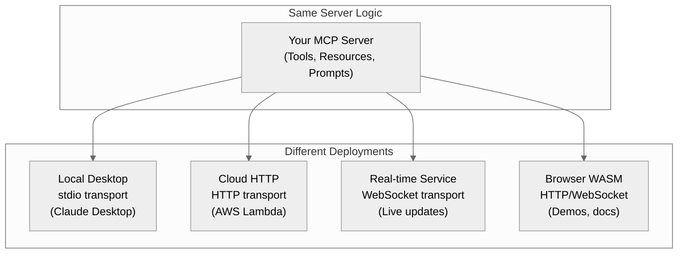
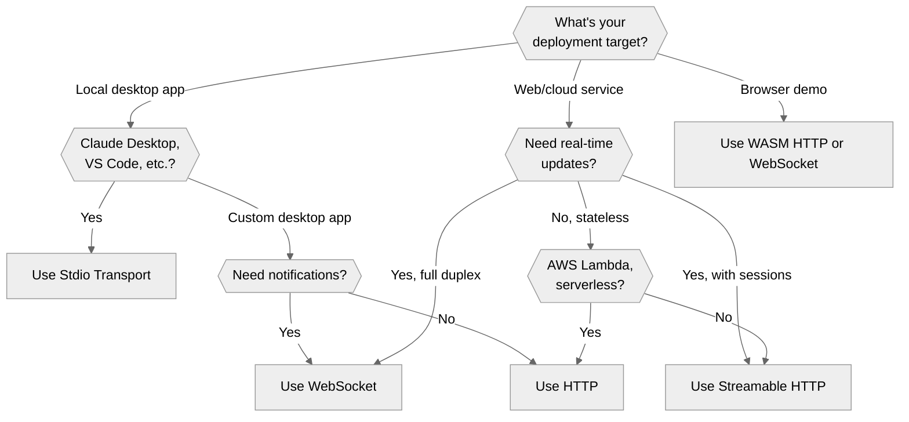

# Chapter 10: Transport Layers — Write Once, Run Anywhere

This chapter introduces the transport layer architecture of MCP—the foundation that enables you to write your server logic once and deploy it across diverse environments without modification. Just as a web application can be deployed behind different web servers (nginx, Apache, Cloudflare), your MCP server can run over different transport mechanisms (stdio, HTTP, WebSocket) without changing a single line of business logic.

## The Power of Transport Abstraction

One of PMCP's most powerful features is its clean separation between **what your server does** (business logic) and **how it communicates** (transport layer).

```rust
use async_trait::async_trait;
use pmcp::{Server, ToolHandler, RequestHandlerExtra, ServerCapabilities};
use pmcp::server::streamable_http_server::StreamableHttpServer;
use serde_json::{json, Value};
use std::net::{Ipv4Addr, SocketAddr};
use std::sync::Arc;
use tokio::sync::Mutex;

// Your business logic - transport-agnostic
struct CalculatorTool;

#[async_trait]
impl ToolHandler for CalculatorTool {
    async fn handle(&self, args: Value, _extra: RequestHandlerExtra) -> pmcp::Result<Value> {
        // This code is identical regardless of transport
        let a = args["a"].as_f64().unwrap();
        let b = args["b"].as_f64().unwrap();
        Ok(json!({ "result": a + b }))
    }
}

// Build your server once
fn build_server() -> pmcp::Result<Server> {
    Server::builder()
        .name("calculator-server")
        .version("1.0.0")
        .tool("calculate", CalculatorTool)
        .capabilities(ServerCapabilities::tools_only())
        .build()
}

// Deploy anywhere - just swap how you run it
async fn deploy_stdio() -> pmcp::Result<()> {
    let server = build_server()?;
    server.run_stdio().await  // stdio transport
}

async fn deploy_http() -> pmcp::Result<()> {
    let server = build_server()?;
    let server = Arc::new(Mutex::new(server));
    let addr = SocketAddr::new(Ipv4Addr::LOCALHOST.into(), 8080);
    let http_server = StreamableHttpServer::new(addr, server);
    http_server.start().await?;
    Ok(())
}

async fn deploy_websocket() -> pmcp::Result<()> {
    // Optional: WebSocket server transport (feature: `websocket`)
    // Typical flow: bind → accept one connection → run with custom transport
    // use pmcp::server::transport::websocket::WebSocketServerTransport;
    // let mut ws = WebSocketServerTransport::default_server();
    // ws.bind().await?;
    // ws.accept().await?;
    // build_server()?.run(ws).await?;
    Ok(())
}
```

This is **write once, run anywhere** in practice. Your `CalculatorTool` works identically whether it's:
- Running locally via stdio for Claude Desktop
- Deployed as an HTTP API for web-based AI agents
- Hosted as a WebSocket service for real-time applications
- Bundled in WASM for browser-based demos

## Why Transport Abstraction Matters

### Client Diversity

Different MCP clients prefer different transport mechanisms:

| Client | Preferred Transport | Why? |
|--------|-------------------|------|
| **Claude Desktop** | stdio | Simple process spawning, secure local execution |
| **Cursor IDE** | HTTP/WebSocket | Network-accessible, works with remote servers |
| **Web-based AI agents** | HTTP/WebSocket | Browser compatibility, CORS support |
| **ChatGPT** | HTTP | RESTful integration, scalable backend |
| **GitHub Copilot** | stdio/HTTP | IDE integration flexibility |
| **Custom enterprise tools** | Any | Depends on infrastructure |

Without transport abstraction, you'd need to maintain separate server implementations for each client type. With PMCP, you write your logic once and support all clients.

### Deployment Flexibility

Your deployment environment often dictates transport choice:



ASCII fallback:
```
              Your MCP Server Logic
             (Tools, Resources, Prompts)
                       |
      +----------------+----------------+----------------+
      |                |                |                |
   stdio       Streamable HTTP    WebSocket (client)   WASM
      |                |                |                |
  Claude         Cloud Platforms    Connect to WS    Browser
  Desktop     (Lambda, Fly.io,        servers         Demos
              Workers, K8s, VPS)
```

## Available Transport Options

PMCP provides several built-in transport implementations, each optimized for specific use cases:

### 1. **Stdio Transport** (Process-based)
- **Best for**: Local desktop applications (Claude Desktop, VS Code extensions)
- **Mechanism**: Standard input/output streams
- **Pros**: Simple, secure, process isolation, no network overhead
- **Cons**: Local-only, one client per process

### 2. **Streamable HTTP** (Flexible HTTP-based transport)
- **Best for**: Cloud deployments, web apps, Cursor IDE, serverless functions, containerized services
- **Mechanism**: HTTP POST for requests, **optional** SSE for server notifications
- **Modes**:
  - **Stateless** (JSON only): No sessions, pure request/response, perfect for serverless (AWS Lambda, Cloudflare Workers, etc.)
  - **Stateful** (JSON + optional SSE): Sessions tracked, SSE for notifications, ideal for long-lived servers
- **Pros**: Extremely flexible, works through firewalls, choose your tradeoffs (stateless vs stateful, JSON vs SSE)
- **Cons**: More configuration options than stdio
- **Note**: PMCP's built-in HTTP server using Axum (feature: `streamable-http`)

### 3. **WebSocket Transport** (Client + optional Server)
- **Best for**: Connecting to existing WebSocket MCP servers
- **Mechanism**: Persistent WebSocket connection with JSON messages
- **Pros**: True bi-directional communication, low latency, efficient
- **Cons**: Firewall issues, connection management complexity
- **Note**: Client transport is available via `WebSocketTransport` (feature: `websocket`). A server transport is also provided as `pmcp::server::transport::websocket::WebSocketServerTransport` (feature: `websocket`) and demonstrated in `examples/27_websocket_server_enhanced.rs`. For production servers, prefer Streamable HTTP.

### 4. **WASM Transports** (Browser-based)
- **Best for**: Browser demos, documentation, client-side tools
- **Mechanism**: Web APIs (fetch, WebSocket) compiled to WebAssembly
- **Pros**: No server required, instant demos, sandboxed security
- **Cons**: Limited capabilities, browser-only
- **Note**: On `wasm32` targets, `Transport` relaxes `Send + Sync` requirements; use `WasmHttpTransport` and `WasmWebSocketTransport`

### Feature Flags

Transport implementations are feature-gated. Enable them in your `Cargo.toml`:

```toml
[dependencies]
pmcp = { version = "1.7", features = ["streamable-http", "http", "websocket"] }

# For minimal stdio-only deployment:
pmcp = { version = "1.7", default-features = false }

# For WebAssembly targets:
pmcp = { version = "1.7", features = ["wasm"] }
```

**Available features:**
- `streamable-http`: Streamable HTTP server (Axum-based) and client transport
- `http`: Base HTTP utilities (included with `streamable-http`)
- `websocket`: WebSocket client transport (crate root) and server transport (`pmcp::server::transport::websocket`), requires `tokio`
- `wasm`: WASM-compatible transports for browser use

## Understanding Streamable HTTP Modes

Streamable HTTP is PMCP's most flexible transport, offering different operational modes for different deployment scenarios:

### Mode 1: Stateless + JSON Response (Serverless-Optimized)

**When to use:**
- AWS Lambda, Cloudflare Workers, Google Cloud Functions, Azure Functions
- Serverless platforms with cold starts and per-request billing
- Auto-scaling environments where sessions can't be maintained
- Simple request/response patterns without server notifications

**How it works:**
```rust
let config = StreamableHttpServerConfig {
    session_id_generator: None,  // ❌ No sessions
    enable_json_response: true,   // ✅ Simple JSON responses
    event_store: None,            // ❌ No event history
    ..Default::default()
};
```

- Client sends HTTP POST → Server responds with JSON → Connection closes
- No state maintained between requests
- No server-initiated notifications
- Minimal memory footprint per request

**Deployment targets:** AWS Lambda, Cloudflare Workers, Google Cloud Functions, Azure Functions, Vercel, Netlify Functions

### Mode 2: Stateful + JSON Response (Session without SSE)

**When to use:**
- Long-lived servers (VPS, EC2, containers) where you want session tracking
- Need to correlate multiple requests from same client
- Don't need server-initiated notifications (client can poll)

**How it works:**
```rust
let config = StreamableHttpServerConfig {
    session_id_generator: Some(Box::new(|| Uuid::new_v4().to_string())),  // ✅ Sessions
    enable_json_response: true,   // ✅ JSON responses
    event_store: Some(...),       // ✅ Track session history
    ..Default::default()
};
```

- Server generates `mcp-session-id` on first request
- Client includes session ID in subsequent requests
- Server maintains session state
- Still uses JSON responses (no SSE)

**Deployment targets:** Docker containers, Kubernetes, Fly.io, Railway, traditional VPS, AWS EC2, Google Compute Engine

### Mode 3: Stateful + SSE (Full Real-Time)

**When to use:**
- Cursor IDE integration (Cursor expects SSE)
- Need server-initiated notifications (progress, logging, resource changes)
- Long-running operations with real-time updates
- WebSocket-like behavior over HTTP

**How it works:**
```rust
let config = StreamableHttpServerConfig {
    session_id_generator: Some(Box::new(|| Uuid::new_v4().to_string())),  // ✅ Sessions
    enable_json_response: false,  // ✅ Use SSE for responses
    event_store: Some(...),       // ✅ Track events for resumption
    ..Default::default()
};
```

- Client sends `Accept: text/event-stream` header
- Server responds with SSE stream for notifications
- Supports resumption via `Last-Event-Id` header
- Full bi-directional communication

**Deployment targets:** Docker, Kubernetes, Fly.io, Railway, VPS, AWS EC2, Google Compute Engine, DigitalOcean, Hetzner, any long-lived server

### Mode Comparison

| Feature | Stateless + JSON | Stateful + JSON | Stateful + SSE |
|---------|------------------|-----------------|----------------|
| **Sessions** | ❌ None | ✅ Tracked | ✅ Tracked |
| **Server Notifications** | ❌ No | ⚠️ Poll only | ✅ Real-time |
| **Memory per client** | ~10KB | ~50KB | ~300KB |
| **Cold start friendly** | ✅ Yes | ⚠️ Loses sessions | ❌ No |
| **Serverless** | ✅ Perfect | ⚠️ Works but loses state | ❌ Not recommended |
| **Cursor IDE** | ⚠️ Limited | ⚠️ Limited | ✅ Full support |
| **Best for** | Lambda, Workers | Containers, VPS | Real-time apps |

## The Transport Trait: Your Interface to Freedom

All transports implement a single, simple trait (`pmcp::Transport`, re-exported from `pmcp::shared::transport`):

```rust
use async_trait::async_trait;
use std::fmt::Debug;

#[async_trait]
pub trait Transport: Send + Sync + Debug {
    /// Send a message over the transport
    async fn send(&mut self, message: TransportMessage) -> Result<()>;

    /// Receive a message from the transport
    async fn receive(&mut self) -> Result<TransportMessage>;

    /// Close the transport
    async fn close(&mut self) -> Result<()>;

    /// Check if still connected
    fn is_connected(&self) -> bool { true }

    /// Get transport type for debugging
    fn transport_type(&self) -> &'static str { "unknown" }
}
```

This trait is **all you need** to make your server work with any communication mechanism. The server core only knows about this interface—it doesn't care if messages travel over stdin, HTTP, WebSocket, or carrier pigeon.

**Note**: For WASM targets, the trait relaxes `Send + Sync` requirements since Web APIs are single-threaded.

## Transport Messages: The Universal Currency

All transports exchange the same message types (`pmcp::shared::TransportMessage`):

```rust
use pmcp::shared::TransportMessage;
use pmcp::types::{RequestId, Request, JSONRPCResponse, Notification};

pub enum TransportMessage {
    /// Client request (initialize, tools/call, etc.)
    Request {
        id: RequestId,
        request: Request,
    },

    /// Server response
    Response(JSONRPCResponse),

    /// Server notification (progress, logging, etc.)
    Notification(Notification),
}
```

Whether you're using stdio or HTTP, your server sends and receives the same `TransportMessage` variants. The transport handles the serialization details:
- **stdio**: Line-delimited JSON on stdin/stdout
- **Streamable HTTP**: JSON in HTTP POST body, SSE for server messages
- **WebSocket**: JSON text frames (currently; binary frames not yet implemented)

## Choosing the Right Transport

Use this decision tree to select your transport:



ASCII fallback:
```
Deployment Target?
├─ Local Desktop → Claude Desktop/VS Code → Stdio
│                → Custom app with notifications → WebSocket
│                → Custom app without notifications → HTTP
│
├─ Web/Cloud → Need real-time? → Yes + sessions → Streamable HTTP
│                               → Yes + full duplex → WebSocket
│                               → No → Serverless? → Yes → HTTP
│                                                  → No → Streamable HTTP
│
└─ Browser Demo → WASM HTTP or WebSocket
```

### Quick Selection Guide

| Scenario | Recommended Transport | Mode | Why? |
|----------|----------------------|------|------|
| **Claude Desktop** | Stdio | N/A | Native support, simplest setup |
| **Cursor IDE** | Streamable HTTP | Stateful + SSE | Cursor expects SSE for notifications |
| **AWS Lambda** | Streamable HTTP | Stateless + JSON | No sessions, cold-start friendly |
| **Cloudflare Workers** | Streamable HTTP | Stateless + JSON | Serverless edge, no state |
| **Google Cloud Functions** | Streamable HTTP | Stateless + JSON | Serverless, auto-scaling |
| **Docker/Kubernetes** | Streamable HTTP | Stateful + JSON or SSE | Long-lived, sessions work |
| **Fly.io / Railway** | Streamable HTTP | Stateful + SSE | Persistent servers, real-time |
| **Traditional VPS** | Streamable HTTP | Stateful + SSE | Full control, long-lived |
| **Browser demo** | WASM + Streamable HTTP | Client-side | No backend required |
| **Enterprise proxy** | Streamable HTTP | Any mode | Firewall-friendly HTTPS |
| **Connect to WS server** | WebSocket (client) | N/A | Full-duplex communication |
| **Multi-tenant SaaS** | Streamable HTTP | Stateful + SSE | Session isolation, notifications |

## Transport Architecture Deep Dive

### Separation of Concerns

PMCP maintains strict layering:

```
┌─────────────────────────────────────┐
│   Your Application Logic            │
│   (Tools, Resources, Prompts)       │ ← Transport-agnostic
├─────────────────────────────────────┤
│   MCP Server Core                   │
│   (Protocol, Routing, State)        │ ← Transport-agnostic
├─────────────────────────────────────┤
│   Transport Trait                   │
│   (send, receive, close)            │ ← Universal interface
├─────────────────────────────────────┤
│   Transport Implementation          │
│   (Stdio/HTTP/WebSocket/etc.)       │ ← Environment-specific
└─────────────────────────────────────┘
```

Your code at the top two layers **never changes**. Only the bottom layer changes based on deployment.

### Message Flow Example

Here's how a tool call flows through different transports:

**Stdio Transport:**
```
Client (Claude Desktop)
  ↓ spawns process
Server Process
  ↓ reads stdin (line-delimited JSON)
Transport receives: {"jsonrpc":"2.0","method":"tools/call",...}
  ↓ deserializes to TransportMessage::Request
Server Core
  ↓ routes to tool handler
Your CalculatorTool.handle()
  ↓ returns result
Server Core
  ↓ creates TransportMessage::Response
Transport
  ↓ writes to stdout (JSON + newline)
Client receives result
```

**Streamable HTTP Transport:**
```
Client (Cursor IDE, Web browser)
  ↓ HTTP POST to /
Streamable HTTP Server (Axum)
  ↓ reads request body (JSON-RPC)
  ↓ checks Accept header, mcp-protocol-version
Transport receives: {"jsonrpc":"2.0","method":"tools/call",...}
  ↓ deserializes to TransportMessage::Request
Server Core
  ↓ routes to tool handler
Your CalculatorTool.handle()  ← SAME CODE
  ↓ returns result
Server Core
  ↓ creates TransportMessage::Response
Transport
  ↓ HTTP 200 response with JSON body (or SSE if Accept: text/event-stream)
  ↓ includes mcp-session-id header if stateful
Client receives result
```

Notice: **Your tool handler code is identical.** The transport handles all the I/O details.

## Supporting Multiple Transports Simultaneously

Many production deployments support multiple transports at once:

```rust
use pmcp::{Server, ServerCapabilities};
use pmcp::server::streamable_http_server::StreamableHttpServer;
use std::net::SocketAddr;
use std::sync::Arc;
use tokio::sync::Mutex;
use tracing::info;

#[tokio::main]
async fn main() -> pmcp::Result<()> {
    // Create shared server capabilities
    let capabilities = ServerCapabilities::tools_only();

    // Spawn stdio server for Claude Desktop
    tokio::spawn(async {
        let stdio_server = Server::builder()
            .name("calculator-server")
            .version("1.0.0")
            .capabilities(capabilities.clone())
            .tool("calculator", CalculatorTool)
            .build()
            .expect("Failed to build stdio server");

        stdio_server.run_stdio().await.expect("Stdio server failed");
    });

    // Spawn HTTP server for web clients
    let http_server = Server::builder()
        .name("calculator-server")
        .version("1.0.0")
        .capabilities(capabilities)
        .tool("calculator", CalculatorTool)
        .build()?;

    let http_server = Arc::new(Mutex::new(http_server));
    let addr = SocketAddr::from(([0, 0, 0, 0], 8080));
    let streamable = StreamableHttpServer::new(addr, http_server);

    info!("Starting HTTP server on {}", addr);
    streamable.start().await?;

    // All transports use the same CalculatorTool implementation!
    Ok(())
}
```

This pattern enables:
- **Local development** via stdio
- **Production deployment** via Streamable HTTP
- **Testing** via any transport
- **Gradual migration** from one transport to another

## Transport Configuration

Each transport has specific configuration needs:

### Stdio Transport - Server Side
```rust
use pmcp::{Server, ServerCapabilities};

// Minimal - just build and run
let server = Server::builder()
    .name("my-server")
    .version("1.0.0")
    .tool("my_tool", MyTool)
    .capabilities(ServerCapabilities::tools_only())
    .build()?;

server.run_stdio().await?;  // Reads stdin, writes stdout
```

### Streamable HTTP Server Configuration
```rust
use pmcp::{Server, ServerCapabilities};
use pmcp::server::streamable_http_server::{StreamableHttpServer, StreamableHttpServerConfig};
use std::net::SocketAddr;
use std::sync::Arc;
use tokio::sync::Mutex;

let server = Server::builder()
    .name("http-server")
    .version("1.0.0")
    .capabilities(ServerCapabilities::tools_only())
    .build()?;

let server = Arc::new(Mutex::new(server));
let addr = SocketAddr::from(([0, 0, 0, 0], 8080));

// Stateful mode (default) - sessions tracked
let http_server = StreamableHttpServer::new(addr, server.clone());

// Or configure for stateless mode (serverless-friendly)
let config = StreamableHttpServerConfig {
    session_id_generator: None,  // Stateless
    enable_json_response: false,  // Use SSE
    event_store: None,
    on_session_initialized: None,
    on_session_closed: None,
};
let http_server = StreamableHttpServer::with_config(addr, server, config);

let (bound_addr, handle) = http_server.start().await?;
```

**Streamable HTTP Protocol Details:**

The Streamable HTTP server enforces MCP-specific headers:

- **`mcp-protocol-version`**: Protocol version header (e.g., `2024-11-05`)
- **`mcp-session-id`**: Session identifier (stateful mode only)
- **`Accept`**: Must include `application/json` or `text/event-stream`
  - `Accept: application/json` → Simple JSON responses
  - `Accept: text/event-stream` → Server-Sent Events for notifications
- **`Last-Event-Id`**: For SSE resumption after reconnection

**Full working examples:**
- `examples/22_streamable_http_server_stateful.rs` - Session management, SSE notifications
- `examples/23_streamable_http_server_stateless.rs` - Serverless-friendly, no sessions
- `examples/24_streamable_http_client.rs` - Client connecting to both modes

### WebSocket Transport - Client Side
```rust
use pmcp::{Client, ClientCapabilities, WebSocketTransport, WebSocketConfig};
use std::time::Duration;
use url::Url;

let config = WebSocketConfig {
    url: Url::parse("ws://localhost:3000/mcp")?,
    auto_reconnect: true,
    reconnect_delay: Duration::from_secs(1),
    max_reconnect_delay: Duration::from_secs(30),
    max_reconnect_attempts: Some(5),
    ping_interval: Some(Duration::from_secs(30)),
    request_timeout: Duration::from_secs(30),
};

let transport = WebSocketTransport::new(config);
transport.connect().await?;  // Must connect before using

let mut client = Client::new(transport);
client.initialize(ClientCapabilities::minimal()).await?;
```

### Streamable HTTP Transport - Client Side
```rust
use pmcp::shared::streamable_http::{StreamableHttpTransport, StreamableHttpTransportConfig};
use url::Url;

let config = StreamableHttpTransportConfig {
    url: Url::parse("http://localhost:8080")?,
    extra_headers: vec![],
    auth_provider: None,
    session_id: None,
    enable_json_response: true,
    on_resumption_token: None,
};

let transport = StreamableHttpTransport::new(config);
let mut client = Client::new(transport);
```

## Transport Characteristics Comparison

| Feature | Stdio | Streamable HTTP | WebSocket (client) |
|---------|-------|----------------|-------------------|
| **Setup Complexity** | Trivial | Medium | Medium |
| **Latency** | Lowest | Low | Lowest |
| **Server Notifications** | Full | SSE streams | Full |
| **State Management** | Per-process | Optional sessions | Connection-based |
| **Firewall Friendly** | N/A | ✅ Yes | ⚠️ Sometimes |
| **Scalability** | 1:1 process | Horizontal/session-aware | Connection pools |
| **Browser Support** | ❌ No | ✅ Yes | ✅ Yes |
| **Message Format** | Line-delimited JSON | JSON + SSE | JSON text frames |
| **Connection Persistence** | Process lifetime | Session-scoped | Persistent |
| **Server Implementation** | Built-in | Built-in (Axum) | Client-only |
| **Best for** | Local desktop apps | Cursor IDE, web apps, cloud | Connecting to WS servers |

## Real-World Deployment Patterns

### Pattern 1: Local-First with Cloud Fallback (Client)
```rust
use pmcp::shared::streamable_http::{StreamableHttpTransport, StreamableHttpTransportConfig};

// Try connecting to local server first, fallback to cloud
let transport = if is_local_server_available().await {
    // Local stdio server via another process (requires process spawning)
    create_stdio_client_transport()
} else {
    // Cloud HTTP server
    let config = StreamableHttpTransportConfig {
        url: Url::parse("https://api.example.com/mcp")?,
        ..Default::default()
    };
    StreamableHttpTransport::new(config)
};

let mut client = Client::new(transport);
```

### Pattern 2: Multi-Transport Server
```rust
use pmcp::{Server, ServerCapabilities};
use pmcp::server::streamable_http_server::StreamableHttpServer;
use std::net::SocketAddr;
use std::sync::Arc;
use tokio::sync::Mutex;

// Serve same MCP server logic on multiple transports simultaneously
#[tokio::main]
async fn main() -> pmcp::Result<()> {
    // Build server once
    let capabilities = ServerCapabilities::tools_only();

    // Stdio server for local Claude Desktop
    let stdio_server = Server::builder()
        .name("multi-transport-server")
        .version("1.0.0")
        .capabilities(capabilities.clone())
        .tool("my_tool", MyTool)
        .build()?;

    tokio::spawn(async move {
        stdio_server.run_stdio().await
    });

    // HTTP server for remote clients
    let http_server = Server::builder()
        .name("multi-transport-server")
        .version("1.0.0")
        .capabilities(capabilities)
        .tool("my_tool", MyTool)
        .build()?;

    let http_server = Arc::new(Mutex::new(http_server));
    let addr = SocketAddr::from(([0, 0, 0, 0], 8080));
    let streamable = StreamableHttpServer::new(addr, http_server);
    streamable.start().await?;

    Ok(())
}
```

### Pattern 3: Multi-Platform Deployment (Same Code, Different Modes)

**AWS Lambda (Stateless)**
```rust
use pmcp::server::streamable_http_server::{StreamableHttpServer, StreamableHttpServerConfig};

// Serverless: No sessions, pure request/response
let config = StreamableHttpServerConfig {
    session_id_generator: None,      // Stateless
    enable_json_response: true,      // JSON only
    event_store: None,               // No event history
    on_session_initialized: None,
    on_session_closed: None,
};

let server = build_my_server()?;  // Same server logic
let http_server = StreamableHttpServer::with_config(addr, Arc::new(Mutex::new(server)), config);
```

**Fly.io / Railway (Stateful + SSE)**
```rust
// Long-lived servers: Sessions + real-time notifications
let config = StreamableHttpServerConfig::default();  // Uses default (stateful + SSE)

let server = build_my_server()?;  // Same server logic
let http_server = StreamableHttpServer::new(addr, Arc::new(Mutex::new(server)));
```

**Docker / Kubernetes (Stateful + JSON)**
```rust
// Containers: Session tracking without SSE overhead
let config = StreamableHttpServerConfig {
    session_id_generator: Some(Box::new(|| Uuid::new_v4().to_string())),
    enable_json_response: true,      // JSON responses
    event_store: Some(Arc::new(InMemoryEventStore::default())),
    ..Default::default()
};

let server = build_my_server()?;  // Same server logic
let http_server = StreamableHttpServer::with_config(addr, Arc::new(Mutex::new(server)), config);
```

**Key insight:** Same `build_my_server()` function, different deployment configs!

### Pattern 4: Hybrid Architecture
```rust
// Different transports for different trust levels
match tool_trust_level(tool_name) {
    TrustLevel::Trusted => {
        // Call tool on local stdio server (more secure)
        local_stdio_client.call_tool(tool_name, args).await
    }
    TrustLevel::Untrusted => {
        // Call tool on sandboxed HTTP server (isolated)
        remote_http_client.call_tool(tool_name, args).await
    }
}
```

## When to Create Custom Transports

Most developers will use the built-in transports, but you might create a custom transport for:

- **Custom protocols**: gRPC, QUIC, MQTT
- **Hardware integration**: Serial ports, USB, Bluetooth
- **Message queues**: RabbitMQ, Kafka, SQS
- **IPC mechanisms**: Named pipes, domain sockets
- **Exotic environments**: Embedded systems, IoT devices

Custom transports are covered in Chapter 23. For now, know that if you can implement `async fn send()` and `async fn receive()`, you can add any transport mechanism to PMCP.

## Performance Considerations

Transport choice affects performance:

### Latency Rankings (Typical)
1. **Stdio**: ~0.1ms (local IPC, no network)
2. **WebSocket (client)**: ~1-5ms (persistent connection, JSON text frames)
3. **Streamable HTTP**: ~2-10ms (HTTP POST + SSE)

### Throughput Rankings (Messages/sec)
1. **Stdio**: 5,000+ (line-buffered, local IPC)
2. **WebSocket (client)**: 3,000+ (persistent, JSON text)
3. **Streamable HTTP**: 1,000+ (HTTP overhead, optional sessions)

### Memory Rankings (Per Connection)
1. **Stdio**: ~100KB (process isolation, stdio buffers)
2. **Streamable HTTP (stateless)**: ~50KB (no session state)
3. **WebSocket (client)**: ~200KB (frame buffers, reconnection logic)
4. **Streamable HTTP (stateful)**: ~300KB (session state + SSE event store)

Choose based on your bottleneck:
- **Latency-critical** → stdio or WebSocket client
- **Scale-critical** → Streamable HTTP (stateless mode)
- **Balanced** → Streamable HTTP (stateful mode)

## Testing Across Transports

Write tests that work with any transport:

```rust
#[cfg(test)]
mod tests {
    // Generic test that works with any transport
    async fn test_calculator_with_transport<T: Transport>(
        transport: T
    ) -> Result<()> {
        let mut client = Client::new(transport);

        let result = client.call_tool("calculator", json!({
            "operation": "add",
            "a": 5,
            "b": 3
        })).await?;

        assert_eq!(result["result"], 8);
        Ok(())
    }

    #[tokio::test]
    async fn test_stdio() {
        test_calculator_with_transport(StdioTransport::new()).await.unwrap();
    }

    #[tokio::test]
    async fn test_http() {
        test_calculator_with_transport(HttpTransport::new()).await.unwrap();
    }

    #[tokio::test]
    async fn test_websocket() {
        test_calculator_with_transport(WebSocketTransport::new()).await.unwrap();
    }
}
```

This ensures your server works correctly regardless of transport.

## Migration Between Transports

Changing transports requires minimal code changes—just how you run the server:

```rust
use pmcp::{Server, ServerCapabilities};
use pmcp::server::streamable_http_server::StreamableHttpServer;
use std::net::SocketAddr;
use std::sync::Arc;
use tokio::sync::Mutex;

// Server logic is identical in both cases
let server = Server::builder()
    .name("my-server")
    .version("1.0.0")
    .tool("my_tool", MyTool)
    .capabilities(ServerCapabilities::tools_only())
    .build()?;

// Before: stdio deployment
server.run_stdio().await?;

// After: HTTP deployment (SAME SERVER LOGIC)
let server = Arc::new(Mutex::new(server));
let addr = SocketAddr::from(([0, 0, 0, 0], 8080));
let http_server = StreamableHttpServer::new(addr, server);
http_server.start().await?;

// Your tool implementations don't change at all!
```

This enables:
- **Development → Production migration**: Stdio locally, HTTP in production
- **A/B testing**: Run same server on multiple transports simultaneously
- **Gradual rollout**: Migrate users from stdio to HTTP incrementally
- **Disaster recovery**: Switch transports if one fails

## What's Next

This chapter introduced the transport layer philosophy and compared the available options. The following chapters dive deep into each transport implementation:

- **Chapter 10.1 - WebSocket Transport**: Client-side WebSocket connections, auto-reconnection, real-time communication
- **Chapter 10.2 - HTTP Transport**: Understanding the base HTTP protocol layer
- **Chapter 10.3 - Streamable HTTP**: Server-side implementation using Axum, SSE for notifications, session management, Cursor IDE compatibility

Each detailed chapter includes:
- Configuration options and best practices
- Production deployment examples (including AWS Lambda, Docker, Kubernetes)
- Performance tuning guides
- Security considerations (CORS, authentication, rate limiting)
- Troubleshooting common issues
- Complete working examples

## Key Takeaways

✅ **Transport abstraction is PMCP's superpower** — write once, deploy anywhere

✅ **Your server logic never changes** — only the transport configuration changes

✅ **Streamable HTTP has three modes** — Stateless (serverless), Stateful + JSON (containers), Stateful + SSE (real-time)

✅ **Deploy to any platform** — AWS Lambda, Cloudflare Workers, Google Cloud Functions, Fly.io, Railway, Docker, Kubernetes, VPS, or traditional servers

✅ **Choose mode based on deployment** — Serverless = stateless, Containers = stateful, Cursor IDE = SSE

✅ **Support multiple transports simultaneously** — stdio for local + Streamable HTTP for cloud

✅ **Test across all transports** — ensures compatibility everywhere

✅ **Migration is configuration** — Same code, different `StreamableHttpServerConfig`

The transport layer is the foundation that makes MCP truly universal. By abstracting away communication details, PMCP lets you focus on building powerful tools, resources, and prompts—confident that they'll work everywhere your users need them.

In the next chapter, we'll explore WebSocket transport in depth, covering client-side WebSocket connections for connecting to existing MCP servers with auto-reconnection, ping/pong heartbeats, and error recovery strategies.
