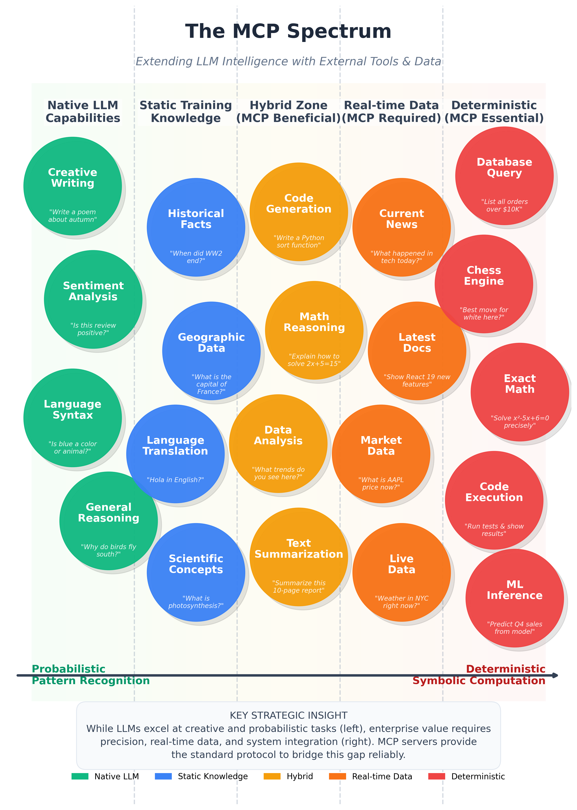

# The AI Integration Problem

## The Fundamental Disconnect

Large Language Models are remarkable at reasoning, summarizing, and generating content. But they have a critical limitation: **they can only work with what's in their context window**.

Your enterprise data lives in:
- Relational databases (PostgreSQL, MySQL, SQL Server)
- Data warehouses (Snowflake, BigQuery, Redshift)
- SaaS platforms (Salesforce, HubSpot, Workday)
- Internal APIs and microservices
- Document stores and file systems
- Real-time event streams

None of this is visible to an LLM by default.

## Statistical Models vs. Symbolic Computation

To understand why this matters, we need to distinguish between what LLMs do well and what they don't.

### What LLMs Excel At

LLMs are **statistical models** trained on vast amounts of text. They excel at:

- **Pattern recognition**: Understanding intent from natural language
- **Synthesis**: Combining information into coherent narratives
- **Translation**: Converting between formats, languages, and styles
- **Reasoning**: Following logical chains (with limitations)

When you ask "What were our Q3 sales?", the LLM perfectly understands your intent.

### What LLMs Cannot Do

LLMs cannot perform **symbolic computation**—precise operations on structured data:

- Query a database
- Call an API with exact parameters
- Perform arithmetic on large numbers
- Access real-time information
- Execute business logic

When the LLM understands you want Q3 sales, it has no way to fetch that data.

### The AI Capability Spectrum

The diagram below illustrates the full spectrum of AI tasks, from probabilistic pattern recognition (where LLMs excel natively) to deterministic symbolic computation (where external tools are essential).



On the **left side**, tasks like creative writing, sentiment analysis, and language translation are native LLM strengths—probabilistic pattern matching on training data. Moving toward the **center**, tasks like code generation and data analysis benefit from MCP augmentation but can partially work with LLM reasoning alone.

On the **right side**, tasks become impossible without external tools: database queries require actual database connections, real-time data needs live APIs, and exact math demands calculators. These deterministic tasks are where MCP servers become essential.

**The key insight**: Enterprise value increasingly lives on the right side of this spectrum. While LLMs excel at creative and probabilistic tasks, business operations require precision, real-time data, and system integration—exactly what MCP provides.

## The Integration Gap

This creates a fundamental gap:

```
┌─────────────────────────────────────────────────────────────────┐
│                                                                 │
│   Human Intent          LLM Understanding         Actual Data   │
│   ─────────────         ─────────────────         ───────────   │
│                                                                 │
│   "What were our   ───▶  Understands the    ───▶  ??? No way    │
│    Q3 sales by           question perfectly       to access     │
│    region?"                                       Salesforce    │
│                                                                 │
└─────────────────────────────────────────────────────────────────┘
```

The human has to bridge this gap manually—the copy-paste tax we discussed.

## Why This Problem Is Getting Worse

### Data Volume Is Exploding

Enterprise data doubles every 2-3 years. The gap between "what AI could analyze" and "what AI can access" widens continuously.

### AI Expectations Are Rising

After seeing demos of AI assistants that seem capable of anything, users expect the same from enterprise tools. The reality disappoints.

### Security Requirements Are Tightening

Simply pasting data into AI tools violates:
- Data residency requirements (GDPR, CCPA)
- Industry regulations (HIPAA, SOC2, PCI-DSS)
- Internal security policies
- Audit and compliance requirements

The manual workaround isn't just inefficient—it's increasingly illegal.

### Multi-System Workflows Are Common

Real business questions rarely involve a single system:

> "Which customers with open support tickets have contracts expiring this quarter?"

This requires:
1. Query the ticketing system (Zendesk/Jira)
2. Query the CRM (Salesforce)
3. Query the contract database
4. Join and analyze the results

No amount of copy-paste makes this efficient.

## The Cost of Manual Integration

Let's quantify the problem for a typical enterprise:

### Direct Costs

| Activity | Time per Instance | Frequency | Annual Cost (at $75/hr) |
|----------|------------------|-----------|------------------------|
| Copy-paste data into AI | 5 minutes | 10x/day/employee | $15,625/employee |
| Re-run queries for context | 10 minutes | 5x/day/employee | $15,625/employee |
| Fix errors from manual transfer | 15 minutes | 2x/day/employee | $9,375/employee |
| **Total per employee** | | | **$40,625/year** |

For a 1,000-person knowledge workforce: **$40 million annually**.

### Indirect Costs

- **Inconsistent answers**: Different employees get different results for the same question
- **Stale data**: By the time it's pasted, it may be outdated
- **Security incidents**: Sensitive data exposed through AI chat logs
- **Compliance violations**: Audit failures, potential fines
- **Missed opportunities**: Questions not asked because the process is too painful

## What's Needed: A Bridge

The solution requires a **programmatic bridge** between:
- Natural language understanding (what the LLM does)
- Precise data operations (what enterprise systems do)

This bridge must be:

| Requirement | Why |
|-------------|-----|
| **Secure** | Enterprise data requires authentication, authorization, audit |
| **Structured** | AI needs to know what operations are available and how to call them |
| **Reliable** | Business processes can't depend on flaky integrations |
| **Discoverable** | AI should find relevant tools without human guidance |
| **Composable** | Complex workflows require multiple operations |

This is exactly what the Model Context Protocol provides.

## Preview: How MCP Solves This

MCP creates a standard interface between AI assistants and external systems:

```
┌─────────────┐     ┌─────────────┐     ┌─────────────┐
│             │     │             │     │             │
│     AI      │────▶│    MCP      │────▶│  Enterprise │
│  Assistant  │     │   Server    │     │   System    │
│             │◀────│             │◀────│             │
│  (Claude,   │     │  (Your      │     │  (Database, │
│   Copilot)  │     │   Code)     │     │   API, etc) │
│             │     │             │     │             │
└─────────────┘     └─────────────┘     └─────────────┘
     │                    │                    │
     │   "Get Q3 sales"   │                    │
     │───────────────────▶│                    │
     │                    │  SELECT sum(...)   │
     │                    │───────────────────▶│
     │                    │                    │
     │                    │◀───────────────────│
     │   Structured data  │   Query results    │
     │◀───────────────────│                    │
```

The AI assistant:
1. Discovers available tools from the MCP server
2. Decides which tool to call based on the user's question
3. Calls the tool with appropriate parameters
4. Receives structured results
5. Synthesizes a response for the user

The human never touches raw data. The AI never accesses systems directly. The MCP server mediates every interaction with full security and audit capability.

### Enterprise Authentication Flow

In enterprise deployments, security is paramount. MCP supports OAuth 2.0 authentication, enabling the AI assistant to act on behalf of the authenticated user:

```
┌─────────────┐     ┌─────────────┐     ┌─────────────┐     ┌─────────────┐
│             │     │             │     │             │     │             │
│    User     │     │     AI      │     │    MCP      │     │  Enterprise │
│             │     │  Assistant  │     │   Server    │     │   System    │
│             │     │             │     │             │     │             │
└──────┬──────┘     └──────┬──────┘     └──────┬──────┘     └──────┬──────┘
       │                   │                   │                   │
       │  1. Authenticate  │                   │                   │
       │   (OAuth/SSO)     │                   │                   │
       │──────────────────▶│                   │                   │
       │                   │                   │                   │
       │  2. Access Token  │                   │                   │
       │◀──────────────────│                   │                   │
       │                   │                   │                   │
       │  3. "Get Q3 sales"│                   │                   │
       │──────────────────▶│                   │                   │
       │                   │                   │                   │
       │                   │  4. Tool call +   │                   │
       │                   │     Access Token  │                   │
       │                   │──────────────────▶│                   │
       │                   │                   │                   │
       │                   │                   │  5. Validate      │
       │                   │                   │     token &       │
       │                   │                   │     check perms   │
       │                   │                   │                   │
       │                   │                   │  6. Query with    │
       │                   │                   │     user context  │
       │                   │                   │──────────────────▶│
       │                   │                   │                   │
       │                   │                   │◀──────────────────│
       │                   │                   │  7. Results       │
       │                   │  8. Structured    │     (filtered by  │
       │                   │     response      │      user perms)  │
       │                   │◀──────────────────│                   │
       │                   │                   │                   │
       │  9. AI-generated  │                   │                   │
       │     answer        │                   │                   │
       │◀──────────────────│                   │                   │
```

This flow ensures:

| Security Property | How It's Achieved |
|-------------------|-------------------|
| **Identity verification** | User authenticates via corporate IdP (Cognito, Okta, Entra ID) |
| **Delegated access** | AI acts with user's permissions, not elevated privileges |
| **Data filtering** | Enterprise system returns only data the user can see |
| **Audit trail** | Every request is logged with user identity and timestamp |
| **Token expiration** | Short-lived tokens limit exposure window |
| **Scope limitation** | Tokens specify exactly which operations are permitted |

The user sees a seamless AI experience. Behind the scenes, every interaction is authenticated, authorized, and auditable—meeting the strictest enterprise compliance requirements.

---

*But MCP isn't the only approach to AI integration. In the next section, we'll compare it to alternatives and explain why MCP is the right choice for enterprise.*

*Continue to [Why MCP Over Alternatives](./ch01-02-why-mcp.md) →*
