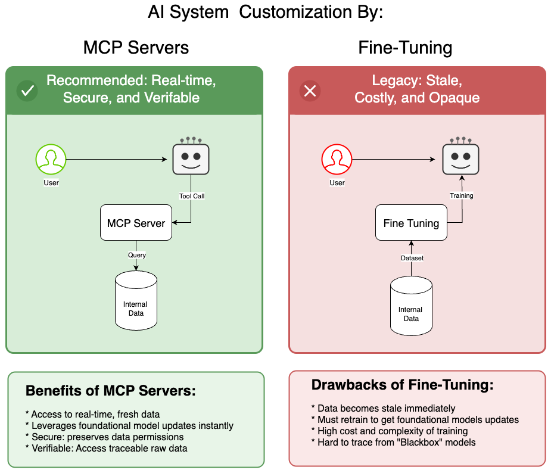

# Why MCP Over Alternatives

Before MCP, organizations tried several approaches to connect AI with enterprise data. Each has significant drawbacks that MCP addresses.

## Alternative 1: Fine-Tuning LLMs

> "What's the best way to personalize AI to understand my business data?"
> "Fine-tune the model on our data."

This was the conventional wisdom—and it's wrong for most use cases.

### Why Fine-Tuning Made Sense (Historically)

Early LLMs performed poorly on domain-specific language. Terms have different meanings in different contexts:

| Term | General Meaning | Domain-Specific Meaning |
|------|-----------------|------------------------|
| **Consideration** | Thoughtful attention | Something of value exchanged that makes a contract legally binding (Legal) |
| **Discharge** | To release or let go | Release of a patient from hospital care, or fluid emitted from the body (Medical) |
| **Margin** | The edge of something | Difference between cost and selling price, or collateral for trading (Financial) |

Fine-tuning taught models this specialized vocabulary.

### Why Fine-Tuning Is No Longer The Answer

**1. Foundation models have caught up**

Modern LLMs (GPT-5, Claude Sonnet/Opus 4.7, Gemini 3) are trained extensively on healthcare, financial, and legal domains. The vocabulary problem is largely solved.

**2. Fine-tuning doesn't give access to your data**

Even a fine-tuned model can't answer "What were our Q3 sales?" It learned patterns from training data—it didn't learn to query your Salesforce instance. Fine-tuning teaches *language*, not *data access*.

**3. Models change faster than you can fine-tune**

By the time you've fine-tuned GPT-4, GPT-5 is out. Your investment is frozen in an outdated base model. With MCP, you switch foundation models without changing your integration code.

**4. Fine-tuning requires rare expertise**

Fine-tuning requires experienced ML engineers and data scientists. MCP servers are standard software engineering—skills every organization already has.

**5. Data leakage risks**

Fine-tuning on sensitive data risks that data appearing in model outputs. A secret project name might suddenly surface in responses. MCP servers query data at runtime with proper access controls—nothing is baked into the model.

**6. No audit trail**

When a fine-tuned model produces an answer, you can't trace where it came from. MCP calls are fully logged: which tool, which parameters, which user, when.

The following diagram summarizes the fundamental architectural difference between the two approaches:



With MCP servers (left), the AI queries live data through tool calls, preserving security and traceability. With fine-tuning (right), data is baked into the model during training—immediately becoming stale and impossible to trace.

### The Verdict on Fine-Tuning

Fine-tuning still has niche applications—specialized vocabulary in narrow domains where foundation models underperform. But for connecting AI to enterprise data? It's the wrong tool entirely.

## Alternative 2: Retrieval-Augmented Generation (RAG)

RAG improves on fine-tuning by retrieving relevant documents at query time rather than baking knowledge into the model.

### How RAG Works

```
┌──────────────┐     ┌──────────────┐     ┌──────────────┐
│              │     │              │     │              │
│  User Query  │────▶│   Vector     │────▶│  Retrieve    │
│              │     │   Search     │     │  Documents   │
│              │     │              │     │              │
└──────────────┘     └──────────────┘     └──────────────┘
                                                 │
                                                 ▼
┌──────────────┐     ┌──────────────┐     ┌──────────────┐
│              │     │              │     │              │
│   Response   │◀────│     LLM      │◀────│  Augmented   │
│              │     │              │     │   Prompt     │
│              │     │              │     │              │
└──────────────┘     └──────────────┘     └──────────────┘
```

### Where RAG Falls Short

**1. Documents aren't data**

RAG retrieves text chunks. It can't execute `SELECT SUM(revenue) FROM sales WHERE quarter='Q3'`. Enterprise questions often require computation, not document retrieval.

**2. Semantic search isn't always the right retrieval**

"What were our Q3 sales by region?" doesn't need semantically similar documents. It needs a specific database query. RAG retrieves based on meaning; business queries often need exact matches.

**3. No actions, only reading**

RAG can read documents. It can't create a ticket, send an email, or update a record. MCP supports both read operations (Resources) and write operations (Tools).

**4. Context window limits**

RAG stuffs retrieved documents into the prompt. With limited context windows, you can only include so much. MCP returns structured data—compact and precise.

**5. Stale embeddings**

Vector databases need re-indexing when source documents change. MCP queries live data every time.

### When RAG Makes Sense

RAG excels for knowledge bases, documentation search, and Q&A over static document collections. It complements MCP—use RAG for unstructured knowledge, MCP for structured data and actions.

## Alternative 3: Hand-Written Agent Code

Many teams build custom agents with API calls embedded directly in agent code:

```python
# The "hand-written agent" anti-pattern
class SalesAgent:
    def __init__(self):
        self.salesforce_client = SalesforceAPI(...)
        self.jira_client = JiraAPI(...)
        self.slack_client = SlackAPI(...)
    
    def handle_query(self, user_query: str):
        # LLM decides what to do
        intent = self.llm.classify(user_query)
        
        if intent == "sales_query":
            # Hard-coded API integration
            data = self.salesforce_client.query(...)
            return self.llm.summarize(data)
        
        elif intent == "create_ticket":
            # Another hard-coded integration
            self.jira_client.create_issue(...)
        
        # ... dozens more elif branches
```

This approach seems pragmatic but creates significant problems at scale.

### Problems with Hand-Written Agents

**1. Tight coupling**

The agent code is tightly bound to specific APIs. Changing from Salesforce to HubSpot requires rewriting the agent, not just swapping a connector.

**2. No discoverability**

The LLM can only use tools the developer anticipated. MCP servers advertise their capabilities—the LLM discovers available tools dynamically.

**3. No reusability**

Every team builds their own Salesforce integration. With MCP, one server serves all AI applications in the organization.

**4. Authentication nightmare**

Each integration handles auth differently. OAuth flows, API keys, and token refresh logic scattered throughout agent code. MCP centralizes authentication at the server level.

**5. No standard testing**

How do you test that the agent correctly calls the Jira API? With MCP, standard tools (MCP Inspector, mcp-tester) validate any server.

**6. Vendor lock-in**

An agent built for ChatGPT's function calling won't work with Claude. MCP is an open standard—build once, connect to any compliant client.

**7. Scaling challenges**

Hand-written agents run in a single process. MCP servers can be deployed independently—scale the Salesforce server without touching the Jira server.

### The Maintenance Burden

Consider maintaining 20 API integrations across 5 different AI applications:

| Approach | Integration Points | Maintenance Burden |
|----------|-------------------|-------------------|
| Hand-written agents | 20 × 5 = 100 | Every app maintains every integration |
| MCP servers | 20 + 5 = 25 | Each server maintained once, shared by all apps |

As integrations and applications grow, MCP's advantage compounds.

## MCP: The Right Abstraction

MCP succeeds because it provides the right level of abstraction:

| Challenge | Fine-Tuning | RAG | Hand-Written | MCP |
|-----------|-------------|-----|--------------|-----|
| Access live data | No | Partial | Yes | Yes |
| Perform actions | No | No | Yes | Yes |
| Audit trail | No | Partial | Manual | Built-in |
| Model flexibility | No | Yes | No | Yes |
| Reusable across apps | No | Partial | No | Yes |
| Standard protocol | No | No | No | Yes |
| Enterprise auth | N/A | Custom | Custom | OAuth 2.0 |
| Engineering skills | ML/Data Science | ML/Engineering | Engineering | Engineering |

### MCP Complements, Not Replaces

MCP doesn't eliminate other approaches—it provides the integration layer:

- **Fine-tuned models** can be MCP clients, calling MCP servers for data
- **RAG systems** can be exposed as MCP Resources for document retrieval
- **Existing APIs** can be wrapped in MCP servers for standardized access

MCP is the universal adapter that connects AI to everything else.

## The MCP Ecosystem

The Model Context Protocol, is an open protocol, published by Anthropic in late 2024, has been adopted across the industry:

- **Anthropic**: Claude Desktop, Claude Code, Claude mobile apps
- **OpenAI**: ChatGPT desktop applications
- **Google**: Gemini integrations
- **Microsoft**: GitHub Copilot, VS Code extensions
- **Cursor, Windsurf, Zed**: IDE integrations

Building an MCP server means building once for all these platforms.

### Who Builds MCP Servers?

- **Platform vendors** build servers for their products (Google Workspace, GitHub, Slack)
- **Enterprises** build servers for internal systems (custom databases, proprietary APIs)
- **You** will build servers that connect AI to your organization's unique data

---

## Knowledge Check

Test your understanding of AI integration approaches and why MCP is the right choice for enterprise:

{{#quiz ../quizzes/ch01-enterprise-case.toml}}

---

*MCP is the right protocol. But why implement it in Rust? In the next section, we explore why Rust is the ideal language for enterprise MCP servers.*

*Continue to [Why Rust for Enterprise](./ch01-03-why-rust.md) →*
