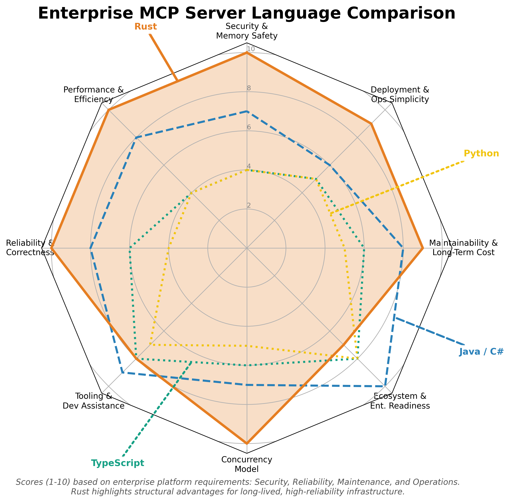

# Why Rust for Enterprise MCP Servers

As enterprises begin building internal MCP servers, the choice of programming language becomes strategic. The default instinct is often to use whatever language the team already knows—Java, C#, Python, or TypeScript. However, for systems that expose sensitive business capabilities to AI agents, language choice has direct implications for security, performance, maintainability, and long-term cost.

## The Language Decision Matrix

When evaluating languages for enterprise MCP servers, consider these dimensions:

- **Security & Memory Safety**: Protection against buffer overflows, use-after-free, data races
- **Performance & Efficiency**: Latency, throughput, resource consumption
- **Deployment & Ops Simplicity**: Binary size, startup time, dependency management
- **Maintainability & Long-Term Cost**: Refactoring safety, code clarity over time
- **Ecosystem & Enterprise Readiness**: Libraries, frameworks, corporate adoption
- **Concurrency Model**: Handling parallel requests safely
- **Tooling & Dev Assistance**: IDE support, AI coding assistance effectiveness
- **Reliability & Correctness**: Compile-time guarantees, runtime predictability

The following radar chart compares Rust, Python, TypeScript, and Java/C# across these enterprise requirements:



Rust dominates in security, performance, reliability, and deployment simplicity—the dimensions that matter most for infrastructure that bridges AI and enterprise systems.

## 1. Security by Construction

The majority of cybersecurity vulnerabilities in modern systems—buffer overflows, memory corruption, data races, use-after-free bugs—are **prevented entirely** by Rust's compiler and ownership model.

For CIOs and CISOs, this translates to concrete benefits:

| Security Benefit | Business Impact |
|------------------|-----------------|
| No buffer overflows | Eliminates entire vulnerability class |
| No data races | Safe concurrent access to shared state |
| No null pointer exceptions | Predictable behavior, fewer crashes |
| No use-after-free | Memory safety without garbage collection |

When MCP servers act as the bridge between AI agents and internal systems, reducing risk is not optional. Rust enforces safety at compile time—before code ever runs inside your infrastructure.

### The CVE Perspective

Microsoft and Google have independently reported that **~70% of their security vulnerabilities** are memory safety issues. Rust eliminates this entire category by design.

```rust
// This won't compile - Rust prevents data races at compile time
fn dangerous_concurrent_access() {
    let mut data = vec![1, 2, 3];
    
    std::thread::spawn(|| {
        data.push(4);  // Error: cannot borrow `data` as mutable
    });
    
    println!("{:?}", data);
}
```

## 2. Performance That Impacts Business Value

MCP servers often sit on critical paths:

- Answering low-latency requests from LLMs
- Serving real-time enterprise data
- Running high-volume automation workflows

Rust's performance matches C/C++ but with far stronger safety guarantees:

| Metric | Rust | Python | TypeScript | Java |
|--------|------|--------|------------|------|
| Cold start (Lambda) | ~10ms | ~300ms | ~150ms | ~500ms |
| Memory footprint | 10-20MB | 50-100MB | 40-80MB | 100-200MB |
| Requests/sec (typical) | 50,000+ | 1,000-5,000 | 5,000-15,000 | 10,000-30,000 |

*Approximate figures for typical MCP server workloads*

### Why Performance Matters for MCP

High performance enables:

- **Faster responses** → Better user adoption, lower frustration
- **More responsive autonomous workflows** → AI agents don't wait
- **Lower cloud spend** → Fewer CPU cycles for the same work
- **Better scalability** → Handle traffic spikes gracefully

In an AI-native enterprise, performance isn't a nice-to-have—it's a force multiplier.

### Serverless Cost Implications

On AWS Lambda, you pay for GB-seconds. A Rust function that completes in 10ms costs 1/30th of a Python function that takes 300ms—for identical functionality.

At scale, this difference compounds:

| Monthly Invocations | Python Cost | Rust Cost | Annual Savings |
|---------------------|-------------|-----------|----------------|
| 1 million | $50 | $2 | $576 |
| 100 million | $5,000 | $167 | $57,996 |
| 1 billion | $50,000 | $1,667 | $579,996 |

## 3. A Language Built for AI-Assisted Development

A surprising benefit of Rust in the age of LLMs: **it works exceptionally well with AI coding assistants**.

Why? Rust's compiler gives exact, helpful error messages and enforces correctness at the type system level. This allows AI tools like Claude, ChatGPT, and Copilot to:

- Generate high-quality code with fewer logical errors
- Fix mistakes rapidly using compiler feedback
- Maintain consistent patterns across teams

### The "Read, Don't Write" Paradigm

> "You don't need to learn how to write Rust.
> You need to learn how to read Rust."

The AI writes the code. Developers validate it. The compiler catches mistakes before they reach production.

This dramatically increases productivity for teams adopting MCP—especially teams new to Rust:

```rust
// AI-generated MCP tool implementation
#[tool(
    name = "query_sales",
    description = "Query sales data by region and quarter"
)]
async fn query_sales(
    #[arg(description = "Sales region (NA, EMEA, APAC)")] 
    region: String,
    #[arg(description = "Quarter (Q1, Q2, Q3, Q4)")] 
    quarter: String,
) -> Result<SalesReport, ToolError> {
    // AI generates the implementation
    // Compiler ensures it's correct
    // Developer reviews and approves
}
```

The developer's job shifts from writing boilerplate to reviewing business logic.

## 4. Predictable, Maintainable, Long-Lived Services

Enterprise MCP servers will remain in production for years, serving mission-critical workflows. Rust provides long-term stability through:

### No Garbage Collector

Rust has no GC, which means:
- **Predictable latency** → No GC pauses during requests
- **Consistent performance** → Same speed at 1 req/sec or 10,000 req/sec
- **Lower memory usage** → No GC overhead

### Strong, Opinionated Ecosystem

| Tool | Purpose | Quality |
|------|---------|---------|
| **Cargo** | Build and dependency management | Best-in-class |
| **rustfmt** | Code formatting | Eliminates style debates |
| **Clippy** | Linting and suggestions | Catches subtle bugs |
| **rust-analyzer** | IDE support | Excellent completions and refactoring |

### Refactoring Safety

Rust's type system makes large refactors safe:

```rust
// Change a function signature
fn process_order(order: Order) -> Result<Receipt, OrderError>
// to
fn process_order(order: Order, user: &User) -> Result<Receipt, OrderError>

// The compiler identifies EVERY call site that needs updating
// Nothing slips through to production
```

In dynamic languages, this refactor could introduce silent bugs. In Rust, the compiler ensures completeness.

## 5. Deployment Simplicity

Rust compiles to a single static binary with no runtime dependencies:

```bash
# Build for production
cargo build --release

# Result: one file, ~5-15MB, ready to deploy
ls -la target/release/my-mcp-server
# -rwxr-xr-x 1 user user 8.2M my-mcp-server
```

Compare this to:
- **Python**: Requires Python runtime, virtualenv, pip dependencies
- **TypeScript**: Requires Node.js runtime, node_modules
- **Java**: Requires JVM, possibly application server

### Container Images

| Language | Typical Image Size | Rust Equivalent |
|----------|-------------------|-----------------|
| Python | 400-800MB | 20-50MB |
| Node.js | 200-400MB | 20-50MB |
| Java | 300-600MB | 20-50MB |

Smaller images mean faster deployments, lower storage costs, and reduced attack surface.

## The PMCP Advantage

The PMCP SDK builds on Rust's strengths to provide enterprise-ready MCP development:

| Challenge | PMCP Solution |
|-----------|---------------|
| Learning curve | `cargo-pmcp` generates idiomatic code |
| Boilerplate | Derive macros handle JSON-RPC, schemas |
| Testing | Built-in test utilities and mocking |
| Deployment | One-command deploy to Lambda, Workers, Cloud Run |
| Observability | Middleware for logging, metrics, tracing |

You get Rust's benefits without fighting the language.

## When Rust Might Not Be Right

To be fair, Rust isn't always the best choice:

- **Rapid prototyping**: Python/TypeScript iterate faster for throwaway code
- **Team expertise**: If your team is deeply invested in another language
- **Existing infrastructure**: If you have mature deployment pipelines for other languages
- **Simple, low-stakes servers**: A weekend project doesn't need Rust's guarantees

However, for **enterprise MCP servers**—systems that will run for years, handle sensitive data, and bridge AI with critical infrastructure—Rust's upfront investment pays dividends.

## Summary: Why Rust for MCP

| Requirement | Why Rust Delivers |
|-------------|-------------------|
| **Security** | Memory safety prevents 70% of vulnerability classes |
| **Performance** | C-level speed, 10-30x faster than Python |
| **Reliability** | No GC pauses, predictable latency |
| **Maintainability** | Compiler-enforced refactoring safety |
| **Deployment** | Single binary, tiny containers |
| **AI-Assisted Dev** | Compiler feedback enables AI coding |
| **Long-term Cost** | Lower cloud bills, fewer incidents, easier maintenance |

Your internal MCP services become **assets**, not liabilities.

---

*Now that you understand why MCP and why Rust, let's build your first production-ready MCP server.*

*Continue to [Your First Production Server](./ch02-first-server.md) →*
